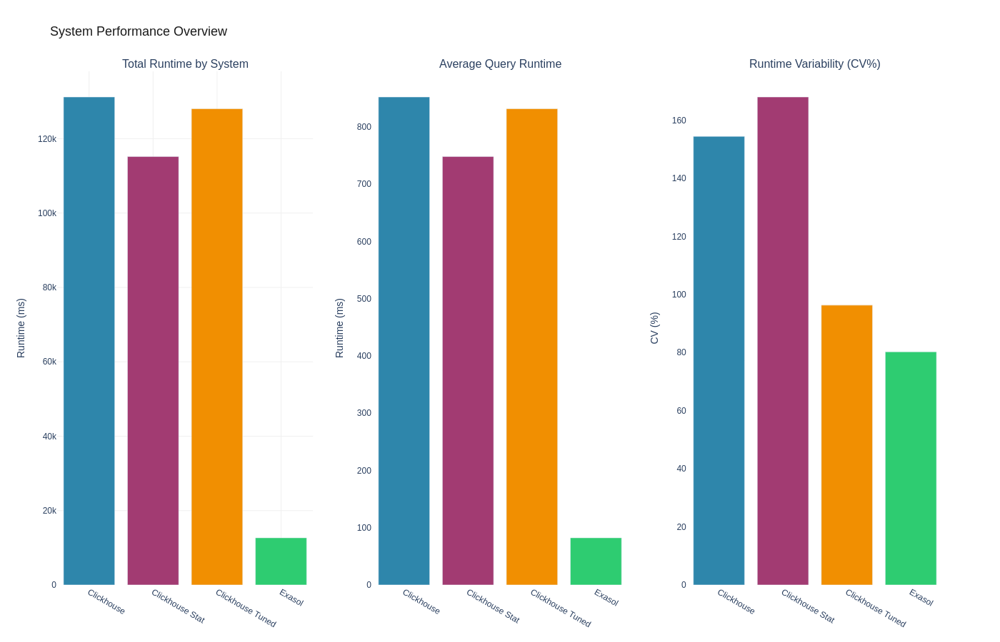
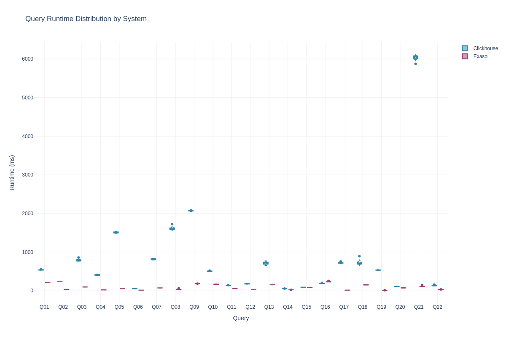
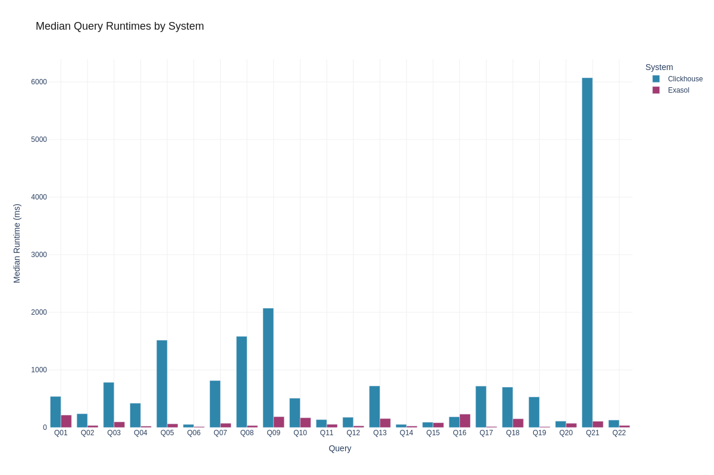
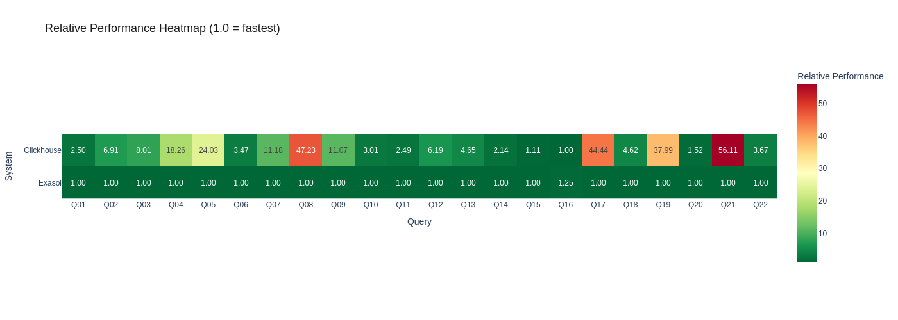
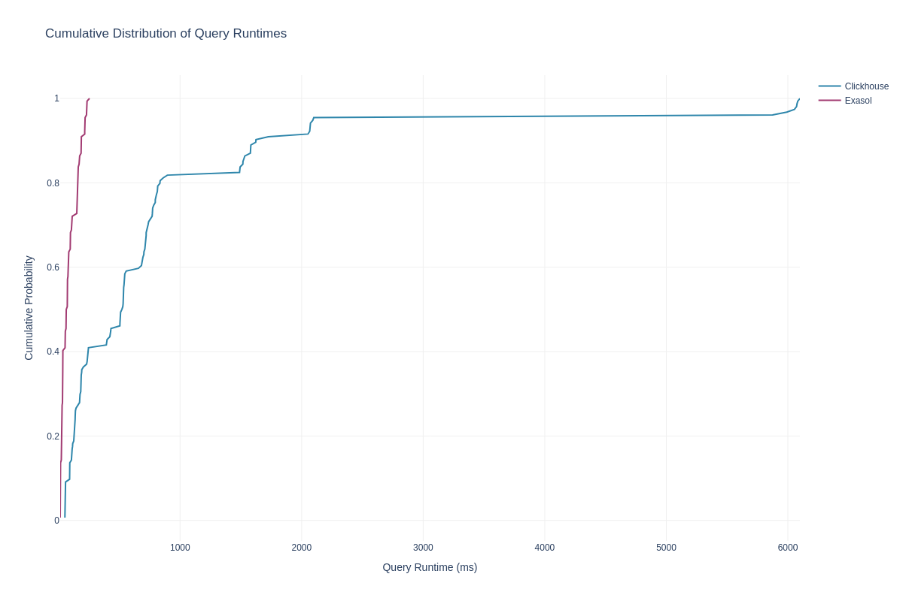

# Exasol vs ClickHouse Performance Comparison on TPC-H SF10

**Author:** Oleksandr Kozachuk, Principal Architect at Exasol AG
**Environment:** aws / eu-west-1 / r5d.4xlarge
**Date:** 2025-10-24 14:55:06

> **Note:** Sensitive information (passwords, IP addresses) has been sanitized for security reasons. Placeholders like `<EXASOL_DB_PASSWORD>`, `<PRIVATE_IP>`, and `<PUBLIC_IP>` are used throughout this document. When reproducing this benchmark, substitute these with your actual credentials and addresses.

This document shows exactly how the benchmark was run so it can be reproduced.

## Executive Summary

We compared 4 database systems:
- **exasol**
- **clickhouse**
- **clickhouse_tuned**
- **clickhouse_stat**

**Key Findings:**
- exasol was the fastest overall with 63.6ms median runtime
- clickhouse_tuned was 8.7x slower
- Tested 616 total query executions across 22 different TPC-H queries

## Systems Under Test

### Exasol 2025.1.0

**Software Configuration:**
- **Database:** exasol 2025.1.0
- **Setup method:** installer

**Hardware Specifications:**
- **Cloud Provider:** AWS
- **Region:** eu-west-1
- **Instance Type:** r5d.4xlarge
- **CPU:** Intel(R) Xeon(R) Platinum 8259CL CPU @ 2.50GHz
- **CPU Cores:** 16 vCPUs
- **Memory:** 124.4GB RAM
- **Hostname:** ip-10-0-1-76

### Clickhouse 25.9.4.58

**Software Configuration:**
- **Database:** clickhouse 25.9.4.58
- **Setup method:** native
- **Data directory:** /data/clickhouse

**Hardware Specifications:**
- **Cloud Provider:** AWS
- **Region:** eu-west-1
- **Instance Type:** r5d.4xlarge
- **CPU:** Intel(R) Xeon(R) Platinum 8259CL CPU @ 2.50GHz
- **CPU Cores:** 16 vCPUs
- **Memory:** 124.4GB RAM
- **Hostname:** ip-10-0-1-236

### Clickhouse_tuned 25.9.4.58

**Software Configuration:**
- **Database:** clickhouse 25.9.4.58
- **Setup method:** native
- **Data directory:** /data/clickhouse

**Hardware Specifications:**
- **Cloud Provider:** AWS
- **Region:** eu-west-1
- **Instance Type:** r5d.4xlarge
- **CPU:** Intel(R) Xeon(R) Platinum 8259CL CPU @ 2.50GHz
- **CPU Cores:** 16 vCPUs
- **Memory:** 124.4GB RAM
- **Hostname:** ip-10-0-1-209

### Clickhouse_stat 25.9.4.58

**Software Configuration:**
- **Database:** clickhouse 25.9.4.58
- **Setup method:** native
- **Data directory:** /data/clickhouse

**Hardware Specifications:**
- **Cloud Provider:** AWS
- **Region:** eu-west-1
- **Instance Type:** r5d.4xlarge
- **CPU:** Intel(R) Xeon(R) Platinum 8259CL CPU @ 2.50GHz
- **CPU Cores:** 16 vCPUs
- **Memory:** 124.4GB RAM
- **Hostname:** ip-10-0-1-182


**Detailed system information:** See attachments for complete system specifications

## Test Environment

This benchmark was executed on the following infrastructure:

### Hardware Specifications

- **Cloud Provider:** AWS
- **Region:** eu-west-1
- **Exasol Instance:** r5d.4xlarge
- **Clickhouse Instance:** r5d.4xlarge
- **Clickhouse_tuned Instance:** r5d.4xlarge
- **Clickhouse_stat Instance:** r5d.4xlarge


### Database Configuration

The following commands were **actually executed** during the benchmark setup. You can copy and paste these to reproduce the installation:

#### Exasol 2025.1.0 Setup

**Storage Configuration:**
```bash
# Stop existing RAID array at /dev/md0 if present
sudo mdadm --stop /dev/md0 2&gt;/dev/null || true

# Clear RAID superblock on /dev/nvme1n1
sudo mdadm --zero-superblock /dev/nvme1n1 2&gt;/dev/null || true

# Clear RAID superblock on /dev/nvme2n1
sudo mdadm --zero-superblock /dev/nvme2n1 2&gt;/dev/null || true

# Create RAID0 array from 2 devices
yes | sudo mdadm --create /dev/md0 --level=0 --raid-devices=2 /dev/nvme1n1 /dev/nvme2n1

# Wait for RAID array /dev/md0 to be ready
sudo mdadm --wait /dev/md0 2&gt;/dev/null || true

# Create mdadm configuration directory
sudo mkdir -p /etc/mdadm

# Save RAID configuration
sudo mdadm --detail --scan | sudo tee -a /etc/mdadm/mdadm.conf

# Create GPT partition table
sudo parted /dev/md0 mklabel gpt

# Execute sudo command on remote system
sudo parted -s /dev/md0 mklabel gpt

# Create 20GB partition for data generation
sudo parted /dev/md0 mkpart primary ext4 1MiB 20GiB

# Execute sudo command on remote system
sudo parted -s /dev/md0 mkpart primary ext4 1MiB 20GiB

# Create raw partition for Exasol (538GB)
sudo parted /dev/md0 mkpart primary 20GiB 100%

# Execute sudo command on remote system
sudo parted -s /dev/md0 mkpart primary 20GiB 100%

# Format /dev/md0p1 with ext4 filesystem
sudo mkfs.ext4 -F /dev/md0p1

# Create mount point /data/tpch_gen
sudo mkdir -p /data/tpch_gen

# Mount /dev/md0p1 to /data/tpch_gen
sudo mount /dev/md0p1 /data/tpch_gen

# Set ownership of /data/tpch_gen to $(whoami):$(whoami)
sudo chown -R $(whoami):$(whoami) /data/tpch_gen

```

**User Setup:**
```bash
# Create Exasol system user
sudo useradd -m exasol

# Add exasol user to sudo group
sudo usermod -aG sudo exasol

# Set password for exasol user (interactive)
sudo passwd exasol

```

**Tool Setup:**
```bash
# Download c4 cluster management tool v4.28.2
wget https://x-up.s3.amazonaws.com/releases/c4/linux/x86_64/4.28.2/c4 -O c4 &amp;&amp; chmod +x c4

```

**SSH Setup:**
```bash
# Generate SSH key pair for cluster communication
ssh-keygen -t rsa -b 2048 -f ~/.ssh/id_rsa -N &#34;&#34;

```

**Configuration:**
```bash
# Create c4 configuration file on remote system
cat &gt; /tmp/exasol_c4.conf &lt;&lt; &#39;EOF&#39;
CCC_HOST_ADDRS=&#34;&lt;PRIVATE_IP&gt;&#34;
CCC_HOST_EXTERNAL_ADDRS=&#34;&lt;SERVER_IP&gt;&#34;
CCC_HOST_DATADISK=/dev/md0p2
CCC_HOST_IMAGE_USER=exasol
CCC_HOST_IMAGE_PASSWORD=&lt;EXASOL_IMAGE_PASSWORD&gt;
CCC_HOST_KEY_PAIR_FILE=id_rsa
CCC_PLAY_RESERVE_NODES=0
CCC_PLAY_WORKING_COPY=@exasol-2025.1.0
CCC_PLAY_DB_PASSWORD=&lt;EXASOL_DB_PASSWORD&gt;
CCC_PLAY_ADMIN_PASSWORD=&lt;EXASOL_ADMIN_PASSWORD&gt;
CCC_ADMINUI_START_SERVER=true
EOF

```

**Cluster Deployment:**
```bash
# Deploy Exasol cluster using c4
./c4 host play -i /tmp/exasol_c4.conf

```

**License Setup:**
```bash
# Install Exasol license file
confd_client license_upload license: &lt;LICENSE_CONTENT&gt;

```

**Database Tuning:**
```bash
# Stop Exasol database for parameter configuration
confd_client db_stop db_name: Exasol

# Configure Exasol database parameters for analytical workload optimization
confd_client db_configure db_name: Exasol params_add: &#34;[&#39;-writeTouchInit=1&#39;,&#39;-cacheMonitorLimit=0&#39;,&#39;-maxOverallSlbUsageRatio=0.95&#39;,&#39;-useQueryCache=0&#39;,&#39;-query_log_timeout=0&#39;,&#39;-joinOrderMethod=0&#39;,&#39;-etlCheckCertsDefault=0&#39;]&#34;

# Starting database with new parameters
confd_client db_start db_name: Exasol

```

**Cluster Management:**
```bash
# Get cluster play ID for confd_client operations
c4 ps

```


**Tuning Parameters:**
- Database RAM: `48g`
- Optimizer mode: `analytical`
- Database parameters:
  - `-writeTouchInit=1`
  - `-cacheMonitorLimit=0`
  - `-maxOverallSlbUsageRatio=0.95`
  - `-useQueryCache=0`
  - `-query_log_timeout=0`
  - `-joinOrderMethod=0`
  - `-etlCheckCertsDefault=0`

**Data Directory:** `None`


#### Clickhouse_tuned 25.9.4.58 Setup

**Storage Configuration:**
```bash
# Stop existing RAID array at /dev/md0 if present
sudo mdadm --stop /dev/md0 2&gt;/dev/null || true

# Clear RAID superblock on /dev/nvme2n1
sudo mdadm --zero-superblock /dev/nvme2n1 2&gt;/dev/null || true

# Clear RAID superblock on /dev/nvme1n1
sudo mdadm --zero-superblock /dev/nvme1n1 2&gt;/dev/null || true

# Create RAID0 array from 2 devices
yes | sudo mdadm --create /dev/md0 --level=0 --raid-devices=2 /dev/nvme2n1 /dev/nvme1n1

# Wait for RAID array /dev/md0 to be ready
sudo mdadm --wait /dev/md0 2&gt;/dev/null || true

# Create mdadm configuration directory
sudo mkdir -p /etc/mdadm

# Save RAID configuration
sudo mdadm --detail --scan | sudo tee -a /etc/mdadm/mdadm.conf

# Format /dev/md0 with ext4 filesystem
sudo mkfs.ext4 -F /dev/md0

# Create mount point /data
sudo mkdir -p /data

# Mount /dev/md0 to /data
sudo mount /dev/md0 /data

# Set ownership of /data to ubuntu:ubuntu
sudo chown -R ubuntu:ubuntu /data

# Create ClickHouse data directory under /data
sudo mkdir -p /data/clickhouse

# Set ownership of /data/clickhouse to clickhouse:clickhouse
sudo chown -R clickhouse:clickhouse /data/clickhouse

```

**Prerequisites:**
```bash
# Update package lists
sudo apt-get update

# Install prerequisite packages for secure repository access
sudo apt-get install -y apt-transport-https ca-certificates curl gnupg

```

**Repository Setup:**
```bash
# Add ClickHouse GPG key to system keyring
curl -fsSL &#39;https://packages.clickhouse.com/rpm/lts/repodata/repomd.xml.key&#39; | sudo gpg --dearmor -o /usr/share/keyrings/clickhouse-keyring.gpg

# Add ClickHouse official repository to APT sources
ARCH=$(dpkg --print-architecture) &amp;&amp; echo &#34;deb [signed-by=/usr/share/keyrings/clickhouse-keyring.gpg arch=${ARCH}] https://packages.clickhouse.com/deb stable main&#34; | sudo tee /etc/apt/sources.list.d/clickhouse.list

# Update package lists with ClickHouse repository
sudo apt-get update

```

**Installation:**
```bash
# Install ClickHouse server and client version &lt;SERVER_IP&gt;
sudo apt-get install -y clickhouse-server=25.9.4.58 clickhouse-client=25.9.4.58

```

**Configuration:**
```bash
# Create custom ClickHouse configuration file
sudo tee /etc/clickhouse-server/config.d/benchmark.xml &gt; /dev/null &lt;&lt; &#39;EOF&#39;
&lt;clickhouse&gt;
    &lt;listen_host&gt;::&lt;/listen_host&gt;
    &lt;path&gt;/data/clickhouse&lt;/path&gt;
    &lt;tmp_path&gt;/data/clickhouse/tmp&lt;/tmp_path&gt;
    &lt;max_server_memory_usage&gt;106897742233&lt;/max_server_memory_usage&gt;
    &lt;max_concurrent_queries&gt;8&lt;/max_concurrent_queries&gt;
    &lt;background_pool_size&gt;16&lt;/background_pool_size&gt;
    &lt;background_schedule_pool_size&gt;16&lt;/background_schedule_pool_size&gt;
    &lt;max_table_size_to_drop&gt;50000000000&lt;/max_table_size_to_drop&gt;
&lt;/clickhouse&gt;
EOF

```

**User Configuration:**
```bash
# Configure ClickHouse user profile with password and query settings
sudo tee /etc/clickhouse-server/users.d/benchmark.xml &gt; /dev/null &lt;&lt; &#39;EOF&#39;
&lt;clickhouse&gt;
    &lt;users&gt;
        &lt;default replace=&#34;true&#34;&gt;
            &lt;password_sha256_hex&gt;2cca9d8714615f4132390a3db9296d39ec051b3faff87be7ea5f7fe0e2de14c9&lt;/password_sha256_hex&gt;
            &lt;networks&gt;
                &lt;ip&gt;::/0&lt;/ip&gt;
            &lt;/networks&gt;
        &lt;/default&gt;
    &lt;/users&gt;
    &lt;profiles&gt;
        &lt;default&gt;
            &lt;max_threads&gt;16&lt;/max_threads&gt;
            &lt;max_memory_usage&gt;45000000000&lt;/max_memory_usage&gt;
            &lt;max_bytes_before_external_sort&gt;73492197785&lt;/max_bytes_before_external_sort&gt;
            &lt;max_bytes_before_external_group_by&gt;73492197785&lt;/max_bytes_before_external_group_by&gt;
            &lt;join_use_nulls&gt;1&lt;/join_use_nulls&gt;
            &lt;allow_experimental_correlated_subqueries&gt;1&lt;/allow_experimental_correlated_subqueries&gt;
            &lt;optimize_read_in_order&gt;1&lt;/optimize_read_in_order&gt;
            &lt;max_insert_threads&gt;8&lt;/max_insert_threads&gt;
        &lt;/default&gt;
    &lt;/profiles&gt;
&lt;/clickhouse&gt;
EOF

```

**Service Management:**
```bash
# Start ClickHouse server service
sudo systemctl start clickhouse-server

# Enable ClickHouse server to start on boot
sudo systemctl enable clickhouse-server

```


**Tuning Parameters:**
- Memory limit: `48g`
- Max threads: `16`
- Max memory usage: `45.0GB`

**Data Directory:** `/data/clickhouse`


#### Clickhouse 25.9.4.58 Setup

**Storage Configuration:**
```bash
# Stop existing RAID array at /dev/md0 if present
sudo mdadm --stop /dev/md0 2&gt;/dev/null || true

# Clear RAID superblock on /dev/nvme1n1
sudo mdadm --zero-superblock /dev/nvme1n1 2&gt;/dev/null || true

# Clear RAID superblock on /dev/nvme2n1
sudo mdadm --zero-superblock /dev/nvme2n1 2&gt;/dev/null || true

# Create RAID0 array from 2 devices
yes | sudo mdadm --create /dev/md0 --level=0 --raid-devices=2 /dev/nvme1n1 /dev/nvme2n1

# Wait for RAID array /dev/md0 to be ready
sudo mdadm --wait /dev/md0 2&gt;/dev/null || true

# Create mdadm configuration directory
sudo mkdir -p /etc/mdadm

# Save RAID configuration
sudo mdadm --detail --scan | sudo tee -a /etc/mdadm/mdadm.conf

# Format /dev/md0 with ext4 filesystem
sudo mkfs.ext4 -F /dev/md0

# Create mount point /data
sudo mkdir -p /data

# Mount /dev/md0 to /data
sudo mount /dev/md0 /data

# Set ownership of /data to ubuntu:ubuntu
sudo chown -R ubuntu:ubuntu /data

# Create ClickHouse data directory under /data
sudo mkdir -p /data/clickhouse

# Set ownership of /data/clickhouse to clickhouse:clickhouse
sudo chown -R clickhouse:clickhouse /data/clickhouse

```

**Prerequisites:**
```bash
# Update package lists
sudo apt-get update

# Install prerequisite packages for secure repository access
sudo apt-get install -y apt-transport-https ca-certificates curl gnupg

```

**Repository Setup:**
```bash
# Add ClickHouse GPG key to system keyring
curl -fsSL &#39;https://packages.clickhouse.com/rpm/lts/repodata/repomd.xml.key&#39; | sudo gpg --dearmor -o /usr/share/keyrings/clickhouse-keyring.gpg

# Add ClickHouse official repository to APT sources
ARCH=$(dpkg --print-architecture) &amp;&amp; echo &#34;deb [signed-by=/usr/share/keyrings/clickhouse-keyring.gpg arch=${ARCH}] https://packages.clickhouse.com/deb stable main&#34; | sudo tee /etc/apt/sources.list.d/clickhouse.list

# Update package lists with ClickHouse repository
sudo apt-get update

```

**Installation:**
```bash
# Install ClickHouse server and client version &lt;SERVER_IP&gt;
sudo apt-get install -y clickhouse-server=25.9.4.58 clickhouse-client=25.9.4.58

```

**Configuration:**
```bash
# Create custom ClickHouse configuration file
sudo tee /etc/clickhouse-server/config.d/benchmark.xml &gt; /dev/null &lt;&lt; &#39;EOF&#39;
&lt;clickhouse&gt;
    &lt;listen_host&gt;::&lt;/listen_host&gt;
    &lt;path&gt;/data/clickhouse&lt;/path&gt;
    &lt;tmp_path&gt;/data/clickhouse/tmp&lt;/tmp_path&gt;
    &lt;max_server_memory_usage&gt;106897748787&lt;/max_server_memory_usage&gt;
    &lt;max_concurrent_queries&gt;8&lt;/max_concurrent_queries&gt;
    &lt;background_pool_size&gt;16&lt;/background_pool_size&gt;
    &lt;background_schedule_pool_size&gt;16&lt;/background_schedule_pool_size&gt;
    &lt;max_table_size_to_drop&gt;50000000000&lt;/max_table_size_to_drop&gt;
&lt;/clickhouse&gt;
EOF

```

**User Configuration:**
```bash
# Configure ClickHouse user profile with password and query settings
sudo tee /etc/clickhouse-server/users.d/benchmark.xml &gt; /dev/null &lt;&lt; &#39;EOF&#39;
&lt;clickhouse&gt;
    &lt;users&gt;
        &lt;default replace=&#34;true&#34;&gt;
            &lt;password_sha256_hex&gt;2cca9d8714615f4132390a3db9296d39ec051b3faff87be7ea5f7fe0e2de14c9&lt;/password_sha256_hex&gt;
            &lt;networks&gt;
                &lt;ip&gt;::/0&lt;/ip&gt;
            &lt;/networks&gt;
        &lt;/default&gt;
    &lt;/users&gt;
    &lt;profiles&gt;
        &lt;default&gt;
            &lt;max_threads&gt;16&lt;/max_threads&gt;
            &lt;max_memory_usage&gt;45000000000&lt;/max_memory_usage&gt;
            &lt;max_bytes_before_external_sort&gt;73492202291&lt;/max_bytes_before_external_sort&gt;
            &lt;max_bytes_before_external_group_by&gt;73492202291&lt;/max_bytes_before_external_group_by&gt;
            &lt;join_use_nulls&gt;1&lt;/join_use_nulls&gt;
            &lt;allow_experimental_correlated_subqueries&gt;1&lt;/allow_experimental_correlated_subqueries&gt;
            &lt;optimize_read_in_order&gt;1&lt;/optimize_read_in_order&gt;
            &lt;max_insert_threads&gt;8&lt;/max_insert_threads&gt;
        &lt;/default&gt;
    &lt;/profiles&gt;
&lt;/clickhouse&gt;
EOF

```

**Service Management:**
```bash
# Start ClickHouse server service
sudo systemctl start clickhouse-server

# Enable ClickHouse server to start on boot
sudo systemctl enable clickhouse-server

```


**Tuning Parameters:**
- Memory limit: `48g`
- Max threads: `16`
- Max memory usage: `45.0GB`

**Data Directory:** `/data/clickhouse`


#### Clickhouse_stat 25.9.4.58 Setup

**Storage Configuration:**
```bash
# Stop existing RAID array at /dev/md0 if present
sudo mdadm --stop /dev/md0 2&gt;/dev/null || true

# Clear RAID superblock on /dev/nvme2n1
sudo mdadm --zero-superblock /dev/nvme2n1 2&gt;/dev/null || true

# Clear RAID superblock on /dev/nvme1n1
sudo mdadm --zero-superblock /dev/nvme1n1 2&gt;/dev/null || true

# Create RAID0 array from 2 devices
yes | sudo mdadm --create /dev/md0 --level=0 --raid-devices=2 /dev/nvme2n1 /dev/nvme1n1

# Wait for RAID array /dev/md0 to be ready
sudo mdadm --wait /dev/md0 2&gt;/dev/null || true

# Create mdadm configuration directory
sudo mkdir -p /etc/mdadm

# Save RAID configuration
sudo mdadm --detail --scan | sudo tee -a /etc/mdadm/mdadm.conf

# Format /dev/md0 with ext4 filesystem
sudo mkfs.ext4 -F /dev/md0

# Create mount point /data
sudo mkdir -p /data

# Mount /dev/md0 to /data
sudo mount /dev/md0 /data

# Set ownership of /data to ubuntu:ubuntu
sudo chown -R ubuntu:ubuntu /data

# Create ClickHouse data directory under /data
sudo mkdir -p /data/clickhouse

# Set ownership of /data/clickhouse to clickhouse:clickhouse
sudo chown -R clickhouse:clickhouse /data/clickhouse

```

**Prerequisites:**
```bash
# Update package lists
sudo apt-get update

# Install prerequisite packages for secure repository access
sudo apt-get install -y apt-transport-https ca-certificates curl gnupg

```

**Repository Setup:**
```bash
# Add ClickHouse GPG key to system keyring
curl -fsSL &#39;https://packages.clickhouse.com/rpm/lts/repodata/repomd.xml.key&#39; | sudo gpg --dearmor -o /usr/share/keyrings/clickhouse-keyring.gpg

# Add ClickHouse official repository to APT sources
ARCH=$(dpkg --print-architecture) &amp;&amp; echo &#34;deb [signed-by=/usr/share/keyrings/clickhouse-keyring.gpg arch=${ARCH}] https://packages.clickhouse.com/deb stable main&#34; | sudo tee /etc/apt/sources.list.d/clickhouse.list

# Update package lists with ClickHouse repository
sudo apt-get update

```

**Installation:**
```bash
# Install ClickHouse server and client version &lt;SERVER_IP&gt;
sudo apt-get install -y clickhouse-server=25.9.4.58 clickhouse-client=25.9.4.58

```

**Configuration:**
```bash
# Create custom ClickHouse configuration file
sudo tee /etc/clickhouse-server/config.d/benchmark.xml &gt; /dev/null &lt;&lt; &#39;EOF&#39;
&lt;clickhouse&gt;
    &lt;listen_host&gt;::&lt;/listen_host&gt;
    &lt;path&gt;/data/clickhouse&lt;/path&gt;
    &lt;tmp_path&gt;/data/clickhouse/tmp&lt;/tmp_path&gt;
    &lt;max_server_memory_usage&gt;106897735680&lt;/max_server_memory_usage&gt;
    &lt;max_concurrent_queries&gt;8&lt;/max_concurrent_queries&gt;
    &lt;background_pool_size&gt;16&lt;/background_pool_size&gt;
    &lt;background_schedule_pool_size&gt;16&lt;/background_schedule_pool_size&gt;
    &lt;max_table_size_to_drop&gt;50000000000&lt;/max_table_size_to_drop&gt;
&lt;/clickhouse&gt;
EOF

```

**User Configuration:**
```bash
# Configure ClickHouse user profile with password and query settings
sudo tee /etc/clickhouse-server/users.d/benchmark.xml &gt; /dev/null &lt;&lt; &#39;EOF&#39;
&lt;clickhouse&gt;
    &lt;users&gt;
        &lt;default replace=&#34;true&#34;&gt;
            &lt;password_sha256_hex&gt;2cca9d8714615f4132390a3db9296d39ec051b3faff87be7ea5f7fe0e2de14c9&lt;/password_sha256_hex&gt;
            &lt;networks&gt;
                &lt;ip&gt;::/0&lt;/ip&gt;
            &lt;/networks&gt;
        &lt;/default&gt;
    &lt;/users&gt;
    &lt;profiles&gt;
        &lt;default&gt;
            &lt;max_threads&gt;16&lt;/max_threads&gt;
            &lt;max_memory_usage&gt;45000000000&lt;/max_memory_usage&gt;
            &lt;max_bytes_before_external_sort&gt;73492193280&lt;/max_bytes_before_external_sort&gt;
            &lt;max_bytes_before_external_group_by&gt;73492193280&lt;/max_bytes_before_external_group_by&gt;
            &lt;join_use_nulls&gt;1&lt;/join_use_nulls&gt;
            &lt;allow_experimental_correlated_subqueries&gt;1&lt;/allow_experimental_correlated_subqueries&gt;
            &lt;optimize_read_in_order&gt;1&lt;/optimize_read_in_order&gt;
            &lt;max_insert_threads&gt;8&lt;/max_insert_threads&gt;
            &lt;allow_experimental_statistics&gt;1&lt;/allow_experimental_statistics&gt;
            &lt;allow_statistics_optimize&gt;1&lt;/allow_statistics_optimize&gt;
        &lt;/default&gt;
    &lt;/profiles&gt;
&lt;/clickhouse&gt;
EOF

```

**Service Management:**
```bash
# Start ClickHouse server service
sudo systemctl start clickhouse-server

# Enable ClickHouse server to start on boot
sudo systemctl enable clickhouse-server

```


**Tuning Parameters:**
- Memory limit: `48g`
- Max threads: `16`
- Max memory usage: `45.0GB`

**Data Directory:** `/data/clickhouse`


## Workload Configuration

### Benchmark Parameters

- **Workload:** TPCH
- **Scale factor:** 10
- **Data format:** csv
- **Queries tested:** All standard TPCH queries (Q01-Q22)
- **Warmup runs per query:** 1
- **Measured runs per query:** 7

### Execution Command

This benchmark is completely self-contained and includes all tuning configurations:

```bash
# Extract and run the benchmark
unzip exa_vs_ch_10g-benchmark.zip
cd exa_vs_ch_10g

# Execute the complete benchmark
./run_benchmark.sh
```

**Manual execution steps:**
```bash
# Install dependencies
pip install -r requirements.txt

# Probe system information
python -m benchkit probe --config config.yaml

# Run benchmark with all configurations applied
python -m benchkit run --config config.yaml
```

**Note:** All database tuning parameters and system configurations are embedded in the benchmark package and applied automatically during execution.

## Results

### Infrastructure Setup Timings

The following table shows the time taken to provision cloud instances and install database software:

| System | Instance Provisioning | Software Installation | Total Setup Time | Notes |
|--------|----------------------|----------------------|------------------|-------|
| Clickhouse_tuned | 143.99s | 33.96s | 177.95s | New infrastructure |
| Clickhouse_stat | 143.99s | 34.60s | 178.59s | New infrastructure |
| Clickhouse | 143.99s | 36.32s | 180.31s | New infrastructure |
| Exasol | 143.99s | 539.43s | 683.42s | New infrastructure |

**Infrastructure Provisioning:** 143.99s
- Cloud instances were provisioned (VMs created, networking configured)

**Software Installation Comparison:**
- Clickhouse_tuned had the fastest software installation at 33.96s
- Exasol took 539.43s to install (15.9x slower)


### Workload Preparation Timings


### Performance Summary

| query   | system           |   warmup |   runs |   median_ms |   mean_ms |   std_ms |   min_ms |   max_ms |
|---------|------------------|----------|--------|-------------|-----------|----------|----------|----------|
| Q01     | clickhouse       |    556.8 |      7 |       556.9 |     559.1 |      7.4 |    551   |    573.3 |
| Q01     | clickhouse_stat  |    534.7 |      7 |       535.1 |     536.6 |      6   |    531.4 |    548.5 |
| Q01     | clickhouse_tuned |    565.2 |      7 |       563.6 |     566.6 |     10   |    554.7 |    580.3 |
| Q01     | exasol           |    209.1 |      7 |       207   |     207.3 |      1.1 |    206.3 |    209.5 |
| Q02     | clickhouse       |    302.4 |      7 |       256.7 |     255.2 |      3.7 |    249.5 |    259.8 |
| Q02     | clickhouse_stat  |    229   |      7 |       210.4 |     210.2 |      6.1 |    203.7 |    220   |
| Q02     | clickhouse_tuned |    302.5 |      7 |       252.3 |     251.4 |      3.8 |    246.6 |    256.5 |
| Q02     | exasol           |     81.8 |      7 |        31.3 |      31.3 |      0.5 |     30.6 |     31.9 |
| Q03     | clickhouse       |    855.2 |      7 |       802.1 |     807.8 |     17.9 |    787.3 |    840.5 |
| Q03     | clickhouse_stat  |    889.6 |      7 |       808.1 |     805.7 |     15.4 |    787.4 |    829   |
| Q03     | clickhouse_tuned |    891.8 |      7 |       827.7 |     827.9 |     18.1 |    801.3 |    849.3 |
| Q03     | exasol           |    100.5 |      7 |        95.3 |      95.9 |      1.8 |     93.2 |     98.2 |
| Q04     | clickhouse       |    458   |      7 |       411.7 |     414.5 |      8.7 |    405.6 |    428.4 |
| Q04     | clickhouse_stat  |    451.1 |      7 |       402.1 |     402   |      2.6 |    398.8 |    406.2 |
| Q04     | clickhouse_tuned |   1290.2 |      7 |      1179.4 |    1168.2 |    165.5 |    963.6 |   1486.5 |
| Q04     | exasol           |     23.1 |      7 |        20.8 |      20.8 |      0.2 |     20.5 |     21.1 |
| Q05     | clickhouse       |   1734.3 |      7 |      1531.3 |    1534.1 |     28.9 |   1495.1 |   1570.9 |
| Q05     | clickhouse_stat  |   1688.6 |      7 |      1531.9 |    1537.9 |     30.8 |   1512.3 |   1604.3 |
| Q05     | clickhouse_tuned |   1790.4 |      7 |      1587.9 |    1596.2 |     45.2 |   1557.4 |   1685.4 |
| Q05     | exasol           |    111.3 |      7 |        60   |      59.9 |      0.6 |     59.3 |     61.2 |
| Q06     | clickhouse       |    111.3 |      7 |        58.3 |      58.8 |      2.6 |     56.6 |     64.2 |
| Q06     | clickhouse_stat  |    103.9 |      7 |        55.4 |      57.1 |      7   |     52.8 |     72.7 |
| Q06     | clickhouse_tuned |    106.4 |      7 |        55.7 |      58   |      3.6 |     55.2 |     64.8 |
| Q06     | exasol           |     14   |      7 |        13.7 |      13.7 |      0.1 |     13.6 |     13.8 |
| Q07     | clickhouse       |    844.7 |      7 |       824.5 |     839.9 |     48.4 |    805.1 |    946.5 |
| Q07     | clickhouse_stat  |    845   |      7 |       828.5 |     845.5 |     33.2 |    817.1 |    908.7 |
| Q07     | clickhouse_tuned |    895.7 |      7 |       848   |     848.5 |     20.3 |    823   |    871.4 |
| Q07     | exasol           |     73.1 |      7 |        68.9 |      68.8 |      0.7 |     67.7 |     69.7 |
| Q08     | clickhouse       |   1669.6 |      7 |      1629.4 |    1636.5 |     31.1 |   1611.1 |   1705.3 |
| Q08     | clickhouse_stat  |    364.3 |      7 |       353.7 |     355.2 |      6.6 |    347.7 |    366.9 |
| Q08     | clickhouse_tuned |   1686.4 |      7 |      1705.3 |    1700.8 |     27.1 |   1652.1 |   1731.5 |
| Q08     | exasol           |     32.4 |      7 |        30.7 |      33.9 |      8.1 |     30.4 |     52.3 |
| Q09     | clickhouse       |   2305.8 |      7 |      2108.7 |    2099   |     23.8 |   2070.2 |   2124.6 |
| Q09     | clickhouse_stat  |    988.2 |      7 |       897.8 |     895.9 |     26.8 |    860.1 |    933.3 |
| Q09     | clickhouse_tuned |   2261.1 |      7 |      2158.9 |    2169.1 |     28   |   2128.7 |   2205   |
| Q09     | exasol           |    183.3 |      7 |       174.5 |     174.5 |      0.5 |    174   |    175.4 |
| Q10     | clickhouse       |    609.2 |      7 |       515.1 |     517   |      9.6 |    508.5 |    537.7 |
| Q10     | clickhouse_stat  |    547.2 |      7 |       524.4 |     532.3 |     16.1 |    518.1 |    556.4 |
| Q10     | clickhouse_tuned |    629.9 |      7 |       538.2 |     535.4 |     13.7 |    511   |    551.4 |
| Q10     | exasol           |    167.2 |      7 |       165.1 |     165.3 |      7   |    153.2 |    176.2 |
| Q11     | clickhouse       |    180.3 |      7 |       139   |     140.3 |      2.3 |    138.2 |    143.8 |
| Q11     | clickhouse_stat  |    182.9 |      7 |       144.9 |     145.1 |      1.2 |    143.4 |    147   |
| Q11     | clickhouse_tuned |    184.5 |      7 |       141   |     143.6 |      6.7 |    137.3 |    155.3 |
| Q11     | exasol           |     53.4 |      7 |        52.2 |      51.5 |      1.1 |     50.1 |     52.5 |
| Q12     | clickhouse       |    300.4 |      7 |       193.6 |     192   |      7.1 |    181.7 |    200.6 |
| Q12     | clickhouse_stat  |    237.9 |      7 |       199.8 |     200.5 |     10   |    185.6 |    218.8 |
| Q12     | clickhouse_tuned |    336.5 |      7 |       181.6 |     182.7 |      8   |    175.9 |    199   |
| Q12     | exasol           |     42.2 |      7 |        27.3 |      27.3 |      0.5 |     26.8 |     28.2 |
| Q13     | clickhouse       |    791.6 |      7 |       760.7 |     754.3 |     31.6 |    685.7 |    780   |
| Q13     | clickhouse_stat  |    779.4 |      7 |       745.6 |     753.5 |     13.5 |    738.2 |    771.8 |
| Q13     | clickhouse_tuned |    792.9 |      7 |       770.7 |     762.6 |     30.4 |    708.9 |    808.6 |
| Q13     | exasol           |    148.4 |      7 |       148.8 |     148.6 |      0.6 |    147.8 |    149.4 |
| Q14     | clickhouse       |     57.8 |      7 |        55   |      55.1 |      1   |     53.4 |     56.8 |
| Q14     | clickhouse_stat  |     70.8 |      7 |        71.3 |      72.3 |      2.4 |     69.8 |     75.5 |
| Q14     | clickhouse_tuned |     65   |      7 |        57.3 |      56.9 |      2.6 |     54.1 |     61.3 |
| Q14     | exasol           |     29.3 |      7 |        23.2 |      23.2 |      0.1 |     23.1 |     23.5 |
| Q15     | clickhouse       |    103.5 |      7 |        93.5 |      93.4 |      0.5 |     92.7 |     94.2 |
| Q15     | clickhouse_stat  |    111.3 |      7 |       100.9 |     101.4 |      0.9 |    100.3 |    102.8 |
| Q15     | clickhouse_tuned |    127.7 |      7 |       103.5 |     103.6 |      3.3 |     97.9 |    108.7 |
| Q15     | exasol           |     78.6 |      7 |        76.6 |      77   |      1.4 |     75.5 |     79   |
| Q16     | clickhouse       |    197.2 |      7 |       192.7 |     192.6 |      2.4 |    188.7 |    196.8 |
| Q16     | clickhouse_stat  |    194.9 |      7 |       191.4 |     193.7 |      7.2 |    188.9 |    209.2 |
| Q16     | clickhouse_tuned |    246.2 |      7 |       220.1 |     221.9 |      4.8 |    215.3 |    227.9 |
| Q16     | exasol           |    230   |      7 |       222.7 |     225.5 |      7.2 |    218.9 |    241   |
| Q17     | clickhouse       |    805.8 |      7 |       732.1 |     734.3 |      7.2 |    727.8 |    749.7 |
| Q17     | clickhouse_stat  |    830.7 |      7 |       733.7 |     737.1 |      9.4 |    729.5 |    757   |
| Q17     | clickhouse_tuned |    255.8 |      7 |       331.1 |     331.3 |      3.1 |    327.3 |    335.3 |
| Q17     | exasol           |     15.5 |      7 |        13.9 |      13.9 |      0.2 |     13.6 |     14.2 |
| Q18     | clickhouse       |    825.2 |      7 |       719.7 |     721.4 |     15.5 |    705.6 |    751.4 |
| Q18     | clickhouse_stat  |    781.6 |      7 |       745.9 |     750.2 |     16.8 |    730.1 |    772.8 |
| Q18     | clickhouse_tuned |   2396   |      7 |      1941.1 |    1944.3 |     46.4 |   1888.2 |   2010.4 |
| Q18     | exasol           |    145.4 |      7 |       146.5 |     146   |      0.9 |    144.9 |    147   |
| Q19     | clickhouse       |    545.2 |      7 |       547.8 |     550.4 |      7.4 |    543.7 |    566.1 |
| Q19     | clickhouse_stat  |    834.8 |      7 |       821.1 |     823.5 |     22.1 |    792.5 |    863.7 |
| Q19     | clickhouse_tuned |   1450.4 |      7 |      1362.1 |    1367.4 |     17.7 |   1351.7 |   1401.9 |
| Q19     | exasol           |     14.6 |      7 |        11.9 |      12.1 |      0.5 |     11.6 |     13.1 |
| Q20     | clickhouse       |    125.8 |      7 |       114   |     113.7 |      3.3 |    108.5 |    118   |
| Q20     | clickhouse_stat  |    140.4 |      7 |       125.6 |     127.7 |      4.8 |    122.2 |    134.8 |
| Q20     | clickhouse_tuned |    475.3 |      7 |       335.4 |     329.9 |      9.2 |    316.3 |    338.2 |
| Q20     | exasol           |     66.4 |      7 |        67.4 |      67.3 |      0.9 |     66   |     68.5 |
| Q21     | clickhouse       |   6334.8 |      7 |      6315.8 |    6332.2 |    203.3 |   6003.2 |   6578.9 |
| Q21     | clickhouse_stat  |   6232.6 |      7 |      6283.7 |    6234.7 |     85.5 |   6130.2 |   6319   |
| Q21     | clickhouse_tuned |   3861.5 |      7 |      3001.6 |    3004.9 |     48.5 |   2932.1 |   3074.9 |
| Q21     | exasol           |    103.4 |      7 |       106.7 |     111.1 |     14.5 |    102.6 |    143.3 |
| Q22     | clickhouse       |    157.1 |      7 |       141.4 |     144.3 |      7.4 |    137.8 |    158.5 |
| Q22     | clickhouse_stat  |    153.2 |      7 |       135.6 |     138   |      7.3 |    130.8 |    150.5 |
| Q22     | clickhouse_tuned |    171.1 |      7 |       124.9 |     124.2 |      7.9 |    114.5 |    135.9 |
| Q22     | exasol           |     34.7 |      7 |        33.6 |      33.6 |      0.3 |     33.1 |     34   |

### System Comparison

| query   | baseline_system   | comparison_system   |   baseline_ms |   comparison_ms |   ratio |   speedup | faster   |
|---------|-------------------|---------------------|---------------|-----------------|---------|-----------|----------|
| Q01     | exasol            | clickhouse_tuned    |         207   |           563.6 |    2.72 |      0.37 | False    |
| Q02     | exasol            | clickhouse_tuned    |          31.3 |           252.3 |    8.06 |      0.12 | False    |
| Q03     | exasol            | clickhouse_tuned    |          95.3 |           827.7 |    8.69 |      0.12 | False    |
| Q04     | exasol            | clickhouse_tuned    |          20.8 |          1179.4 |   56.7  |      0.02 | False    |
| Q05     | exasol            | clickhouse_tuned    |          60   |          1587.9 |   26.46 |      0.04 | False    |
| Q06     | exasol            | clickhouse_tuned    |          13.7 |            55.7 |    4.07 |      0.25 | False    |
| Q07     | exasol            | clickhouse_tuned    |          68.9 |           848   |   12.31 |      0.08 | False    |
| Q08     | exasol            | clickhouse_tuned    |          30.7 |          1705.3 |   55.55 |      0.02 | False    |
| Q09     | exasol            | clickhouse_tuned    |         174.5 |          2158.9 |   12.37 |      0.08 | False    |
| Q10     | exasol            | clickhouse_tuned    |         165.1 |           538.2 |    3.26 |      0.31 | False    |
| Q11     | exasol            | clickhouse_tuned    |          52.2 |           141   |    2.7  |      0.37 | False    |
| Q12     | exasol            | clickhouse_tuned    |          27.3 |           181.6 |    6.65 |      0.15 | False    |
| Q13     | exasol            | clickhouse_tuned    |         148.8 |           770.7 |    5.18 |      0.19 | False    |
| Q14     | exasol            | clickhouse_tuned    |          23.2 |            57.3 |    2.47 |      0.4  | False    |
| Q15     | exasol            | clickhouse_tuned    |          76.6 |           103.5 |    1.35 |      0.74 | False    |
| Q16     | exasol            | clickhouse_tuned    |         222.7 |           220.1 |    0.99 |      1.01 | True     |
| Q17     | exasol            | clickhouse_tuned    |          13.9 |           331.1 |   23.82 |      0.04 | False    |
| Q18     | exasol            | clickhouse_tuned    |         146.5 |          1941.1 |   13.25 |      0.08 | False    |
| Q19     | exasol            | clickhouse_tuned    |          11.9 |          1362.1 |  114.46 |      0.01 | False    |
| Q20     | exasol            | clickhouse_tuned    |          67.4 |           335.4 |    4.98 |      0.2  | False    |
| Q21     | exasol            | clickhouse_tuned    |         106.7 |          3001.6 |   28.13 |      0.04 | False    |
| Q22     | exasol            | clickhouse_tuned    |          33.6 |           124.9 |    3.72 |      0.27 | False    |
| Q01     | exasol            | clickhouse          |         207   |           556.9 |    2.69 |      0.37 | False    |
| Q02     | exasol            | clickhouse          |          31.3 |           256.7 |    8.2  |      0.12 | False    |
| Q03     | exasol            | clickhouse          |          95.3 |           802.1 |    8.42 |      0.12 | False    |
| Q04     | exasol            | clickhouse          |          20.8 |           411.7 |   19.79 |      0.05 | False    |
| Q05     | exasol            | clickhouse          |          60   |          1531.3 |   25.52 |      0.04 | False    |
| Q06     | exasol            | clickhouse          |          13.7 |            58.3 |    4.26 |      0.23 | False    |
| Q07     | exasol            | clickhouse          |          68.9 |           824.5 |   11.97 |      0.08 | False    |
| Q08     | exasol            | clickhouse          |          30.7 |          1629.4 |   53.07 |      0.02 | False    |
| Q09     | exasol            | clickhouse          |         174.5 |          2108.7 |   12.08 |      0.08 | False    |
| Q10     | exasol            | clickhouse          |         165.1 |           515.1 |    3.12 |      0.32 | False    |
| Q11     | exasol            | clickhouse          |          52.2 |           139   |    2.66 |      0.38 | False    |
| Q12     | exasol            | clickhouse          |          27.3 |           193.6 |    7.09 |      0.14 | False    |
| Q13     | exasol            | clickhouse          |         148.8 |           760.7 |    5.11 |      0.2  | False    |
| Q14     | exasol            | clickhouse          |          23.2 |            55   |    2.37 |      0.42 | False    |
| Q15     | exasol            | clickhouse          |          76.6 |            93.5 |    1.22 |      0.82 | False    |
| Q16     | exasol            | clickhouse          |         222.7 |           192.7 |    0.87 |      1.16 | True     |
| Q17     | exasol            | clickhouse          |          13.9 |           732.1 |   52.67 |      0.02 | False    |
| Q18     | exasol            | clickhouse          |         146.5 |           719.7 |    4.91 |      0.2  | False    |
| Q19     | exasol            | clickhouse          |          11.9 |           547.8 |   46.03 |      0.02 | False    |
| Q20     | exasol            | clickhouse          |          67.4 |           114   |    1.69 |      0.59 | False    |
| Q21     | exasol            | clickhouse          |         106.7 |          6315.8 |   59.19 |      0.02 | False    |
| Q22     | exasol            | clickhouse          |          33.6 |           141.4 |    4.21 |      0.24 | False    |
| Q01     | exasol            | clickhouse_stat     |         207   |           535.1 |    2.59 |      0.39 | False    |
| Q02     | exasol            | clickhouse_stat     |          31.3 |           210.4 |    6.72 |      0.15 | False    |
| Q03     | exasol            | clickhouse_stat     |          95.3 |           808.1 |    8.48 |      0.12 | False    |
| Q04     | exasol            | clickhouse_stat     |          20.8 |           402.1 |   19.33 |      0.05 | False    |
| Q05     | exasol            | clickhouse_stat     |          60   |          1531.9 |   25.53 |      0.04 | False    |
| Q06     | exasol            | clickhouse_stat     |          13.7 |            55.4 |    4.04 |      0.25 | False    |
| Q07     | exasol            | clickhouse_stat     |          68.9 |           828.5 |   12.02 |      0.08 | False    |
| Q08     | exasol            | clickhouse_stat     |          30.7 |           353.7 |   11.52 |      0.09 | False    |
| Q09     | exasol            | clickhouse_stat     |         174.5 |           897.8 |    5.14 |      0.19 | False    |
| Q10     | exasol            | clickhouse_stat     |         165.1 |           524.4 |    3.18 |      0.31 | False    |
| Q11     | exasol            | clickhouse_stat     |          52.2 |           144.9 |    2.78 |      0.36 | False    |
| Q12     | exasol            | clickhouse_stat     |          27.3 |           199.8 |    7.32 |      0.14 | False    |
| Q13     | exasol            | clickhouse_stat     |         148.8 |           745.6 |    5.01 |      0.2  | False    |
| Q14     | exasol            | clickhouse_stat     |          23.2 |            71.3 |    3.07 |      0.33 | False    |
| Q15     | exasol            | clickhouse_stat     |          76.6 |           100.9 |    1.32 |      0.76 | False    |
| Q16     | exasol            | clickhouse_stat     |         222.7 |           191.4 |    0.86 |      1.16 | True     |
| Q17     | exasol            | clickhouse_stat     |          13.9 |           733.7 |   52.78 |      0.02 | False    |
| Q18     | exasol            | clickhouse_stat     |         146.5 |           745.9 |    5.09 |      0.2  | False    |
| Q19     | exasol            | clickhouse_stat     |          11.9 |           821.1 |   69    |      0.01 | False    |
| Q20     | exasol            | clickhouse_stat     |          67.4 |           125.6 |    1.86 |      0.54 | False    |
| Q21     | exasol            | clickhouse_stat     |         106.7 |          6283.7 |   58.89 |      0.02 | False    |
| Q22     | exasol            | clickhouse_stat     |          33.6 |           135.6 |    4.04 |      0.25 | False    |

### Visualizations

#### Performance Overview



*Comprehensive dashboard showing key performance metrics: total runtime, average query time, query count, and performance variability (coefficient of variation) across all systems.*

**Interactive version:** [View interactive chart](attachments/figures/system_performance_overview.html) for detailed insights and hover information.

#### Runtime Distributions



*Box plot showing the distribution of query runtimes. The box shows the interquartile range (25th to 75th percentile), with the median marked by the line inside the box. Whiskers extend to show the full range, excluding outliers.*

**Interactive version:** [View interactive chart](attachments/figures/query_runtime_boxplot.html) for detailed query-by-query analysis.



*Bar chart comparing median query runtimes across systems. Lower bars indicate better performance.*

**Interactive version:** [View interactive chart](attachments/figures/median_runtime_bar.html) to explore individual query performance.

#### Comparative Analysis


*Speedup factor comparing each system against the baseline. Values above 1.0 indicate faster performance than the baseline, while values below 1.0 indicate slower performance.*

**Interactive version:** [View interactive chart](attachments/figures/speedup_comparison.html) to compare performance across queries.



*Heatmap showing relative performance across queries and systems. Values are normalized so that 1.0 represents the fastest system for each query. Darker colors indicate better performance.*

**Interactive version:** [View interactive chart](attachments/figures/performance_heatmap.html) for detailed heat map analysis.



*Cumulative distribution function showing the probability that a query completes within a given time. Curves closer to the left indicate better performance.*

**Interactive version:** [View interactive chart](attachments/figures/query_runtime_cdf.html) for interactive exploration.

> **Note:** All visualizations are available as both static PNG images (shown above) and interactive HTML charts (linked). The interactive versions allow you to zoom, pan, and hover for detailed information.

### Key Observations

**clickhouse_tuned:**
- Median runtime: 553.0ms
- Average runtime: 831.6ms
- Fastest query: 54.1ms
- Slowest query: 3074.9ms

**clickhouse:**
- Median runtime: 540.7ms
- Average runtime: 852.1ms
- Fastest query: 53.4ms
- Slowest query: 6578.9ms

**clickhouse_stat:**
- Median runtime: 462.1ms
- Average runtime: 748.0ms
- Fastest query: 52.8ms
- Slowest query: 6319.0ms

**exasol:**
- Median runtime: 63.6ms
- Average runtime: 82.2ms
- Fastest query: 11.6ms
- Slowest query: 241.0ms


### Raw Data

The complete dataset is available in the following files:
- **Query results:** [`attachments/runs.csv`](attachments/runs.csv)
- **Summary statistics:** [`attachments/summary.json`](attachments/summary.json)
- **System information:** [`attachments/system.json`](attachments/system.json)
- **Benchmark package:** [`exa_vs_ch_10g-benchmark.zip`](exa_vs_ch_10g-benchmark.zip)

## Reproducibility

### System Requirements

Based on our testing environment:

- **CPU:** 16 logical cores
- **Memory:** 124.4GB RAM
- **Storage:** NVMe SSD recommended for optimal performance
- **OS:** Linux

### Configuration Files

The exact configuration used for this benchmark is available at:
[`attachments/config.yaml`](attachments/config.yaml)

### System Specifications

**Exasol 2025.1.0:**
- **Setup method:** installer
- **Data directory:** 
- **Applied configurations:**
  - dbram: 48g
  - optimizer_mode: analytical
  - db_params: [&#39;-writeTouchInit=1&#39;, &#39;-cacheMonitorLimit=0&#39;, &#39;-maxOverallSlbUsageRatio=0.95&#39;, &#39;-useQueryCache=0&#39;, &#39;-query_log_timeout=0&#39;, &#39;-joinOrderMethod=0&#39;, &#39;-etlCheckCertsDefault=0&#39;]

**Clickhouse 25.9.4.58:**
- **Setup method:** native
- **Data directory:** /data/clickhouse
- **Applied configurations:**
  - memory_limit: 48g
  - max_threads: 16
  - max_memory_usage: 45000000000

**Clickhouse_tuned 25.9.4.58:**
- **Setup method:** native
- **Data directory:** /data/clickhouse
- **Applied configurations:**
  - memory_limit: 48g
  - max_threads: 16
  - max_memory_usage: 45000000000

**Clickhouse_stat 25.9.4.58:**
- **Setup method:** native
- **Data directory:** /data/clickhouse
- **Applied configurations:**
  - memory_limit: 48g
  - max_threads: 16
  - max_memory_usage: 45000000000
  - allow_experimental_statistics: 1
  - allow_statistics_optimize: 1


## Methodology Notes

**Environment Consistency:**
- All systems tested on identical hardware specifications
- Same operating system and software versions
- Consistent resource allocation and container limits

**Execution Protocol:**
- 1 warmup run(s) per query (results discarded)
- 7 measured runs per query (results recorded)
- Wall-clock time measured by benchmark client
- Database processes restarted between test runs for consistency

**Configuration Management:**
- All tuning parameters documented in this post
- Configuration commands provided for exact reproduction
- System-specific optimizations applied as documented above
- Benchmark package contains all configuration files and scripts