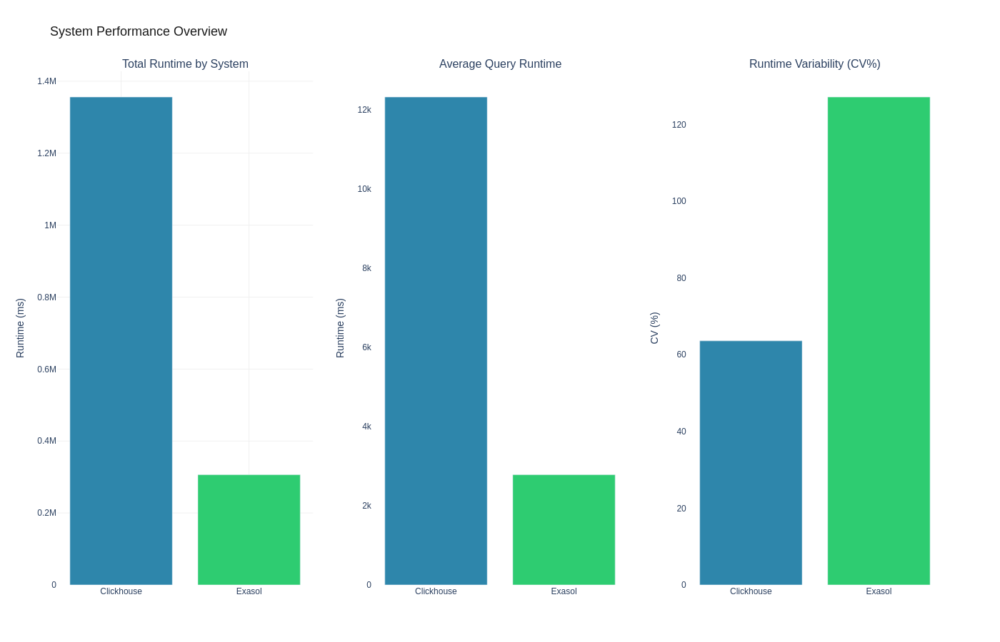
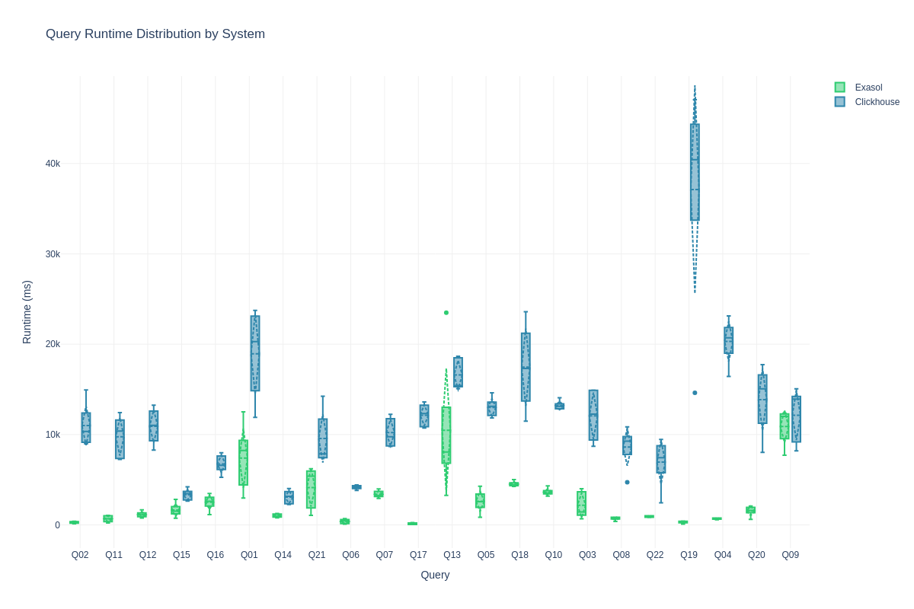
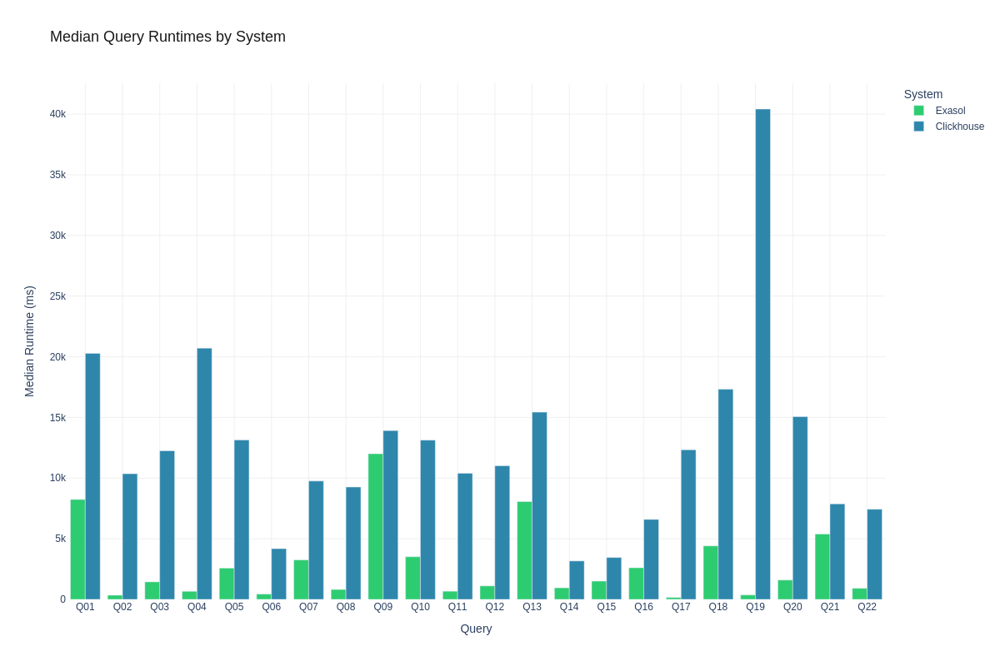
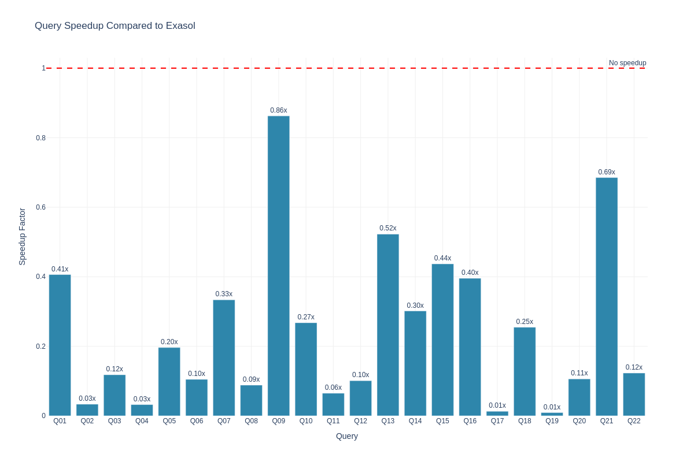
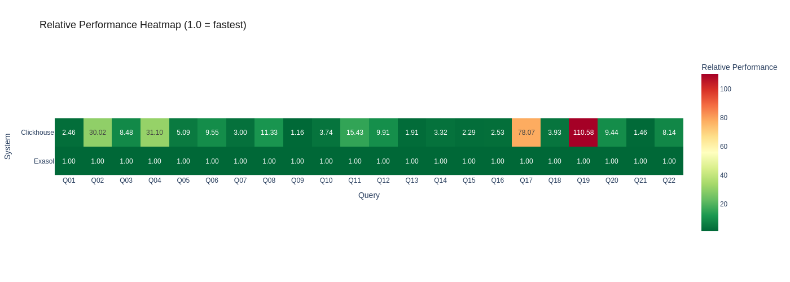

# Minimum Viable Resources - 32GB

**Author:** Benchmark Team
**Environment:** aws / eu-west-1 / r6id.xlarge
**Date:** 2026-01-19 13:50:38

> **Note:** Sensitive information (passwords, IP addresses) has been sanitized for security reasons. Placeholders like `<EXASOL_DB_PASSWORD>`, `<PRIVATE_IP>`, and `<PUBLIC_IP>` are used throughout this document. When reproducing this benchmark, substitute these with your actual credentials and addresses.

This document shows exactly how the benchmark was run so it can be reproduced.

## Executive Summary

We compared 2 database systems:
- **exasol**
- **clickhouse**

**Key Findings:**
- exasol was the fastest overall with 1239.3ms median runtime
- clickhouse was 9.3x slower- Tested 220 total query executions across 22 different TPC-H queries
- **Execution mode:** Multiuser with 5 concurrent streams (randomized distribution)

## Systems Under Test

### Exasol 2025.1.8

**Software Configuration:**
- **Database:** exasol 2025.1.8
- **Setup method:** installer
- **Data device:** /dev/exasol.storage


**Hardware Specifications:**
- **Cloud Provider:** AWS
- **Region:** eu-west-1
- **Instance Type:** r6id.xlarge
- **CPU:** Intel(R) Xeon(R) Platinum 8375C CPU @ 2.90GHz
- **CPU Cores:** 4 vCPUs
- **Memory:** 30.8GB RAM
- **Hostname:** ip-10-0-1-208

### Clickhouse 25.10.2.65

**Software Configuration:**
- **Database:** clickhouse 25.10.2.65
- **Setup method:** native
- **Data directory:** /data/clickhouse


**Hardware Specifications:**
- **Cloud Provider:** AWS
- **Region:** eu-west-1
- **Instance Type:** r6id.xlarge
- **CPU:** Intel(R) Xeon(R) Platinum 8375C CPU @ 2.90GHz
- **CPU Cores:** 4 vCPUs
- **Memory:** 30.8GB RAM
- **Hostname:** ip-10-0-1-242


**Detailed system information:** See attachments for complete system specifications

## Test Environment

This benchmark was executed on the following infrastructure:

### Hardware Specifications

- **Cloud Provider:** AWS
- **Region:** eu-west-1
- **Exasol Instance:** r6id.xlarge
- **Clickhouse Instance:** r6id.xlarge


### Database Configuration

The following commands were **actually executed** during the benchmark setup. You can copy and paste these to reproduce the installation:

#### Exasol 2025.1.8 Setup

**Storage Configuration:**
```bash
# Create GPT partition table
sudo parted /dev/nvme0n1 mklabel gpt

# Execute sudo command on remote system
sudo parted -s /dev/nvme0n1 mklabel gpt

# Create 48GB partition for data generation
sudo parted /dev/nvme0n1 mkpart primary ext4 1MiB 48GiB

# Execute sudo command on remote system
sudo parted -s /dev/nvme0n1 mkpart primary ext4 1MiB 48GiB

# Create raw partition for Exasol (172GB)
sudo parted /dev/nvme0n1 mkpart primary 48GiB 100%

# Execute sudo command on remote system
sudo parted -s /dev/nvme0n1 mkpart primary 48GiB 100%

# Format /dev/nvme0n1p1 with ext4 filesystem
sudo mkfs.ext4 -F /dev/nvme0n1p1

# Create mount point /data
sudo mkdir -p /data

# Mount /dev/nvme0n1p1 to /data
sudo mount /dev/nvme0n1p1 /data

# Set ownership of /data to $(whoami):$(whoami)
sudo chown -R $(whoami):$(whoami) /data

# Create storage symlink: /dev/exasol.storage -&gt; /dev/nvme0n1p2
sudo ln -sf /dev/nvme0n1p2 /dev/exasol.storage

```

**User Setup:**
```bash
# Create Exasol system user
sudo useradd -m -s /bin/bash exasol

# Add exasol user to sudo group
sudo usermod -aG sudo exasol

# Set password for exasol user (interactive)
sudo passwd exasol

```

**Tool Setup:**
```bash
# Download c4 cluster management tool v4.28.5
wget https://x-up.s3.amazonaws.com/releases/c4/linux/x86_64/4.28.5/c4 -O c4 &amp;&amp; chmod +x c4

```

**SSH Setup:**
```bash
# Generate SSH key pair for cluster communication
ssh-keygen -t rsa -b 2048 -f ~/.ssh/id_rsa -N &#34;&#34;

```

**Configuration:**
```bash
# Create c4 configuration file on remote system
cat &gt; /tmp/exasol_c4.conf &lt;&lt; &#39;EOF&#39;
CCC_HOST_ADDRS=&#34;&lt;PRIVATE_IP&gt;&#34;
CCC_HOST_EXTERNAL_ADDRS=&#34;&lt;SERVER_IP&gt;&#34;
CCC_HOST_DATADISK=/dev/exasol.storage
CCC_HOST_IMAGE_USER=exasol
CCC_HOST_IMAGE_PASSWORD=&lt;EXASOL_IMAGE_PASSWORD&gt;
CCC_HOST_KEY_PAIR_FILE=id_rsa
CCC_PLAY_RESERVE_NODES=0
CCC_PLAY_WORKING_COPY=@exasol-2025.1.8
CCC_PLAY_DB_PASSWORD=&lt;EXASOL_DB_PASSWORD&gt;
CCC_PLAY_ADMIN_PASSWORD=&lt;EXASOL_ADMIN_PASSWORD&gt;
CCC_PLAY_DB_MEM_SIZE=24000
CCC_ADMINUI_START_SERVER=true
EOF

```

**Cluster Deployment:**
```bash
# Deploy Exasol cluster using c4
./c4 host play -i /tmp/exasol_c4.conf

```

**License Setup:**
```bash
# Install Exasol license file
confd_client license_upload license: &lt;LICENSE_CONTENT&gt;

```

**Database Tuning:**
```bash
# Stop Exasol database for parameter configuration
confd_client db_stop db_name: Exasol

# Configure Exasol database parameters for analytical workload optimization
confd_client db_configure db_name: Exasol params_add: &#34;[&#39;-writeTouchInit=1&#39;,&#39;-cacheMonitorLimit=0&#39;,&#39;-maxOverallSlbUsageRatio=0.95&#39;,&#39;-useQueryCache=0&#39;,&#39;-query_log_timeout=0&#39;,&#39;-joinOrderMethod=0&#39;,&#39;-etlCheckCertsDefault=0&#39;]&#34;

# Starting database with new parameters
confd_client db_start db_name: Exasol

```

**Setup:**
```bash
# Creating exasol user on all nodes
sudo useradd -m -s /bin/bash exasol || true

# Adding exasol to sudo group on all nodes
sudo usermod -aG sudo exasol || true

# Configuring passwordless sudo on all nodes
sudo sed -i &#34;/%sudo/s/) ALL$/) NOPASSWD: ALL/&#34; /etc/sudoers

```

**Cluster Management:**
```bash
# Get cluster play ID for confd_client operations
c4 ps

```


**Tuning Parameters:**
- Optimizer mode: `analytical`
- Database parameters:
  - `-writeTouchInit=1`
  - `-cacheMonitorLimit=0`
  - `-maxOverallSlbUsageRatio=0.95`
  - `-useQueryCache=0`
  - `-query_log_timeout=0`
  - `-joinOrderMethod=0`
  - `-etlCheckCertsDefault=0`

**Data Directory:** `None`


#### Clickhouse 25.10.2.65 Setup

**Storage Configuration:**
```bash
# Format /dev/disk/by-id/nvme-Amazon_EC2_NVMe_Instance_Storage_AWS24F2F52DF3FA445A2 with ext4 filesystem
sudo mkfs.ext4 -F /dev/disk/by-id/nvme-Amazon_EC2_NVMe_Instance_Storage_AWS24F2F52DF3FA445A2

# Create mount point /data
sudo mkdir -p /data

# Mount /dev/disk/by-id/nvme-Amazon_EC2_NVMe_Instance_Storage_AWS24F2F52DF3FA445A2 to /data
sudo mount /dev/disk/by-id/nvme-Amazon_EC2_NVMe_Instance_Storage_AWS24F2F52DF3FA445A2 /data

# Set ownership of /data to ubuntu:ubuntu
sudo chown -R ubuntu:ubuntu /data

# Create ClickHouse data directory under /data
sudo mkdir -p /data/clickhouse

# Set ownership of /data/clickhouse to clickhouse:clickhouse
sudo chown -R clickhouse:clickhouse /data/clickhouse

```

**Prerequisites:**
```bash
# Update package lists
sudo apt-get update

# Install prerequisite packages for secure repository access
sudo apt-get install -y apt-transport-https ca-certificates curl gnupg

```

**Repository Setup:**
```bash
# Add ClickHouse GPG key to system keyring
curl -fsSL &#39;https://packages.clickhouse.com/rpm/lts/repodata/repomd.xml.key&#39; | sudo gpg --dearmor -o /usr/share/keyrings/clickhouse-keyring.gpg

# Add ClickHouse official repository to APT sources
ARCH=$(dpkg --print-architecture) &amp;&amp; echo &#34;deb [signed-by=/usr/share/keyrings/clickhouse-keyring.gpg arch=${ARCH}] https://packages.clickhouse.com/deb stable main&#34; | sudo tee /etc/apt/sources.list.d/clickhouse.list

# Update package lists with ClickHouse repository
sudo apt-get update

```

**Installation:**
```bash
# Install ClickHouse server and client version &lt;SERVER_IP&gt;
sudo apt-get install -y clickhouse-common-static=25.10.2.65 clickhouse-server=25.10.2.65 clickhouse-client=25.10.2.65

```

**Configuration:**
```bash
# Create custom ClickHouse configuration file
sudo tee /etc/clickhouse-server/config.d/benchmark.xml &gt; /dev/null &lt;&lt; &#39;EOF&#39;
&lt;clickhouse&gt;
    &lt;listen_host&gt;::&lt;/listen_host&gt;
    &lt;path&gt;/data/clickhouse&lt;/path&gt;
    &lt;tmp_path&gt;/data/clickhouse/tmp&lt;/tmp_path&gt;
    &lt;max_server_memory_usage&gt;26472837939&lt;/max_server_memory_usage&gt;
    &lt;max_concurrent_queries&gt;15&lt;/max_concurrent_queries&gt;
    &lt;background_pool_size&gt;16&lt;/background_pool_size&gt;
    &lt;background_schedule_pool_size&gt;4&lt;/background_schedule_pool_size&gt;
    &lt;max_table_size_to_drop&gt;50000000000&lt;/max_table_size_to_drop&gt;
&lt;/clickhouse&gt;
EOF

```

**User Configuration:**
```bash
# Configure ClickHouse user profile with password and query settings
sudo tee /etc/clickhouse-server/users.d/benchmark.xml &gt; /dev/null &lt;&lt; &#39;EOF&#39;
&lt;clickhouse&gt;
    &lt;users&gt;
        &lt;default replace=&#34;true&#34;&gt;
            &lt;password_sha256_hex&gt;2cca9d8714615f4132390a3db9296d39ec051b3faff87be7ea5f7fe0e2de14c9&lt;/password_sha256_hex&gt;
            &lt;networks&gt;
                &lt;ip&gt;::/0&lt;/ip&gt;
            &lt;/networks&gt;
        &lt;/default&gt;
    &lt;/users&gt;
    &lt;profiles&gt;
        &lt;default&gt;
            &lt;max_threads&gt;4&lt;/max_threads&gt;
            &lt;max_memory_usage&gt;4000000000&lt;/max_memory_usage&gt;
            &lt;max_bytes_before_external_sort&gt;2000000000&lt;/max_bytes_before_external_sort&gt;
            &lt;max_bytes_before_external_group_by&gt;2000000000&lt;/max_bytes_before_external_group_by&gt;
            &lt;join_use_nulls&gt;1&lt;/join_use_nulls&gt;
            &lt;allow_experimental_correlated_subqueries&gt;1&lt;/allow_experimental_correlated_subqueries&gt;
            &lt;optimize_read_in_order&gt;1&lt;/optimize_read_in_order&gt;
            &lt;max_insert_threads&gt;8&lt;/max_insert_threads&gt;
        &lt;/default&gt;
    &lt;/profiles&gt;
&lt;/clickhouse&gt;
EOF

```

**Service Management:**
```bash
# Start ClickHouse server service
sudo systemctl start clickhouse-server

# Enable ClickHouse server to start on boot
sudo systemctl enable clickhouse-server

```


**Tuning Parameters:**
- Memory limit: `24g`
- Max threads: `4`
- Max memory usage: `4.0GB`

**Data Directory:** `/data/clickhouse`


## Workload Configuration

### Benchmark Parameters

- **Workload:** TPCH
- **Scale factor:** 30
- **Data format:** csv
- **Queries tested:** All standard TPCH queries (Q01-Q22)
- **Warmup runs per query:** 1
- **Measured runs per query:** 5
- **Execution mode:** Multiuser (5 concurrent streams)
- **Query distribution:** Randomized (seed: 42)
### Execution Command

This benchmark is completely self-contained and includes all tuning configurations:

```bash
# Extract and run the benchmark
unzip scalability_mvr_32-benchmark.zip
cd scalability_mvr_32

# Execute the complete benchmark
./run_benchmark.sh
```

**Manual execution steps:**
```bash
# Install dependencies
pip install -r requirements.txt

# Probe system information
python -m benchkit probe --config config.yaml

# Run benchmark with all configurations applied
python -m benchkit run --config config.yaml
```

**Note:** All database tuning parameters and system configurations are embedded in the benchmark package and applied automatically during execution.

## Results

### Infrastructure Setup Timings


### Workload Preparation Timings


### Performance Summary

| query   | system     |   warmup |   runs |   median_ms |   mean_ms |   std_ms |   min_ms |   max_ms |
|---------|------------|----------|--------|-------------|-----------|----------|----------|----------|
| Q01     | clickhouse |   5455.2 |      5 |     20281.9 |   18932.9 |   4991.9 |  11901.3 |  23732.2 |
| Q01     | exasol     |   1884.6 |      5 |      8237   |    7387.9 |   3653.9 |   2983   |  12507.1 |
| Q02     | clickhouse |   2129   |      5 |     10354.4 |   10997.9 |   2426   |   8974.5 |  14935.1 |
| Q02     | exasol     |     80.2 |      5 |       344.9 |     291   |    116   |    123.2 |    408.5 |
| Q03     | clickhouse |   2535   |      5 |     12252.2 |   12075.2 |   2883.5 |   8692.9 |  14910   |
| Q03     | exasol     |    671.8 |      5 |      1444.2 |    2177.2 |   1495.4 |    680.6 |   4006.7 |
| Q04     | clickhouse |   4340.3 |      5 |     20709.8 |   20314.7 |   2477.4 |  16442.8 |  23140.5 |
| Q04     | exasol     |    129.4 |      5 |       666   |     681.4 |     79.3 |    572.6 |    767   |
| Q05     | clickhouse |   2275.2 |      5 |     13133.8 |   13006   |   1079.8 |  11842.1 |  14614.5 |
| Q05     | exasol     |    540.7 |      5 |      2577.8 |    2623.8 |   1245   |    854.7 |   4269.5 |
| Q06     | clickhouse |    328.8 |      5 |      4177.9 |    4166.8 |    230.8 |   3818.6 |   4429.8 |
| Q06     | exasol     |     84.8 |      5 |       437.7 |     385.6 |    258.4 |     85.3 |    700.2 |
| Q07     | clickhouse |   1692   |      5 |      9755.5 |   10210.2 |   1631.7 |   8686.7 |  12231.8 |
| Q07     | exasol     |    644   |      5 |      3253.9 |    3401   |    412.1 |   2933.1 |   3991.2 |
| Q08     | clickhouse |   1499.7 |      5 |      9263.7 |    8614.1 |   2300.6 |   4731.1 |  10846.2 |
| Q08     | exasol     |    157.6 |      5 |       817.4 |     722.7 |    193.8 |    383.8 |    840.2 |
| Q09     | clickhouse |   1705.3 |      5 |     13917.5 |   12126.5 |   3062.8 |   8187.5 |  15067.9 |
| Q09     | exasol     |   2316.7 |      5 |     12002   |   10900.2 |   1999.1 |   7702.5 |  12362   |
| Q10     | clickhouse |   2824.4 |      5 |     13128   |   13209.8 |    510   |  12833.9 |  14080.2 |
| Q10     | exasol     |    773.3 |      5 |      3512.9 |    3627.1 |    416.1 |   3187.1 |   4314   |
| Q11     | clickhouse |   1123.8 |      5 |     10391.8 |    9758   |   2344.4 |   7244.8 |  12431.6 |
| Q11     | exasol     |    142.9 |      5 |       673.6 |     672.2 |    359.4 |    222   |   1063.2 |
| Q12     | clickhouse |   1740.3 |      5 |     11017.3 |   10918.6 |   2007.9 |   8284.5 |  13250.6 |
| Q12     | exasol     |    176.3 |      5 |      1111.2 |    1141.9 |    342   |    757.3 |   1667.4 |
| Q13     | clickhouse |   3938.6 |      5 |     15431.9 |   16603.9 |   1793.4 |  15088.3 |  18670.9 |
| Q13     | exasol     |   1773.5 |      5 |      8062.2 |   10472.6 |   7648.4 |   3275.3 |  23488.5 |
| Q14     | clickhouse |    346.5 |      5 |      3168.3 |    3080.7 |    769.1 |   2246.8 |   4034   |
| Q14     | exasol     |    168.4 |      5 |       955.2 |    1014.4 |    199.1 |    788.7 |   1256.1 |
| Q15     | clickhouse |    345.1 |      5 |      3454.3 |    3328.7 |    632.6 |   2630.9 |   4206   |
| Q15     | exasol     |    370.8 |      5 |      1509   |    1642.2 |    755.9 |    737   |   2815.3 |
| Q16     | clickhouse |   1530.9 |      5 |      6592.5 |    6753.1 |   1057.3 |   5258.6 |   7982.3 |
| Q16     | exasol     |    649.3 |      5 |      2607.4 |    2510.7 |    861.4 |   1145.9 |   3472.6 |
| Q17     | clickhouse |   1981.8 |      5 |     12327.1 |   12142.9 |   1289.1 |  10721.3 |  13608.6 |
| Q17     | exasol     |     26.6 |      5 |       157.9 |     139.7 |     93.3 |     44.6 |    256.2 |
| Q18     | clickhouse |   3057   |      5 |     17318.6 |   17455.1 |   4771.8 |  11479.6 |  23587.4 |
| Q18     | exasol     |   1110.5 |      5 |      4408.1 |    4515.3 |    296.8 |   4250.8 |   5010.9 |
| Q19     | clickhouse |  11434.7 |      5 |     40416.5 |   37125.3 |  12888.3 |  14623.7 |  47060.1 |
| Q19     | exasol     |     51.2 |      5 |       365.5 |     310.7 |    129.1 |     95.1 |    415.6 |
| Q20     | clickhouse |   2458   |      5 |     15068.2 |   13873.1 |   3825.9 |   8024.2 |  17744.1 |
| Q20     | exasol     |    371.8 |      5 |      1596.8 |    1556.7 |    570.2 |    610.5 |   2095.1 |
| Q21     | clickhouse |   1851.4 |      5 |      7869.1 |    9572.2 |   2984.3 |   7421.3 |  14248.2 |
| Q21     | exasol     |    988.6 |      5 |      5391   |    4135.5 |   2366.3 |   1046.5 |   6206.6 |
| Q22     | clickhouse |    894.9 |      5 |      7431.4 |    6956.7 |   2708.7 |   2449.4 |   9463.7 |
| Q22     | exasol     |    212.1 |      5 |       913.4 |     927.1 |     85.3 |    830   |   1024   |

### System Comparison

| query   | baseline_system   | comparison_system   |   baseline_ms |   comparison_ms |   ratio |   speedup | faster   |
|---------|-------------------|---------------------|---------------|-----------------|---------|-----------|----------|
| Q01     | exasol            | clickhouse          |        8237   |         20281.9 |    2.46 |      0.41 | False    |
| Q02     | exasol            | clickhouse          |         344.9 |         10354.4 |   30.02 |      0.03 | False    |
| Q03     | exasol            | clickhouse          |        1444.2 |         12252.2 |    8.48 |      0.12 | False    |
| Q04     | exasol            | clickhouse          |         666   |         20709.8 |   31.1  |      0.03 | False    |
| Q05     | exasol            | clickhouse          |        2577.8 |         13133.8 |    5.09 |      0.2  | False    |
| Q06     | exasol            | clickhouse          |         437.7 |          4177.9 |    9.55 |      0.1  | False    |
| Q07     | exasol            | clickhouse          |        3253.9 |          9755.5 |    3    |      0.33 | False    |
| Q08     | exasol            | clickhouse          |         817.4 |          9263.7 |   11.33 |      0.09 | False    |
| Q09     | exasol            | clickhouse          |       12002   |         13917.5 |    1.16 |      0.86 | False    |
| Q10     | exasol            | clickhouse          |        3512.9 |         13128   |    3.74 |      0.27 | False    |
| Q11     | exasol            | clickhouse          |         673.6 |         10391.8 |   15.43 |      0.06 | False    |
| Q12     | exasol            | clickhouse          |        1111.2 |         11017.3 |    9.91 |      0.1  | False    |
| Q13     | exasol            | clickhouse          |        8062.2 |         15431.9 |    1.91 |      0.52 | False    |
| Q14     | exasol            | clickhouse          |         955.2 |          3168.3 |    3.32 |      0.3  | False    |
| Q15     | exasol            | clickhouse          |        1509   |          3454.3 |    2.29 |      0.44 | False    |
| Q16     | exasol            | clickhouse          |        2607.4 |          6592.5 |    2.53 |      0.4  | False    |
| Q17     | exasol            | clickhouse          |         157.9 |         12327.1 |   78.07 |      0.01 | False    |
| Q18     | exasol            | clickhouse          |        4408.1 |         17318.6 |    3.93 |      0.25 | False    |
| Q19     | exasol            | clickhouse          |         365.5 |         40416.5 |  110.58 |      0.01 | False    |
| Q20     | exasol            | clickhouse          |        1596.8 |         15068.2 |    9.44 |      0.11 | False    |
| Q21     | exasol            | clickhouse          |        5391   |          7869.1 |    1.46 |      0.69 | False    |
| Q22     | exasol            | clickhouse          |         913.4 |          7431.4 |    8.14 |      0.12 | False    |

### Per-Stream Statistics

This benchmark was executed using **5 concurrent streams** to simulate multi-user workload. The following tables show the performance distribution across streams for each system:

#### Clickhouse

| Stream ID | Queries Executed | Avg Runtime (ms) | Median Runtime (ms) | Min Runtime (ms) | Max Runtime (ms) |
|-----------|------------------|------------------|---------------------|------------------|------------------|
| 0 | 22 | 12387.4 | 11504.9 | 2630.9 | 47060.1 |
| 1 | 22 | 13148.7 | 11767.8 | 2371.8 | 43430.5 |
| 2 | 22 | 12751.2 | 11755.0 | 3582.6 | 40095.6 |
| 3 | 22 | 11711.4 | 12289.7 | 2246.8 | 20281.9 |
| 4 | 22 | 11642.8 | 9442.4 | 3454.3 | 40416.5 |

**Performance Analysis for Clickhouse:**
- Fastest stream median: 9442.4ms
- Slowest stream median: 12289.7ms
- Stream performance variation: 30.2% difference between fastest and slowest streams
- This demonstrates **varying** performance across concurrent streams
#### Exasol

| Stream ID | Queries Executed | Avg Runtime (ms) | Median Runtime (ms) | Min Runtime (ms) | Max Runtime (ms) |
|-----------|------------------|------------------|---------------------|------------------|------------------|
| 0 | 22 | 3107.9 | 1050.6 | 95.1 | 23488.5 |
| 1 | 22 | 2289.2 | 1532.2 | 290.4 | 8237.0 |
| 2 | 22 | 2661.8 | 1256.8 | 194.5 | 12002.0 |
| 3 | 22 | 3193.5 | 1917.0 | 45.5 | 12362.0 |
| 4 | 22 | 2665.2 | 1409.7 | 44.6 | 12507.1 |

**Performance Analysis for Exasol:**
- Fastest stream median: 1050.6ms
- Slowest stream median: 1917.0ms
- Stream performance variation: 82.5% difference between fastest and slowest streams
- This demonstrates **varying** performance across concurrent streams

**Query Distribution Method:**
- Queries were randomized across streams (seed: 42) for realistic multi-user simulation


### Visualizations

#### Performance Overview



*Comprehensive dashboard showing key performance metrics: total runtime, average query time, query count, and performance variability (coefficient of variation) across all systems.*

**Interactive version:** [View interactive chart](attachments/figures/system_performance_overview.html) for detailed insights and hover information.

#### Runtime Distributions



*Box plot showing the distribution of query runtimes. The box shows the interquartile range (25th to 75th percentile), with the median marked by the line inside the box. Whiskers extend to show the full range, excluding outliers.*

**Interactive version:** [View interactive chart](attachments/figures/query_runtime_boxplot.html) for detailed query-by-query analysis.



*Bar chart comparing median query runtimes across systems. Lower bars indicate better performance.*

**Interactive version:** [View interactive chart](attachments/figures/median_runtime_bar.html) to explore individual query performance.

#### Comparative Analysis



*Speedup factor comparing each system against the baseline. Values above 1.0 indicate faster performance than the baseline, while values below 1.0 indicate slower performance.*

**Interactive version:** [View interactive chart](attachments/figures/speedup_comparison.html) to compare performance across queries.



*Heatmap showing relative performance across queries and systems. Values are normalized so that 1.0 represents the fastest system for each query. Darker colors indicate better performance.*

**Interactive version:** [View interactive chart](attachments/figures/performance_heatmap.html) for detailed heat map analysis.


> **Note:** All visualizations are available as both static PNG images (shown above) and interactive HTML charts (linked). The interactive versions allow you to zoom, pan, and hover for detailed information.

### Key Observations

**exasol:**
- Median runtime: 1239.3ms
- Average runtime: 2783.5ms
- Fastest query: 44.6ms
- Slowest query: 23488.5ms

**clickhouse:**
- Median runtime: 11504.9ms
- Average runtime: 12328.3ms
- Fastest query: 2246.8ms
- Slowest query: 47060.1ms


### Raw Data

The complete dataset is available in the following files:
- **Query results:** [`attachments/runs.csv`](attachments/runs.csv)
- **Summary statistics:** [`attachments/summary.json`](attachments/summary.json)
- **System information:** [`attachments/system.json`](attachments/system.json)
- **Benchmark package:** [`scalability_mvr_32-benchmark.zip`](scalability_mvr_32-benchmark.zip)

## Reproducibility

### System Requirements

Based on our testing environment:

- **CPU:** 4 logical cores
- **Memory:** 30.8GB RAM
- **Storage:** NVMe SSD recommended for optimal performance
- **OS:** Linux

### Configuration Files

The exact configuration used for this benchmark is available at:
[`attachments/config.yaml`](attachments/config.yaml)

### System Specifications

**Exasol 2025.1.8:**
- **Setup method:** installer
- **Data directory:** 
- **Applied configurations:**
  - optimizer_mode: analytical
  - db_params: [&#39;-writeTouchInit=1&#39;, &#39;-cacheMonitorLimit=0&#39;, &#39;-maxOverallSlbUsageRatio=0.95&#39;, &#39;-useQueryCache=0&#39;, &#39;-query_log_timeout=0&#39;, &#39;-joinOrderMethod=0&#39;, &#39;-etlCheckCertsDefault=0&#39;]

**Clickhouse 25.10.2.65:**
- **Setup method:** native
- **Data directory:** /data/clickhouse
- **Applied configurations:**
  - memory_limit: 24g
  - max_threads: 4
  - max_memory_usage: 4000000000
  - max_bytes_before_external_group_by: 2000000000
  - max_bytes_before_external_sort: 2000000000
  - join_algorithm: grace_hash
  - max_bytes_in_join: 1000000000


## Methodology Notes

**Environment Consistency:**
- All systems tested on identical hardware specifications
- Same operating system and software versions
- Consistent resource allocation and container limits

**Execution Protocol:**
- 1 warmup run(s) per query (sequential, results discarded)
- 5 measured runs per query (results recorded)
- Measured runs executed across 5 concurrent streams (randomized distribution)
- Wall-clock time measured by benchmark client
- Database processes restarted between test runs for consistency

**Configuration Management:**
- All tuning parameters documented in this post
- Configuration commands provided for exact reproduction
- System-specific optimizations applied as documented above
- Benchmark package contains all configuration files and scripts