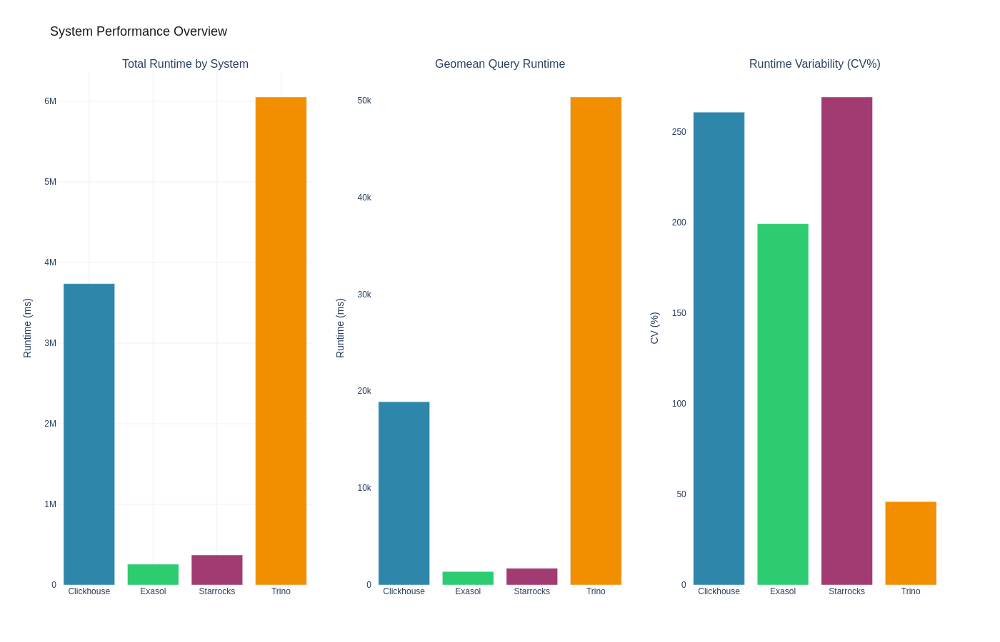
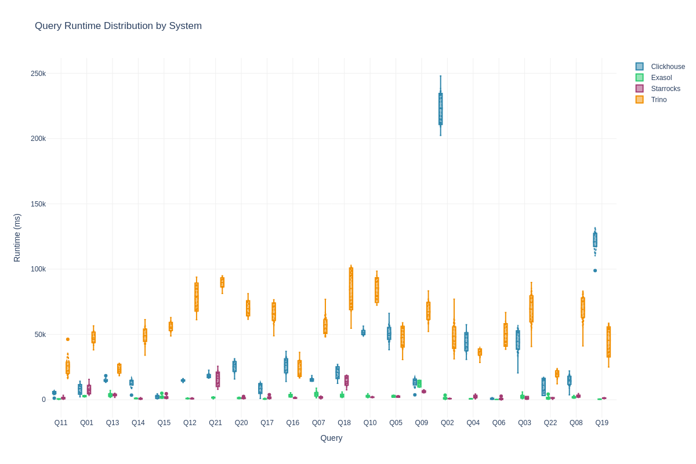
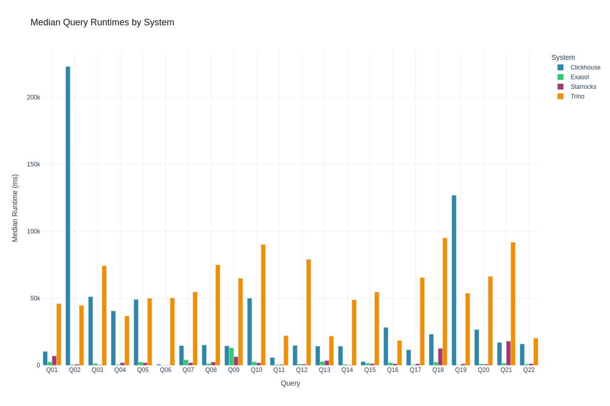
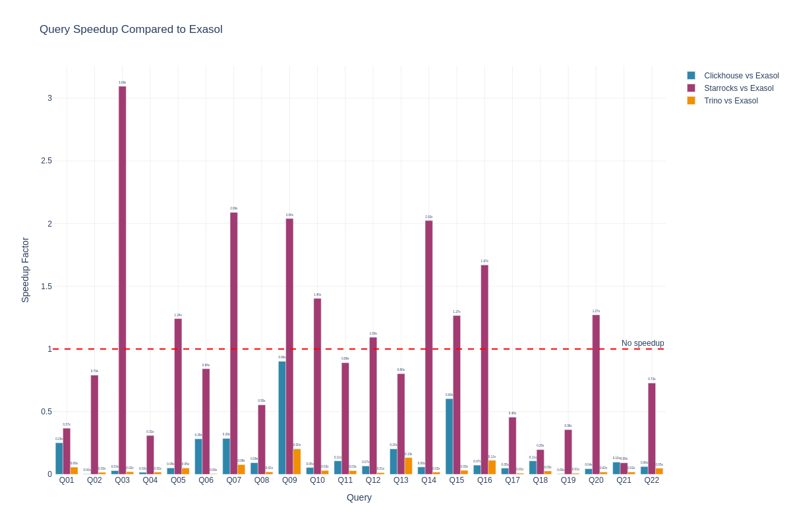
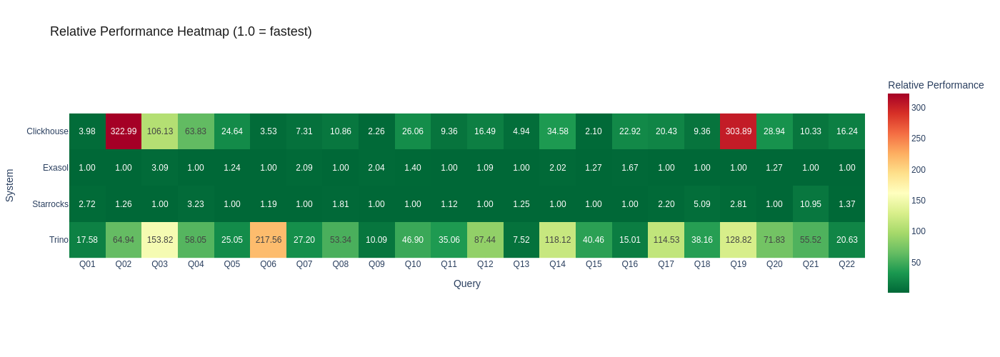

# Streamlined Scalability - Node Scaling (8 Nodes)

**Author:** Benchmark Team
**Environment:** aws / eu-west-1 / r6id.large
**Date:** N/A

> **Note:** Sensitive information (passwords, IP addresses) has been sanitized for security reasons. Placeholders like `<EXASOL_DB_PASSWORD>`, `<PRIVATE_IP>`, and `<PUBLIC_IP>` are used throughout this document. When reproducing this benchmark, substitute these with your actual credentials and addresses.

This document shows exactly how the benchmark was run so it can be reproduced.

## Executive Summary


## Systems Under Test

### Exasol 2025.2.0

**Software Configuration:**
- **Database:** exasol 2025.2.0
- **Setup method:** installer
- **Data device:** /dev/exasol.storage
- **Cluster configuration:** 8-node cluster


**Hardware Specifications:**
- **Cloud Provider:** AWS
- **Region:** eu-west-1
- **Instance Type:** r6id.large
- **Node Count:** 8 nodes
- **CPU:** Intel(R) Xeon(R) Platinum 8375C CPU @ 2.90GHz
- **CPU Cores per node:** 2 vCPUs (16 total vCPUs)
- **Memory per node:** 15.3GB RAM (122.4GB total RAM)
- **Node hostnames:**
  - exasol-node5: ip-10-0-1-13
  - exasol-node3: ip-10-0-1-169
  - exasol-node4: ip-10-0-1-52
  - exasol-node0: ip-10-0-1-150
  - exasol-node1: ip-10-0-1-181
  - exasol-node7: ip-10-0-1-197
  - exasol-node2: ip-10-0-1-230
  - exasol-node6: ip-10-0-1-138

### Clickhouse 26.1.3.52

**Software Configuration:**
- **Database:** clickhouse 26.1.3.52
- **Setup method:** native
- **Data directory:** /data/clickhouse
- **Cluster configuration:** 8-node cluster


**Hardware Specifications:**
- **Cloud Provider:** AWS
- **Region:** eu-west-1
- **Instance Type:** r6id.large
- **Node Count:** 8 nodes
- **CPU:** Intel(R) Xeon(R) Platinum 8375C CPU @ 2.90GHz
- **CPU Cores per node:** 2 vCPUs (16 total vCPUs)
- **Memory per node:** 15.3GB RAM (122.4GB total RAM)
- **Node hostnames:**
  - clickhouse-node7: ip-10-0-1-227
  - clickhouse-node3: ip-10-0-1-33
  - clickhouse-node6: ip-10-0-1-197
  - clickhouse-node1: ip-10-0-1-224
  - clickhouse-node5: ip-10-0-1-72
  - clickhouse-node4: ip-10-0-1-142
  - clickhouse-node2: ip-10-0-1-105
  - clickhouse-node0: ip-10-0-1-74

### Trino 479

**Software Configuration:**
- **Database:** trino 479
- **Setup method:** native
- **Cluster configuration:** 8-node cluster


**Hardware Specifications:**
- **Cloud Provider:** AWS
- **Region:** eu-west-1
- **Instance Type:** r6id.large
- **Node Count:** 8 nodes
- **CPU:** Intel(R) Xeon(R) Platinum 8375C CPU @ 2.90GHz
- **CPU Cores per node:** 2 vCPUs (16 total vCPUs)
- **Memory per node:** 15.3GB RAM (122.4GB total RAM)
- **Node hostnames:**
  - trino-node3: ip-10-0-1-247
  - trino-node4: ip-10-0-1-85
  - trino-node2: ip-10-0-1-17
  - trino-node5: ip-10-0-1-184
  - trino-node1: ip-10-0-1-68
  - trino-node0: ip-10-0-1-252
  - trino-node7: ip-10-0-1-202
  - trino-node6: ip-10-0-1-49

### Starrocks 4.0.6

**Software Configuration:**
- **Database:** starrocks 4.0.6
- **Setup method:** native
- **Cluster configuration:** 8-node cluster


**Hardware Specifications:**
- **Cloud Provider:** AWS
- **Region:** eu-west-1
- **Instance Type:** r6id.large
- **Node Count:** 8 nodes
- **CPU:** Intel(R) Xeon(R) Platinum 8375C CPU @ 2.90GHz
- **CPU Cores per node:** 2 vCPUs (16 total vCPUs)
- **Memory per node:** 15.3GB RAM (122.4GB total RAM)
- **Node hostnames:**
  - starrocks-node0: ip-10-0-1-189
  - starrocks-node6: ip-10-0-1-147
  - starrocks-node4: ip-10-0-1-153
  - starrocks-node2: ip-10-0-1-150
  - starrocks-node3: ip-10-0-1-135
  - starrocks-node1: ip-10-0-1-230
  - starrocks-node5: ip-10-0-1-148
  - starrocks-node7: ip-10-0-1-13


**Detailed system information:** See attachments for complete system specifications

## Test Environment

This benchmark was executed on the following infrastructure:

### Hardware Specifications

- **Cloud Provider:** AWS
- **Region:** eu-west-1
- **Exasol Instance:** r6id.large
- **Clickhouse Instance:** r6id.large
- **Trino Instance:** r6id.large
- **Starrocks Instance:** r6id.large


### Database Configuration

The following commands were **actually executed** during the benchmark setup. You can copy and paste these to reproduce the installation:

#### Exasol 2025.2.0 Setup

**Storage Configuration:**
```bash
# [All 8 Nodes] Create GPT partition table
sudo parted -s /dev/nvme1n1 mklabel gpt

# [All 8 Nodes] Create 70GB partition for data generation
sudo parted -s /dev/nvme1n1 mkpart primary ext4 1MiB 70GiB

# [All 8 Nodes] Create raw partition for Exasol (39GB)
sudo parted -s /dev/nvme1n1 mkpart primary 70GiB 100%

# [All 8 Nodes] Format /dev/nvme1n1p1 with ext4 filesystem
sudo mkfs.ext4 -F /dev/nvme1n1p1

# [All 8 Nodes] Create mount point /data
sudo mkdir -p /data

# [All 8 Nodes] Mount /dev/nvme1n1p1 to /data
sudo mount /dev/nvme1n1p1 /data

# [All 8 Nodes] Set ownership of /data to $(whoami):$(whoami)
sudo chown -R $(whoami):$(whoami) /data

```

**User Setup:**
```bash
# [All 8 Nodes] Create Exasol system user
sudo useradd -m -s /bin/bash exasol || true

# [All 8 Nodes] Add exasol user to sudo group
sudo usermod -aG sudo exasol || true

# Set password for exasol user (interactive)
sudo passwd exasol

```

**Tool Setup:**
```bash
# Download c4 cluster management tool v4.28.5
wget -q --tries=3 --retry-connrefused --waitretry=5 https://x-up.s3.amazonaws.com/releases/c4/linux/x86_64/4.28.5/c4 -O c4 &amp;&amp; chmod +x c4

```

**SSH Setup:**
```bash
# Generate SSH key pair for cluster communication
ssh-keygen -t rsa -b 2048 -f ~/.ssh/id_rsa -N &#34;&#34;

# [All 8 Nodes] Distribute ubuntu SSH key to exasol user
sudo mkdir -p ~exasol/.ssh &amp;&amp; echo &#39;ssh-rsa AAAAB3NzaC1yc2EAAAADAQABAAABAQCmo2+nc1FsSvh3neEY5pV0yoQmjkgCUs1mcDPfCn8qfThK7Pjx/6PevqphZLn0pYlZ4N0Xy9K7QwzQafLtkLCOrFVDTfeFBhlWTHOZz7S8wstrL6y2r0b7bMw+9+QqYxhyxkxCFdENIywGXRczZrjQQq9UrV4EMoiEKhp5dcHFWOZqTolSTy+LGpjkVpzyDO5843AQG98iA+4sVr34Nqz4W7/5ASmE+AoScQPec9L1gLCO9SL3JP6ZE68OjqM8vSWgSq/f618Kv8vvnyrHEjSDOv9QOfDILui6NXCjtXYZyoVdg04nzYzY62gJYIVrh0ijce4z4tQqTZ9CyMfnTqRf ubuntu@ip-10-0-1-150&#39; | sudo tee ~exasol/.ssh/authorized_keys &gt; /dev/null &amp;&amp; sudo chown -R exasol:exasol ~exasol/.ssh &amp;&amp; sudo chmod 700 ~exasol/.ssh &amp;&amp; sudo chmod 600 ~exasol/.ssh/authorized_keys

# [All 8 Nodes] Configure localhost SSH access to exasol user
ssh-keyscan -H localhost &gt;&gt; ~/.ssh/known_hosts 2&gt;/dev/null || true
ssh-keyscan -H 127.0.0.1 &gt;&gt; ~/.ssh/known_hosts 2&gt;/dev/null || true
mkdir -p ~/.ssh
touch ~/.ssh/config
grep -q &#34;Host localhost&#34; ~/.ssh/config 2&gt;/dev/null || cat &gt;&gt; ~/.ssh/config &lt;&lt; &#39;SSHEOF&#39;

Host localhost 127.0.0.1
    StrictHostKeyChecking no
    UserKnownHostsFile /dev/null
    LogLevel ERROR
SSHEOF
chmod 600 ~/.ssh/config

# [All 8 Nodes] Generate SSH key pair for exasol user
sudo -u exasol bash -c &#39;mkdir -p ~/.ssh &amp;&amp; chmod 700 ~/.ssh &amp;&amp; if [ ! -f ~/.ssh/id_rsa ]; then ssh-keygen -t rsa -b 2048 -f ~/.ssh/id_rsa -N &#34;&#34; -q; fi&#39;

# [All 8 Nodes] Cross-distribute exasol SSH keys for cluster communication
# Collect exasol public keys from all nodes, distribute to all authorized_keys
sudo cat ~exasol/.ssh/id_rsa.pub  # on each node
echo &#39;&lt;KEY&gt;&#39; | sudo tee -a ~exasol/.ssh/authorized_keys &gt; /dev/null
sudo chown exasol:exasol ~exasol/.ssh/authorized_keys &amp;&amp; sudo chmod 600 ~exasol/.ssh/authorized_keys

# [All 8 Nodes] Configure exasol SSH config for cluster nodes
sudo -u exasol bash -c &#39;
mkdir -p ~/.ssh &amp;&amp; chmod 700 ~/.ssh
touch ~/.ssh/config &amp;&amp; chmod 600 ~/.ssh/config
grep -q &#34;Host localhost&#34; ~/.ssh/config 2&gt;/dev/null || cat &gt;&gt; ~/.ssh/config &lt;&lt; SSHEOF

Host localhost 127.0.0.1 &lt;PRIVATE_IP&gt; &lt;PRIVATE_IP&gt; &lt;PRIVATE_IP&gt; &lt;PRIVATE_IP&gt; &lt;PRIVATE_IP&gt; &lt;PRIVATE_IP&gt; &lt;PRIVATE_IP&gt; &lt;PRIVATE_IP&gt; &lt;PUBLIC_IP&gt; &lt;PUBLIC_IP&gt; &lt;PUBLIC_IP&gt; &lt;PUBLIC_IP&gt; &lt;PUBLIC_IP&gt; &lt;PUBLIC_IP&gt; &lt;PUBLIC_IP&gt; &lt;PUBLIC_IP&gt;
    StrictHostKeyChecking no
    UserKnownHostsFile /dev/null
    LogLevel ERROR
SSHEOF
&#39;

```

**Configuration:**
```bash
# Create c4 configuration file on remote system
echo &#34;CCC_HOST_ADDRS=\&#34;&lt;PRIVATE_IP&gt; &lt;PRIVATE_IP&gt; &lt;PRIVATE_IP&gt; &lt;PRIVATE_IP&gt; &lt;PRIVATE_IP&gt; &lt;PRIVATE_IP&gt; &lt;PRIVATE_IP&gt; &lt;PRIVATE_IP&gt;\&#34;
CCC_HOST_EXTERNAL_ADDRS=\&#34;&lt;PUBLIC_IP&gt; &lt;PUBLIC_IP&gt; &lt;PUBLIC_IP&gt; &lt;PUBLIC_IP&gt; &lt;PUBLIC_IP&gt; &lt;PUBLIC_IP&gt; &lt;PUBLIC_IP&gt; &lt;PUBLIC_IP&gt;\&#34;
CCC_HOST_DATADISK=/dev/exasol.storage
CCC_HOST_IMAGE_USER=exasol
CCC_HOST_IMAGE_PASSWORD=&lt;EXASOL_IMAGE_PASSWORD&gt;
CCC_HOST_KEY_PAIR_FILE=id_rsa
CCC_PLAY_RESERVE_NODES=0
CCC_PLAY_WORKING_COPY=@exasol-2025.2.0
CCC_PLAY_DB_PASSWORD=&lt;EXASOL_DB_PASSWORD&gt;
CCC_PLAY_ADMIN_PASSWORD=&lt;EXASOL_ADMIN_PASSWORD&gt;
CCC_PLAY_DB_MEM_SIZE=96000
CCC_ADMINUI_START_SERVER=true&#34; | tee /tmp/exasol_c4.conf &gt; /dev/null

```

**Cluster Deployment:**
```bash
# Deploy Exasol cluster using c4
./c4 host play -i /tmp/exasol_c4.conf

```

**License Setup:**
```bash
# Install Exasol license file
confd_client license_upload license: &lt;LICENSE_CONTENT&gt;

```

**Database Tuning:**
```bash
# Stop Exasol database for parameter configuration
confd_client db_stop db_name: Exasol

# Configure Exasol database parameters for analytical workload optimization
confd_client db_configure db_name: Exasol params_add: &#34;[&#39;-writeTouchInit=1&#39;,&#39;-cacheMonitorLimit=0&#39;,&#39;-maxOverallSlbUsageRatio=0.95&#39;,&#39;-useQueryCache=0&#39;,&#39;-query_log_timeout=0&#39;,&#39;-joinOrderMethod=0&#39;,&#39;-etlCheckCertsDefault=0&#39;,&#39;-replicationborder=550000&#39;]&#34;

# Starting database with new parameters
confd_client db_start db_name: Exasol

```

**Setup:**
```bash
# [All 8 Nodes] Configuring passwordless sudo on all nodes
sudo sed -i &#34;/%sudo/s/) ALL$/) NOPASSWD: ALL/&#34; /etc/sudoers

```

**Cluster Management:**
```bash
# Get cluster play ID for confd_client operations
c4 ps

```


**Tuning Parameters:**
- Optimizer mode: `analytical`
- Database parameters:
  - `-writeTouchInit=1`
  - `-cacheMonitorLimit=0`
  - `-maxOverallSlbUsageRatio=0.95`
  - `-useQueryCache=0`
  - `-query_log_timeout=0`
  - `-joinOrderMethod=0`
  - `-etlCheckCertsDefault=0`
  - `-replicationborder=550000`

**Data Directory:** `None`


#### Trino 479 Setup

**Storage Configuration:**
```bash
# [All 8 Nodes] Format /dev/disk/by-id/nvme-Amazon_EC2_NVMe_Instance_Storage_AWS466FEF4B759BBAAB1 with ext4 filesystem
sudo mkfs.ext4 -F /dev/disk/by-id/nvme-Amazon_EC2_NVMe_Instance_Storage_AWS466FEF4B759BBAAB1

# [All 8 Nodes] Create mount point /data
sudo mkdir -p /data

# [All 8 Nodes] Mount /dev/disk/by-id/nvme-Amazon_EC2_NVMe_Instance_Storage_AWS466FEF4B759BBAAB1 to /data
sudo mount /dev/disk/by-id/nvme-Amazon_EC2_NVMe_Instance_Storage_AWS466FEF4B759BBAAB1 /data

# [All 8 Nodes] Set ownership of /data to ubuntu:ubuntu
sudo chown -R ubuntu:ubuntu /data

# [All 8 Nodes] Create trino data directory
sudo mkdir -p /data/trino &amp;&amp; sudo chmod 1777 /data/trino

```

**Prerequisites:**
```bash
# [All 8 Nodes] Add Eclipse Temurin (Adoptium) repository for Java 22
wget -qO - https://packages.adoptium.net/artifactory/api/gpg/key/public | sudo gpg --dearmor -o /usr/share/keyrings/adoptium.gpg 2&gt;/dev/null || true
echo &#34;deb [signed-by=/usr/share/keyrings/adoptium.gpg] https://packages.adoptium.net/artifactory/deb $(lsb_release -sc) main&#34; | sudo tee /etc/apt/sources.list.d/adoptium.list

# [All 8 Nodes] Install Java 25 (required by Trino 479+)
sudo apt-get update &amp;&amp; sudo apt-get install -y temurin-25-jdk

# [All 8 Nodes] Install python symlink (required by Trino launcher)
sudo apt-get install -y python-is-python3

```

**User Setup:**
```bash
# [All 8 Nodes] Create Trino system user
sudo useradd -r -s /bin/false trino || true

```

**Installation:**
```bash
# [All 8 Nodes] Download Trino server version 479
wget -q --tries=3 --retry-connrefused --waitretry=5 https://github.com/trinodb/trino/releases/download/479/trino-server-479.tar.gz -O /tmp/trino-server.tar.gz

# [All 8 Nodes] Extract Trino server to /opt
sudo tar -xzf /tmp/trino-server.tar.gz -C /opt/

# [All 8 Nodes] Create symlink /opt/trino-server
sudo ln -sf /opt/trino-server-479 /opt/trino-server

# [All 8 Nodes] Create Trino directories
sudo mkdir -p /var/trino/data /etc/trino /var/log/trino

# [All 8 Nodes] Create etc symlink for Trino launcher
sudo ln -sf /etc/trino /opt/trino-server/etc

```

**Configuration:**
```bash
# [All 8 Nodes] Configure Trino node properties
sudo tee /etc/trino/node.properties &gt; /dev/null &lt;&lt; &#39;EOF&#39;
node.environment=production
node.id=3bbe8f3e-3776-4ff2-9385-4741d44d2716
node.data-dir=/var/trino/data
EOF

# [All 8 Nodes] Configure JVM with 12G heap (80% of 15.3G total RAM)
sudo tee /etc/trino/jvm.config &gt; /dev/null &lt;&lt; &#39;EOF&#39;
-server
-Xmx12G
-Xms12G
-XX:+UseG1GC
-XX:G1HeapRegionSize=32M
-XX:+ExplicitGCInvokesConcurrent
-XX:+HeapDumpOnOutOfMemoryError
-XX:+ExitOnOutOfMemoryError
-XX:ReservedCodeCacheSize=512M
-Djdk.attach.allowAttachSelf=true
-Djdk.nio.maxCachedBufferSize=2000000
EOF

# [All 8 Nodes] Configure Trino as coordinator
sudo tee /etc/trino/config.properties &gt; /dev/null &lt;&lt; &#39;EOF&#39;
coordinator=true
node-scheduler.include-coordinator=true
http-server.http.port=8080
discovery.uri=http://&lt;PRIVATE_IP&gt;:8080
query.max-memory=72GB
query.max-memory-per-node=8GB
EOF

# [All 8 Nodes] Configure Hive catalog with file metastore at local:///data/trino/hive-metastore
sudo tee /etc/trino/catalog/hive.properties &gt; /dev/null &lt;&lt; &#39;EOF&#39;
connector.name=hive
hive.metastore=file
hive.metastore.catalog.dir=local:///data/trino/hive-metastore
hive.storage-format=PARQUET
hive.compression-codec=SNAPPY
fs.native-local.enabled=true
local.location=/
fs.native-s3.enabled=true
s3.region=eu-west-1
EOF

# [All 8 Nodes] Create Trino systemd service
sudo tee /etc/systemd/system/trino.service &gt; /dev/null &lt;&lt; &#39;EOF&#39;
[Unit]
Description=Trino Server
After=network.target

[Service]
Type=forking
User=trino
Group=trino
ExecStart=/opt/trino-server/bin/launcher start
ExecStop=/opt/trino-server/bin/launcher stop
Restart=on-failure
RestartSec=10

[Install]
WantedBy=multi-user.target
EOF

```

**Service Management:**
```bash
# [All 8 Nodes] Reload systemd daemon
sudo systemctl daemon-reload

# [All 8 Nodes] Start and enable Trino service
sudo systemctl start trino &amp;&amp; sudo systemctl enable trino

```

**Setup:**
```bash
# [All 8 Nodes] Execute sudo command on remote system
sudo mkdir -p /data/trino/hive-metastore

# [All 8 Nodes] Execute sudo command on remote system
sudo chown -R trino:trino /data/trino/hive-metastore

# [All 8 Nodes] Execute sudo command on remote system
sudo chmod -R 755 /data/trino/hive-metastore

# [All 8 Nodes] Execute sudo command on remote system
sudo mkdir -p /etc/trino/catalog

```


**Tuning Parameters:**

**Data Directory:** `/data/trino`


#### Starrocks 4.0.6 Setup

**Storage Configuration:**
```bash
# [All 8 Nodes] Format /dev/disk/by-id/nvme-Amazon_EC2_NVMe_Instance_Storage_AWS39DD5A2A744AA01EA with ext4 filesystem
sudo mkfs.ext4 -F /dev/disk/by-id/nvme-Amazon_EC2_NVMe_Instance_Storage_AWS39DD5A2A744AA01EA

# [All 8 Nodes] Create mount point /data
sudo mkdir -p /data

# [All 8 Nodes] Mount /dev/disk/by-id/nvme-Amazon_EC2_NVMe_Instance_Storage_AWS39DD5A2A744AA01EA to /data
sudo mount /dev/disk/by-id/nvme-Amazon_EC2_NVMe_Instance_Storage_AWS39DD5A2A744AA01EA /data

# [All 8 Nodes] Set ownership of /data to ubuntu:ubuntu
sudo chown -R ubuntu:ubuntu /data

# [All 8 Nodes] Create starrocks data directory
sudo mkdir -p /data/starrocks &amp;&amp; sudo chmod 1777 /data/starrocks

# [All 8 Nodes] Set ownership of /data/starrocks to ubuntu:ubuntu
sudo chown -R ubuntu:ubuntu /data/starrocks

```

**Prerequisites:**
```bash
# [All 8 Nodes] Install Java, MySQL client, and utilities
sudo apt-get update &amp;&amp; sudo apt-get install -y openjdk-17-jdk curl wget mysql-client

# [All 8 Nodes] Set JAVA_HOME environment variable
echo &#34;export JAVA_HOME=/usr/lib/jvm/java-17-openjdk-amd64&#34; | sudo tee -a /etc/profile.d/java.sh

```

**Installation:**
```bash
# [All 8 Nodes] Extract StarRocks to installation directory
sudo mkdir -p /opt/starrocks &amp;&amp; sudo tar -xzf /tmp/starrocks-4.0.6.tar.gz -C /opt/starrocks --strip-components=1

# [All 8 Nodes] Set StarRocks directory ownership
sudo chown -R $(whoami):$(whoami) /opt/starrocks

```

**Configuration:**
```bash
# [All 8 Nodes] Configure StarRocks FE
sudo tee /opt/starrocks/fe/conf/fe.conf &gt; /dev/null &lt;&lt; &#39;EOF&#39;
# StarRocks FE Configuration
LOG_DIR = /opt/starrocks/fe/log
meta_dir = /opt/starrocks/fe/meta
http_port = 8030
rpc_port = 9020
query_port = 9030
edit_log_port = 9010
priority_networks = &lt;PRIVATE_IP&gt;/24
# Performance tuning
qe_max_connection = 1024
# Memory settings
metadata_memory_limit = 8G

EOF

# [All 8 Nodes] Configure StarRocks BE
sudo tee /opt/starrocks/be/conf/be.conf &gt; /dev/null &lt;&lt; &#39;EOF&#39;
# StarRocks BE Configuration
LOG_DIR = /opt/starrocks/be/log
be_port = 9060
be_http_port = 8040
heartbeat_service_port = 9050
brpc_port = 8060
priority_networks = &lt;PRIVATE_IP&gt;/24
storage_root_path = /data/starrocks
# Performance tuning - aggressive memory use with spill fallback
mem_limit = 90%
# Parallel execution
parallel_fragment_exec_instance_num = 16
# Spill-to-disk for memory-intensive queries (safety net)
spill_local_storage_dir = /data/starrocks/spill
enable_spill = true
spill_mode = auto

EOF

```

**Service Management:**
```bash
# [All 8 Nodes] Start StarRocks FE
export JAVA_HOME=/usr/lib/jvm/java-17-openjdk-amd64 &amp;&amp; cd /opt/starrocks/fe &amp;&amp; ./bin/start_fe.sh --daemon

# [All 8 Nodes] Start StarRocks BE
export JAVA_HOME=/usr/lib/jvm/java-17-openjdk-amd64 &amp;&amp; cd /opt/starrocks/be &amp;&amp; ./bin/start_be.sh --daemon

# Start FE on follower nodes to join cluster
export JAVA_HOME=/usr/lib/jvm/java-17-openjdk-amd64 &amp;&amp; cd /opt/starrocks/fe &amp;&amp; ./bin/start_fe.sh --helper &lt;PRIVATE_IP&gt;:9010 --daemon

```

**Setup:**
```bash
# [All 8 Nodes] Execute test command on remote system
test -f /tmp/starrocks-4.0.6.tar.gz &amp;&amp; echo exists

```

**Cluster Configuration:**
```bash
# Add FE follower node 1
mysql -h &lt;PRIVATE_IP&gt; -P 9030 -u root -e &#34;ALTER SYSTEM ADD FOLLOWER &#39;&lt;PRIVATE_IP&gt;:9010&#39;&#34;

# Register BE on node 0
mysql -h &lt;PRIVATE_IP&gt; -P 9030 -u root -e &#34;ALTER SYSTEM ADD BACKEND &#39;&lt;PRIVATE_IP&gt;:9050&#39;&#34;

```


**Tuning Parameters:**

**Data Directory:** `/data/starrocks`


#### Clickhouse 26.1.3.52 Setup

**Storage Configuration:**
```bash
# [All 8 Nodes] Format /dev/disk/by-id/nvme-Amazon_EC2_NVMe_Instance_Storage_AWS48B58CD4D211693BE with ext4 filesystem
sudo mkfs.ext4 -F /dev/disk/by-id/nvme-Amazon_EC2_NVMe_Instance_Storage_AWS48B58CD4D211693BE

# [All 8 Nodes] Create mount point /data
sudo mkdir -p /data

# [All 8 Nodes] Mount /dev/disk/by-id/nvme-Amazon_EC2_NVMe_Instance_Storage_AWS48B58CD4D211693BE to /data
sudo mount /dev/disk/by-id/nvme-Amazon_EC2_NVMe_Instance_Storage_AWS48B58CD4D211693BE /data

# [All 8 Nodes] Set ownership of /data to ubuntu:ubuntu
sudo chown -R ubuntu:ubuntu /data

# [All 8 Nodes] Create clickhouse data directory
sudo mkdir -p /data/clickhouse &amp;&amp; sudo chmod 1777 /data/clickhouse

# [All 8 Nodes] Set ownership of /data/clickhouse to clickhouse:clickhouse
sudo chown -R clickhouse:clickhouse /data/clickhouse

```

**Prerequisites:**
```bash
# [All 8 Nodes] Update package lists
sudo apt-get update

# [All 8 Nodes] Install prerequisite packages for secure repository access
sudo apt-get install -y apt-transport-https ca-certificates curl gnupg

```

**Repository Setup:**
```bash
# [All 8 Nodes] Add ClickHouse GPG key to system keyring
curl -fsSL &#39;https://packages.clickhouse.com/rpm/lts/repodata/repomd.xml.key&#39; | sudo gpg --dearmor -o /usr/share/keyrings/clickhouse-keyring.gpg

# [All 8 Nodes] Add ClickHouse official repository to APT sources
ARCH=$(dpkg --print-architecture) &amp;&amp; echo &#34;deb [signed-by=/usr/share/keyrings/clickhouse-keyring.gpg arch=${ARCH}] https://packages.clickhouse.com/deb stable main&#34; | sudo tee /etc/apt/sources.list.d/clickhouse.list

# [All 8 Nodes] Update package lists with ClickHouse repository
sudo apt-get update

```

**Installation:**
```bash
# [All 8 Nodes] Install ClickHouse server and client version &lt;PUBLIC_IP&gt;
DEBIAN_FRONTEND=noninteractive sudo -E apt-get install -y clickhouse-common-static=26.1.3.52 clickhouse-server=26.1.3.52 clickhouse-client=26.1.3.52

```

**Configuration:**
```bash
# [All 8 Nodes] Create custom ClickHouse configuration file
sudo tee /etc/clickhouse-server/config.d/benchmark.xml &gt; /dev/null &lt;&lt; &#39;EOF&#39;
&lt;clickhouse&gt;
    &lt;listen_host&gt;::&lt;/listen_host&gt;
    &lt;path&gt;/data/clickhouse&lt;/path&gt;
    &lt;tmp_path&gt;/data/clickhouse/tmp&lt;/tmp_path&gt;
    &lt;max_server_memory_usage&gt;13175789977&lt;/max_server_memory_usage&gt;
    &lt;max_concurrent_queries&gt;14&lt;/max_concurrent_queries&gt;
    &lt;background_pool_size&gt;16&lt;/background_pool_size&gt;
    &lt;background_schedule_pool_size&gt;2&lt;/background_schedule_pool_size&gt;
    &lt;max_table_size_to_drop&gt;50000000000&lt;/max_table_size_to_drop&gt;
&lt;/clickhouse&gt;
EOF

```

**User Configuration:**
```bash
# [All 8 Nodes] Configure ClickHouse user profile with password and query settings
sudo tee /etc/clickhouse-server/users.d/benchmark.xml &gt; /dev/null &lt;&lt; &#39;EOF&#39;
&lt;clickhouse&gt;
    &lt;users&gt;
        &lt;default replace=&#34;true&#34;&gt;
            &lt;password_sha256_hex&gt;2cca9d8714615f4132390a3db9296d39ec051b3faff87be7ea5f7fe0e2de14c9&lt;/password_sha256_hex&gt;
            &lt;networks&gt;
                &lt;ip&gt;::/0&lt;/ip&gt;
            &lt;/networks&gt;
        &lt;/default&gt;
    &lt;/users&gt;
    &lt;profiles&gt;
        &lt;default&gt;
            &lt;max_threads&gt;2&lt;/max_threads&gt;
            &lt;max_memory_usage&gt;3000000000&lt;/max_memory_usage&gt;
            &lt;max_bytes_before_external_sort&gt;1000000000&lt;/max_bytes_before_external_sort&gt;
            &lt;max_bytes_before_external_group_by&gt;1000000000&lt;/max_bytes_before_external_group_by&gt;
            &lt;join_use_nulls&gt;1&lt;/join_use_nulls&gt;
            &lt;allow_experimental_correlated_subqueries&gt;1&lt;/allow_experimental_correlated_subqueries&gt;
            &lt;optimize_read_in_order&gt;1&lt;/optimize_read_in_order&gt;
            &lt;max_insert_threads&gt;8&lt;/max_insert_threads&gt;
            &lt;distributed_product_mode&gt;global&lt;/distributed_product_mode&gt;
        &lt;/default&gt;
    &lt;/profiles&gt;
&lt;/clickhouse&gt;
EOF

```

**Service Management:**
```bash
# [All 8 Nodes] Start ClickHouse server service
sudo systemctl start clickhouse-server

# [All 8 Nodes] Enable ClickHouse server to start on boot
sudo systemctl enable clickhouse-server

```

**Cluster Configuration:**
```bash
# Create cluster configuration (remote_servers.xml) on all nodes
sudo tee /etc/clickhouse-server/config.d/remote_servers.xml &gt; /dev/null &lt;&lt; &#39;EOF&#39;
&lt;clickhouse&gt;
    &lt;remote_servers&gt;
        &lt;benchmark_cluster&gt;
        &lt;shard&gt;
            &lt;replica&gt;
                &lt;host&gt;&lt;PRIVATE_IP&gt;&lt;/host&gt;
                &lt;port&gt;9000&lt;/port&gt;
                &lt;user&gt;default&lt;/user&gt;
                &lt;password&gt;&lt;DATABASE_PASSWORD&gt;&lt;/password&gt;
            &lt;/replica&gt;
        &lt;/shard&gt;
        &lt;shard&gt;
            &lt;replica&gt;
                &lt;host&gt;&lt;PRIVATE_IP&gt;&lt;/host&gt;
                &lt;port&gt;9000&lt;/port&gt;
                &lt;user&gt;default&lt;/user&gt;
                &lt;password&gt;&lt;DATABASE_PASSWORD&gt;&lt;/password&gt;
            &lt;/replica&gt;
        &lt;/shard&gt;
        &lt;shard&gt;
            &lt;replica&gt;
                &lt;host&gt;&lt;PRIVATE_IP&gt;&lt;/host&gt;
                &lt;port&gt;9000&lt;/port&gt;
                &lt;user&gt;default&lt;/user&gt;
                &lt;password&gt;&lt;DATABASE_PASSWORD&gt;&lt;/password&gt;
            &lt;/replica&gt;
        &lt;/shard&gt;
        &lt;shard&gt;
            &lt;replica&gt;
                &lt;host&gt;&lt;PRIVATE_IP&gt;&lt;/host&gt;
                &lt;port&gt;9000&lt;/port&gt;
                &lt;user&gt;default&lt;/user&gt;
                &lt;password&gt;&lt;DATABASE_PASSWORD&gt;&lt;/password&gt;
            &lt;/replica&gt;
        &lt;/shard&gt;
        &lt;shard&gt;
            &lt;replica&gt;
                &lt;host&gt;&lt;PRIVATE_IP&gt;&lt;/host&gt;
                &lt;port&gt;9000&lt;/port&gt;
                &lt;user&gt;default&lt;/user&gt;
                &lt;password&gt;&lt;DATABASE_PASSWORD&gt;&lt;/password&gt;
            &lt;/replica&gt;
        &lt;/shard&gt;
        &lt;shard&gt;
            &lt;replica&gt;
                &lt;host&gt;&lt;PRIVATE_IP&gt;&lt;/host&gt;
                &lt;port&gt;9000&lt;/port&gt;
                &lt;user&gt;default&lt;/user&gt;
                &lt;password&gt;&lt;DATABASE_PASSWORD&gt;&lt;/password&gt;
            &lt;/replica&gt;
        &lt;/shard&gt;
        &lt;shard&gt;
            &lt;replica&gt;
                &lt;host&gt;&lt;PRIVATE_IP&gt;&lt;/host&gt;
                &lt;port&gt;9000&lt;/port&gt;
                &lt;user&gt;default&lt;/user&gt;
                &lt;password&gt;&lt;DATABASE_PASSWORD&gt;&lt;/password&gt;
            &lt;/replica&gt;
        &lt;/shard&gt;
        &lt;shard&gt;
            &lt;replica&gt;
                &lt;host&gt;&lt;PRIVATE_IP&gt;&lt;/host&gt;
                &lt;port&gt;9000&lt;/port&gt;
                &lt;user&gt;default&lt;/user&gt;
                &lt;password&gt;&lt;DATABASE_PASSWORD&gt;&lt;/password&gt;
            &lt;/replica&gt;
        &lt;/shard&gt;
        &lt;/benchmark_cluster&gt;
    &lt;/remote_servers&gt;
&lt;/clickhouse&gt;
EOF

# Create node-specific macros (example for node 0)
sudo tee /etc/clickhouse-server/config.d/macros.xml &gt; /dev/null &lt;&lt; &#39;EOF&#39;
&lt;clickhouse&gt;
    &lt;macros&gt;
        &lt;cluster&gt;benchmark_cluster&lt;/cluster&gt;
        &lt;shard&gt;1&lt;/shard&gt;
        &lt;replica&gt;node1&lt;/replica&gt;
    &lt;/macros&gt;
&lt;/clickhouse&gt;
EOF

# Restart ClickHouse on all nodes (parallel for Keeper quorum)
sudo systemctl restart clickhouse-server

```

**Keeper Configuration:**
```bash
# Create ClickHouse Keeper server config (example for node 0)
sudo tee /etc/clickhouse-server/config.d/keeper.xml &gt; /dev/null &lt;&lt; &#39;EOF&#39;
&lt;clickhouse&gt;
    &lt;keeper_server&gt;
        &lt;tcp_port&gt;9181&lt;/tcp_port&gt;
        &lt;server_id&gt;1&lt;/server_id&gt;
        &lt;log_storage_path&gt;/var/lib/clickhouse/coordination/log&lt;/log_storage_path&gt;
        &lt;snapshot_storage_path&gt;/var/lib/clickhouse/coordination/snapshots&lt;/snapshot_storage_path&gt;
        &lt;coordination_settings&gt;
            &lt;operation_timeout_ms&gt;10000&lt;/operation_timeout_ms&gt;
            &lt;session_timeout_ms&gt;30000&lt;/session_timeout_ms&gt;
            &lt;raft_logs_level&gt;warning&lt;/raft_logs_level&gt;
        &lt;/coordination_settings&gt;
        &lt;raft_configuration&gt;
            &lt;server&gt;
                &lt;id&gt;1&lt;/id&gt;
                &lt;hostname&gt;&lt;PRIVATE_IP&gt;&lt;/hostname&gt;
                &lt;port&gt;9234&lt;/port&gt;
            &lt;/server&gt;
            &lt;server&gt;
                &lt;id&gt;2&lt;/id&gt;
                &lt;hostname&gt;&lt;PRIVATE_IP&gt;&lt;/hostname&gt;
                &lt;port&gt;9234&lt;/port&gt;
            &lt;/server&gt;
            &lt;server&gt;
                &lt;id&gt;3&lt;/id&gt;
                &lt;hostname&gt;&lt;PRIVATE_IP&gt;&lt;/hostname&gt;
                &lt;port&gt;9234&lt;/port&gt;
            &lt;/server&gt;
            &lt;server&gt;
                &lt;id&gt;4&lt;/id&gt;
                &lt;hostname&gt;&lt;PRIVATE_IP&gt;&lt;/hostname&gt;
                &lt;port&gt;9234&lt;/port&gt;
            &lt;/server&gt;
            &lt;server&gt;
                &lt;id&gt;5&lt;/id&gt;
                &lt;hostname&gt;&lt;PRIVATE_IP&gt;&lt;/hostname&gt;
                &lt;port&gt;9234&lt;/port&gt;
            &lt;/server&gt;
            &lt;server&gt;
                &lt;id&gt;6&lt;/id&gt;
                &lt;hostname&gt;&lt;PRIVATE_IP&gt;&lt;/hostname&gt;
                &lt;port&gt;9234&lt;/port&gt;
            &lt;/server&gt;
            &lt;server&gt;
                &lt;id&gt;7&lt;/id&gt;
                &lt;hostname&gt;&lt;PRIVATE_IP&gt;&lt;/hostname&gt;
                &lt;port&gt;9234&lt;/port&gt;
            &lt;/server&gt;
            &lt;server&gt;
                &lt;id&gt;8&lt;/id&gt;
                &lt;hostname&gt;&lt;PRIVATE_IP&gt;&lt;/hostname&gt;
                &lt;port&gt;9234&lt;/port&gt;
            &lt;/server&gt;
        &lt;/raft_configuration&gt;
    &lt;/keeper_server&gt;
&lt;/clickhouse&gt;
EOF

# Create ZooKeeper client config pointing to Keeper cluster
sudo tee /etc/clickhouse-server/config.d/use_keeper.xml &gt; /dev/null &lt;&lt; &#39;EOF&#39;
&lt;clickhouse&gt;
    &lt;zookeeper&gt;
        &lt;node&gt;
            &lt;host&gt;&lt;PRIVATE_IP&gt;&lt;/host&gt;
            &lt;port&gt;9181&lt;/port&gt;
        &lt;/node&gt;
        &lt;node&gt;
            &lt;host&gt;&lt;PRIVATE_IP&gt;&lt;/host&gt;
            &lt;port&gt;9181&lt;/port&gt;
        &lt;/node&gt;
        &lt;node&gt;
            &lt;host&gt;&lt;PRIVATE_IP&gt;&lt;/host&gt;
            &lt;port&gt;9181&lt;/port&gt;
        &lt;/node&gt;
        &lt;node&gt;
            &lt;host&gt;&lt;PRIVATE_IP&gt;&lt;/host&gt;
            &lt;port&gt;9181&lt;/port&gt;
        &lt;/node&gt;
        &lt;node&gt;
            &lt;host&gt;&lt;PRIVATE_IP&gt;&lt;/host&gt;
            &lt;port&gt;9181&lt;/port&gt;
        &lt;/node&gt;
        &lt;node&gt;
            &lt;host&gt;&lt;PRIVATE_IP&gt;&lt;/host&gt;
            &lt;port&gt;9181&lt;/port&gt;
        &lt;/node&gt;
        &lt;node&gt;
            &lt;host&gt;&lt;PRIVATE_IP&gt;&lt;/host&gt;
            &lt;port&gt;9181&lt;/port&gt;
        &lt;/node&gt;
        &lt;node&gt;
            &lt;host&gt;&lt;PRIVATE_IP&gt;&lt;/host&gt;
            &lt;port&gt;9181&lt;/port&gt;
        &lt;/node&gt;
    &lt;/zookeeper&gt;
    &lt;distributed_ddl&gt;
        &lt;path&gt;/clickhouse/task_queue/ddl&lt;/path&gt;
    &lt;/distributed_ddl&gt;
&lt;/clickhouse&gt;
EOF

```


**Tuning Parameters:**
- Memory limit: `12g`
- Max threads: `2`
- Max memory usage: `3.0GB`

**Data Directory:** `/data/clickhouse`


## Workload Configuration

### Benchmark Parameters

- **Workload:** TPCH
- **Scale factor:** 50
- **Data format:** csv
- **Queries tested:** All standard TPCH queries (Q01-Q22)
- **Warmup runs per query:** 1
- **Measured runs per query:** 5
- **Execution mode:** Multiuser (4 concurrent streams)
- **Query distribution:** Randomized (seed: 42)
### Execution Command

This benchmark is completely self-contained and includes all tuning configurations:

```bash
# Extract and run the benchmark
unzip extscal_nodes_8-benchmark.zip
cd extscal_nodes_8

# Execute the complete benchmark
./run_benchmark.sh
```

**Manual execution steps:**
```bash
# Install dependencies
pip install -r requirements.txt

# Probe system information
python -m benchkit probe --config config.yaml

# Run benchmark with all configurations applied
python -m benchkit run --config config.yaml
```

**Note:** All database tuning parameters and system configurations are embedded in the benchmark package and applied automatically during execution.

## Results

### Infrastructure Setup Timings


### Workload Preparation Timings

The following table shows the time taken for data generation, schema creation, and data loading for each system:

| System | Data Generation | Schema Creation | Data Loading | Total Preparation | Raw Size | Stored Size | Compression |
|--------|----------------|-----------------|--------------|-------------------|----------|-------------|-------------|
| Clickhouse | 1543.80s | 1.87s | 658.73s | 2229.53s | N/A | N/A | N/A |
| Starrocks | 1531.62s | 0.40s | 456.64s | 2034.33s | 5.5 GB | 5.5 GB | 1.0x |
| Trino | 455.78s | 3.04s | 0.00s | 515.87s | N/A | N/A | N/A |
| Exasol | 989.36s | 3.06s | 589.55s | 1655.38s | 47.9 GB | 10.8 GB | 4.4x |

**Key Observations:**
- Trino had the fastest preparation time at 515.87s
- Clickhouse took 2229.53s (4.3x slower)

### Performance Summary

| query   | system     |   runs |   median_ms |   mean_ms |   std_ms |   min_ms |   max_ms |
|---------|------------|--------|-------------|-----------|----------|----------|----------|
| Q01     | clickhouse |      5 |     10439.7 |    8496.7 |   4838.6 |   2180.5 |  14183.5 |
| Q01     | exasol     |      5 |      2623.5 |    2730.4 |    506   |   2104.3 |   3326.5 |
| Q01     | starrocks  |      5 |      7141.3 |    8149.6 |   4693.2 |   3795   |  15616.7 |
| Q01     | trino      |      5 |     46118.7 |   47363.3 |   6772.9 |  38221.2 |  56654.8 |
| Q02     | clickhouse |      5 |    223092   |  223443   |  17214.7 | 202465   | 247938   |
| Q02     | exasol     |      5 |       690.7 |    1244.1 |   1292.8 |    409.2 |   3523.3 |
| Q02     | starrocks  |      5 |       873.5 |     876.7 |    201.8 |    628.2 |   1187.5 |
| Q02     | trino      |      5 |     44856.5 |   48777.4 |  17079.6 |  31268.3 |  77020.9 |
| Q03     | clickhouse |      5 |     51312.7 |   44721.5 |  14029.4 |  20568.9 |  54948.4 |
| Q03     | exasol     |      5 |      1496.2 |    2414.9 |   2068.1 |    804   |   5946.9 |
| Q03     | starrocks  |      5 |       483.5 |    1275.9 |   1136.1 |    389.8 |   2568   |
| Q03     | trino      |      5 |     74372.6 |   69397.6 |  18182.4 |  40703.9 |  89825.4 |
| Q04     | clickhouse |      5 |     40629.3 |   43612.6 |  10176.3 |  30814.1 |  57502.3 |
| Q04     | exasol     |      5 |       636.5 |     715.9 |    164.8 |    586   |    963.4 |
| Q04     | starrocks  |      5 |      2056.5 |    2389.9 |   1445.1 |    686.1 |   4454.5 |
| Q04     | trino      |      5 |     36949.7 |   35873.9 |   4300.2 |  28523.9 |  38953.2 |
| Q05     | clickhouse |      5 |     49232.3 |   50872.2 |   9976.1 |  38340   |  66139.5 |
| Q05     | exasol     |      5 |      2481.1 |    2595.3 |    765   |   1850.6 |   3496.8 |
| Q05     | starrocks  |      5 |      1998.3 |    2351.3 |    607.4 |   1883.8 |   3221.1 |
| Q05     | trino      |      5 |     50063.7 |   47710.3 |  11145.5 |  30745.8 |  58950.4 |
| Q06     | clickhouse |      5 |       817.9 |     817.1 |    547.2 |    218.6 |   1606.1 |
| Q06     | exasol     |      5 |       231.4 |     226.6 |     31.2 |    180.5 |    256.7 |
| Q06     | starrocks  |      5 |       275   |     736.4 |   1148.2 |     90   |   2777   |
| Q06     | trino      |      5 |     50344.3 |   50585.2 |  11298.6 |  38573.2 |  66827.9 |
| Q07     | clickhouse |      5 |     14729.8 |   15364.4 |   1843.1 |  14054.5 |  18566   |
| Q07     | exasol     |      5 |      4206.7 |    4418.6 |   2776.5 |   1371.1 |   8897.4 |
| Q07     | starrocks  |      5 |      2013.7 |    1783.5 |    849.1 |    618.8 |   2859.8 |
| Q07     | trino      |      5 |     54781.9 |   57490.4 |  11299.5 |  48153.7 |  76957.2 |
| Q08     | clickhouse |      5 |     15278.1 |   14428.4 |   6672.6 |   3762.4 |  22112.3 |
| Q08     | exasol     |      5 |      1406.7 |    1898.1 |    877.4 |   1302.1 |   3365.7 |
| Q08     | starrocks  |      5 |      2540.9 |    2846.4 |   1158.5 |   1803.2 |   4707   |
| Q08     | trino      |      5 |     75038.5 |   69118.8 |  16225.3 |  41159.8 |  82527.5 |
| Q09     | clickhouse |      5 |     14588.7 |   12840.2 |   5200.9 |   3703.1 |  16376.3 |
| Q09     | exasol     |      5 |     13143.1 |   12471.2 |   2652.7 |   9494.5 |  14955   |
| Q09     | starrocks  |      5 |      6443.2 |    6349.6 |    956.9 |   5227.4 |   7673   |
| Q09     | trino      |      5 |     65040.3 |   67364.9 |  11335.9 |  52297.8 |  83333   |
| Q10     | clickhouse |      5 |     50139.4 |   51520.6 |   2919   |  49082   |  56421.4 |
| Q10     | exasol     |      5 |      2699.1 |    2800.9 |   1169.7 |   1526.3 |   4659.4 |
| Q10     | starrocks  |      5 |      1924.1 |    1944.5 |    358.3 |   1517.5 |   2499.9 |
| Q10     | trino      |      5 |     90249   |   85639.9 |  11254   |  72432.3 |  98461.3 |
| Q11     | clickhouse |      5 |      5926.1 |    5115   |   2223.7 |   1183.8 |   6571.3 |
| Q11     | exasol     |      5 |       633.3 |     553.1 |    210.3 |    243.1 |    740.5 |
| Q11     | starrocks  |      5 |       711.8 |    1319.4 |   1214.4 |    587.5 |   3447.3 |
| Q11     | trino      |      5 |     22205.8 |   25923.5 |  11611.5 |  16885.6 |  46257.7 |
| Q12     | clickhouse |      5 |     14923   |   14764   |   1087.7 |  13181   |  16202.8 |
| Q12     | exasol     |      5 |       988.8 |     982.8 |    286.8 |    620   |   1405.9 |
| Q12     | starrocks  |      5 |       904.8 |     912.8 |    385.4 |    517.4 |   1523.3 |
| Q12     | trino      |      5 |     79116.9 |   78454.5 |  13172.2 |  61318.6 |  93931   |
| Q13     | clickhouse |      5 |     14400.3 |   14965.7 |   1968.2 |  13314.9 |  18387.9 |
| Q13     | exasol     |      5 |      2914   |    3623.1 |   2047.8 |   1725.4 |   7037.2 |
| Q13     | starrocks  |      5 |      3631.5 |    3593.6 |   1194.2 |   1708.9 |   4991.2 |
| Q13     | trino      |      5 |     21909.8 |   23257.7 |   4028.3 |  18416.7 |  27811.8 |
| Q14     | clickhouse |      5 |     14369.3 |   12344.6 |   4950.3 |   3533.2 |  15238.4 |
| Q14     | exasol     |      5 |       840.8 |     989.6 |    303.3 |    747.8 |   1450.6 |
| Q14     | starrocks  |      5 |       415.5 |     741.1 |    544.9 |    339.3 |   1607   |
| Q14     | trino      |      5 |     49079.1 |   48905   |   9799   |  34100.9 |  61407.3 |
| Q15     | clickhouse |      5 |      2838   |    2403.1 |   1565.1 |    652.6 |   4501.4 |
| Q15     | exasol     |      5 |      1711.7 |    2169.2 |   1593.4 |   1092   |   4956.4 |
| Q15     | starrocks  |      5 |      1352   |    1872.7 |   1538.3 |    825.1 |   4593.6 |
| Q15     | trino      |      5 |     54703.8 |   55755.9 |   5202.5 |  48785.4 |  62937.3 |
| Q16     | clickhouse |      5 |     28382.6 |   26357.8 |   8590.1 |  13944.7 |  37069.5 |
| Q16     | exasol     |      5 |      2067.2 |    3045.3 |   1495.9 |   2022.6 |   5401.6 |
| Q16     | starrocks  |      5 |      1238.3 |    1383.4 |    452.3 |    989.7 |   2131.7 |
| Q16     | trino      |      5 |     18591.6 |   23539.6 |   8382.5 |  16738.5 |  36297.7 |
| Q17     | clickhouse |      5 |     11688.7 |    8751.1 |   5087.1 |   1030.4 |  12552.2 |
| Q17     | exasol     |      5 |       572   |     641.3 |    332.8 |    303.5 |   1189.2 |
| Q17     | starrocks  |      5 |      1256.1 |    1652.9 |   1245.2 |    756.9 |   3830.1 |
| Q17     | trino      |      5 |     65509.8 |   65796.7 |  10706.1 |  48962.2 |  76626.8 |
| Q18     | clickhouse |      5 |     23328.1 |   21010.9 |   5928.8 |  12546.1 |  27118.9 |
| Q18     | exasol     |      5 |      2493.5 |    3170.2 |   1683.7 |   1690.4 |   5923   |
| Q18     | starrocks  |      5 |     12686.2 |   13880.7 |   4644.5 |   7521.6 |  18821.8 |
| Q18     | trino      |      5 |     95142.3 |   85171.9 |  20404.8 |  54777.3 | 101490   |
| Q19     | clickhouse |      5 |    127025   |  121005   |  12499.5 |  98881.9 | 128485   |
| Q19     | exasol     |      5 |       418   |     422.6 |    124.2 |    291.1 |    612.7 |
| Q19     | starrocks  |      5 |      1174.2 |    1187.9 |    321.4 |    782.8 |   1654.5 |
| Q19     | trino      |      5 |     53848.1 |   45547.1 |  14600.1 |  25062.9 |  58569.8 |
| Q20     | clickhouse |      5 |     26763.2 |   25240   |   5954.2 |  15894   |  31403.4 |
| Q20     | exasol     |      5 |      1175.8 |    1263.4 |    504.7 |    737.6 |   1955   |
| Q20     | starrocks  |      5 |       924.9 |    1261.2 |    703.3 |    825.4 |   2500.4 |
| Q20     | trino      |      5 |     66435.9 |   69697.8 |   7892.5 |  61595.4 |  81285.7 |
| Q21     | clickhouse |      5 |     17103.3 |   18294.9 |   2474.4 |  16565.5 |  22598.5 |
| Q21     | exasol     |      5 |      1655.9 |    1616.4 |    603.5 |    690.5 |   2316.3 |
| Q21     | starrocks  |      5 |     18137.2 |   16452.8 |   7113.2 |   7974.3 |  25624.7 |
| Q21     | trino      |      5 |     91942.6 |   89831.9 |   5347.4 |  81376.6 |  94959   |
| Q22     | clickhouse |      5 |     16049.1 |   11066.8 |   7193.7 |   3150.1 |  16536.1 |
| Q22     | exasol     |      5 |       988   |    1473.9 |   1619.8 |    344.7 |   4320.1 |
| Q22     | starrocks  |      5 |      1357   |    1269   |    541.7 |    345.3 |   1696   |
| Q22     | trino      |      5 |     20380.5 |   19450.5 |   4354.6 |  12183.7 |  23596.2 |


### Visualizations

#### Performance Overview



*Comprehensive dashboard showing key performance metrics: total runtime, average query time, query count, and performance variability (coefficient of variation) across all systems.*

**Interactive version:** [View interactive chart](attachments/figures/system_performance_overview.html) for detailed insights and hover information.

#### Runtime Distributions



*Box plot showing the distribution of query runtimes. The box shows the interquartile range (25th to 75th percentile), with the median marked by the line inside the box. Whiskers extend to show the full range, excluding outliers.*

**Interactive version:** [View interactive chart](attachments/figures/query_runtime_boxplot.html) for detailed query-by-query analysis.



*Bar chart comparing median query runtimes across systems. Lower bars indicate better performance.*

**Interactive version:** [View interactive chart](attachments/figures/median_runtime_bar.html) to explore individual query performance.

#### Comparative Analysis



*Speedup factor comparing each system against the baseline. Values above 1.0 indicate faster performance than the baseline, while values below 1.0 indicate slower performance.*

**Interactive version:** [View interactive chart](attachments/figures/speedup_comparison.html) to compare performance across queries.



*Heatmap showing relative performance across queries and systems. Values are normalized so that 1.0 represents the fastest system for each query. Darker colors indicate better performance.*

**Interactive version:** [View interactive chart](attachments/figures/performance_heatmap.html) for detailed heat map analysis.


> **Note:** All visualizations are available as both static PNG images (shown above) and interactive HTML charts (linked). The interactive versions allow you to zoom, pan, and hover for detailed information.

### Key Observations


### Raw Data

The complete dataset is available in the following files:
- **Query results:** [`attachments/runs.csv`](attachments/runs.csv)
- **Summary statistics:** [`attachments/summary.json`](attachments/summary.json)
- **System information:** [`attachments/system.json`](attachments/system.json)
- **Benchmark package:** [`extscal_nodes_8-benchmark.zip`](extscal_nodes_8-benchmark.zip)

## Reproducibility

### System Requirements

Based on our testing environment:

- **CPU:** 2 logical cores
- **Memory:** 15.3GB RAM
- **Storage:** NVMe SSD recommended for optimal performance
- **OS:** Linux

### Configuration Files

The exact configuration used for this benchmark is available at:
[`attachments/config.yaml`](attachments/config.yaml)

### System Specifications

**Exasol 2025.2.0:**
- **Setup method:** installer
- **Data directory:** 
- **Applied configurations:**
  - optimizer_mode: analytical
  - db_params: [&#39;-writeTouchInit=1&#39;, &#39;-cacheMonitorLimit=0&#39;, &#39;-maxOverallSlbUsageRatio=0.95&#39;, &#39;-useQueryCache=0&#39;, &#39;-query_log_timeout=0&#39;, &#39;-joinOrderMethod=0&#39;, &#39;-etlCheckCertsDefault=0&#39;, &#39;-replicationborder=550000&#39;]

**Clickhouse 26.1.3.52:**
- **Setup method:** native
- **Data directory:** /data/clickhouse
- **Applied configurations:**
  - memory_limit: 12g
  - max_threads: 2
  - max_memory_usage: 3000000000
  - max_bytes_before_external_group_by: 1000000000
  - max_bytes_before_external_sort: 1000000000
  - join_algorithm: grace_hash
  - max_bytes_in_join: 2000000000

**Trino 479:**
- **Setup method:** native
- **Data directory:** 
- **Applied configurations:**
  - query_max_memory: 72GB
  - query_max_memory_per_node: 9GB

**Starrocks 4.0.6:**
- **Setup method:** native
- **Data directory:** 
- **Applied configurations:**
  - bucket_count: 32
  - replication_num: 1


## Methodology Notes

**Environment Consistency:**
- All systems tested on identical hardware specifications
- Same operating system and software versions
- Consistent resource allocation and container limits

**Execution Protocol:**
- 1 warmup run(s) per query (sequential, results discarded)
- 5 measured runs per query (results recorded)
- Measured runs executed across 4 concurrent streams (randomized distribution)
- Wall-clock time measured by benchmark client
- Database processes restarted between test runs for consistency

**Configuration Management:**
- All tuning parameters documented in this post
- Configuration commands provided for exact reproduction
- System-specific optimizations applied as documented above
- Benchmark package contains all configuration files and scripts