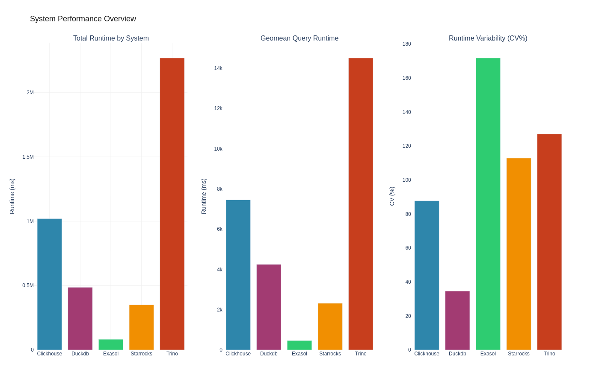
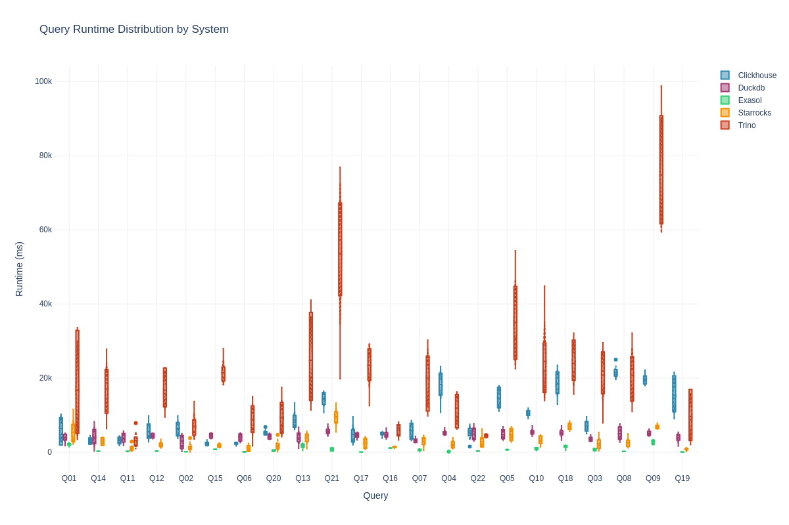
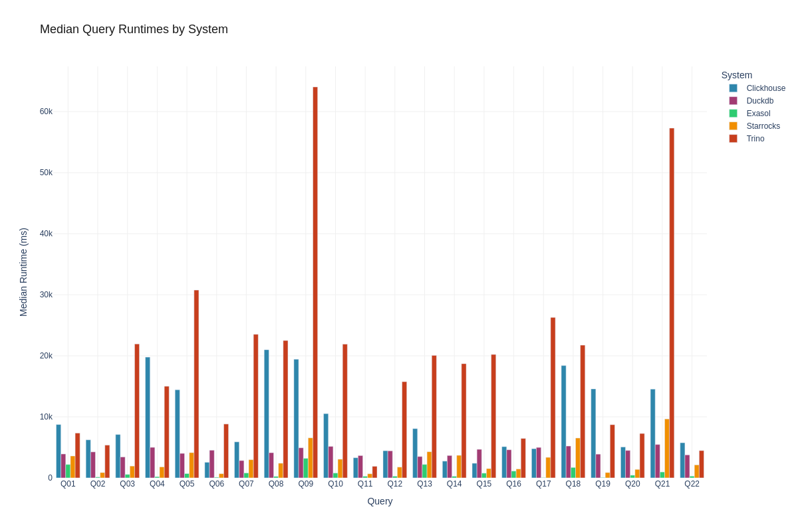
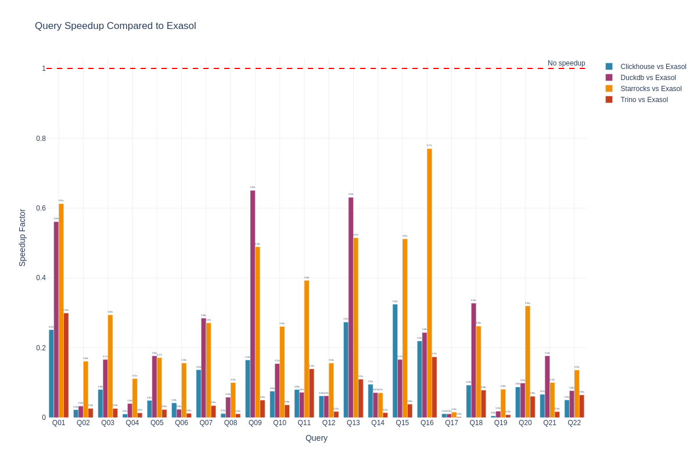
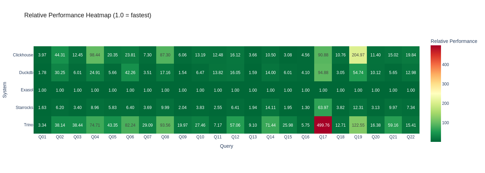

# Streamlined Scalability - Stream Scaling (8 Streams)

**Author:** Benchmark Team
**Environment:** aws / eu-west-1 / r6id.8xlarge
**Date:** 2026-02-17 17:36:58

> **Note:** Sensitive information (passwords, IP addresses) has been sanitized for security reasons. Placeholders like `<EXASOL_DB_PASSWORD>`, `<PRIVATE_IP>`, and `<PUBLIC_IP>` are used throughout this document. When reproducing this benchmark, substitute these with your actual credentials and addresses.

This document shows exactly how the benchmark was run so it can be reproduced.

## Executive Summary

We compared 5 database systems:
- **clickhouse**
- **duckdb**
- **exasol**
- **starrocks**
- **trino**

**Key Findings:**
- exasol was the fastest overall with 338.8ms median runtime
- trino was 48.4x slower- Tested 550 total query executions across 22 different TPC-H queries
- **Execution mode:** Multiuser with 8 concurrent streams (randomized distribution)

## Systems Under Test

### Exasol 2025.2.0

**Software Configuration:**
- **Database:** exasol 2025.2.0
- **Setup method:** installer
- **Data device:** /dev/exasol.storage


**Hardware Specifications:**
- **Cloud Provider:** AWS
- **Region:** eu-west-1
- **Instance Type:** r6id.8xlarge
- **CPU:** Intel(R) Xeon(R) Platinum 8375C CPU @ 2.90GHz
- **CPU Cores:** 32 vCPUs
- **Memory:** 247.7GB RAM
- **Hostname:** ip-10-0-1-196

### Clickhouse 26.1.3.52

**Software Configuration:**
- **Database:** clickhouse 26.1.3.52
- **Setup method:** native
- **Data directory:** /data/clickhouse


**Hardware Specifications:**
- **Cloud Provider:** AWS
- **Region:** eu-west-1
- **Instance Type:** r6id.8xlarge
- **CPU:** Intel(R) Xeon(R) Platinum 8375C CPU @ 2.90GHz
- **CPU Cores:** 32 vCPUs
- **Memory:** 247.7GB RAM
- **Hostname:** ip-10-0-1-10

### Trino 479

**Software Configuration:**
- **Database:** trino 479
- **Setup method:** native


**Hardware Specifications:**
- **Cloud Provider:** AWS
- **Region:** eu-west-1
- **Instance Type:** r6id.8xlarge
- **CPU:** Intel(R) Xeon(R) Platinum 8375C CPU @ 2.90GHz
- **CPU Cores:** 32 vCPUs
- **Memory:** 247.7GB RAM
- **Hostname:** ip-10-0-1-178

### Starrocks 4.0.6

**Software Configuration:**
- **Database:** starrocks 4.0.6
- **Setup method:** native


**Hardware Specifications:**
- **Cloud Provider:** AWS
- **Region:** eu-west-1
- **Instance Type:** r6id.8xlarge
- **CPU:** Intel(R) Xeon(R) Platinum 8375C CPU @ 2.90GHz
- **CPU Cores:** 32 vCPUs
- **Memory:** 247.7GB RAM
- **Hostname:** ip-10-0-1-29

### Duckdb 1.4.4

**Software Configuration:**
- **Database:** duckdb 1.4.4
- **Setup method:** native
- **Data directory:** /data/duckdb


**Hardware Specifications:**
- **Cloud Provider:** AWS
- **Region:** eu-west-1
- **Instance Type:** r6id.8xlarge
- **CPU:** Intel(R) Xeon(R) Platinum 8375C CPU @ 2.90GHz
- **CPU Cores:** 32 vCPUs
- **Memory:** 247.7GB RAM
- **Hostname:** ip-10-0-1-78


**Detailed system information:** See attachments for complete system specifications

## Test Environment

This benchmark was executed on the following infrastructure:

### Hardware Specifications

- **Cloud Provider:** AWS
- **Region:** eu-west-1
- **Exasol Instance:** r6id.8xlarge
- **Clickhouse Instance:** r6id.8xlarge
- **Trino Instance:** r6id.8xlarge
- **Starrocks Instance:** r6id.8xlarge
- **Duckdb Instance:** r6id.8xlarge


### Database Configuration

The following commands were **actually executed** during the benchmark setup. You can copy and paste these to reproduce the installation:

#### Exasol 2025.2.0 Setup

**Storage Configuration:**
```bash
# Create GPT partition table
sudo parted -s /dev/nvme1n1 mklabel gpt

# Create 70GB partition for data generation
sudo parted -s /dev/nvme1n1 mkpart primary ext4 1MiB 70GiB

# Create raw partition for Exasol (1699GB)
sudo parted -s /dev/nvme1n1 mkpart primary 70GiB 100%

# Format /dev/nvme1n1p1 with ext4 filesystem
sudo mkfs.ext4 -F /dev/nvme1n1p1

# Create mount point /data
sudo mkdir -p /data

# Mount /dev/nvme1n1p1 to /data
sudo mount /dev/nvme1n1p1 /data

# Set ownership of /data to $(whoami):$(whoami)
sudo chown -R $(whoami):$(whoami) /data

```

**User Setup:**
```bash
# Create Exasol system user
sudo useradd -m -s /bin/bash exasol || true

# Add exasol user to sudo group
sudo usermod -aG sudo exasol || true

# Set password for exasol user (interactive)
sudo passwd exasol

```

**SSH Setup:**
```bash
# Generate SSH key pair for cluster communication
ssh-keygen -t rsa -b 2048 -f ~/.ssh/id_rsa -N &#34;&#34;

# Distribute ubuntu SSH key to exasol user
sudo mkdir -p ~exasol/.ssh &amp;&amp; echo &#39;ssh-rsa AAAAB3NzaC1yc2EAAAADAQABAAABAQCddWe0MSlyC1+QQ5tTWyWMoOZKUSOPDVqgjZBIH4XFUxKQ4iHiIQGBLunnymNVVl96/USqHd8ELxrLTE9vnLJhVd+Iq3tyO96/2na8EB0N2LScHFPRgJr1mXtsdu4uj/yrbTcwO6DLJP7hewlX42mB+V3e4rMievYrLgsSPSwfagPKZ+YJ3SHza5LneAuNLRqbYe9saE12AnhBijbvU32qgneq1XKcdZBmW1AKuA8AxBw9fF8UrMkhS1A4/eMOKABJTceVWjPWBKizuwXQOcypGWk1QywyIMxiAd41iF5TCqfA+clXA9dm7/DuxQMukJ6iemDENkPcYg5wtU5pPabx ubuntu@ip-10-0-1-196&#39; | sudo tee ~exasol/.ssh/authorized_keys &gt; /dev/null &amp;&amp; sudo chown -R exasol:exasol ~exasol/.ssh &amp;&amp; sudo chmod 700 ~exasol/.ssh &amp;&amp; sudo chmod 600 ~exasol/.ssh/authorized_keys

# Configure localhost SSH access to exasol user
ssh-keyscan -H localhost &gt;&gt; ~/.ssh/known_hosts 2&gt;/dev/null || true
ssh-keyscan -H 127.0.0.1 &gt;&gt; ~/.ssh/known_hosts 2&gt;/dev/null || true
mkdir -p ~/.ssh
touch ~/.ssh/config
grep -q &#34;Host localhost&#34; ~/.ssh/config 2&gt;/dev/null || cat &gt;&gt; ~/.ssh/config &lt;&lt; &#39;SSHEOF&#39;

Host localhost 127.0.0.1
    StrictHostKeyChecking no
    UserKnownHostsFile /dev/null
    LogLevel ERROR
SSHEOF
chmod 600 ~/.ssh/config

# Generate SSH key pair for exasol user
sudo -u exasol bash -c &#39;mkdir -p ~/.ssh &amp;&amp; chmod 700 ~/.ssh &amp;&amp; if [ ! -f ~/.ssh/id_rsa ]; then ssh-keygen -t rsa -b 2048 -f ~/.ssh/id_rsa -N &#34;&#34; -q; fi&#39;

# [All 1 Nodes] Cross-distribute exasol SSH keys for cluster communication
# Collect exasol public keys from all nodes, distribute to all authorized_keys
sudo cat ~exasol/.ssh/id_rsa.pub  # on each node
echo &#39;&lt;KEY&gt;&#39; | sudo tee -a ~exasol/.ssh/authorized_keys &gt; /dev/null
sudo chown exasol:exasol ~exasol/.ssh/authorized_keys &amp;&amp; sudo chmod 600 ~exasol/.ssh/authorized_keys

# Configure exasol SSH config for cluster nodes
sudo -u exasol bash -c &#39;
mkdir -p ~/.ssh &amp;&amp; chmod 700 ~/.ssh
touch ~/.ssh/config &amp;&amp; chmod 600 ~/.ssh/config
grep -q &#34;Host localhost&#34; ~/.ssh/config 2&gt;/dev/null || cat &gt;&gt; ~/.ssh/config &lt;&lt; SSHEOF

Host localhost 127.0.0.1 &lt;PRIVATE_IP&gt; &lt;PUBLIC_IP&gt;
    StrictHostKeyChecking no
    UserKnownHostsFile /dev/null
    LogLevel ERROR
SSHEOF
&#39;

```

**License Setup:**
```bash
# Install Exasol license file
confd_client license_upload license: &lt;LICENSE_CONTENT&gt;

```

**Database Tuning:**
```bash
# Stop Exasol database for parameter configuration
confd_client db_stop db_name: Exasol

# Configure Exasol database parameters for analytical workload optimization
confd_client db_configure db_name: Exasol params_add: &#34;[&#39;-writeTouchInit=1&#39;,&#39;-cacheMonitorLimit=0&#39;,&#39;-maxOverallSlbUsageRatio=0.95&#39;,&#39;-useQueryCache=0&#39;,&#39;-query_log_timeout=0&#39;,&#39;-joinOrderMethod=0&#39;,&#39;-etlCheckCertsDefault=0&#39;]&#34;

# Starting database with new parameters
confd_client db_start db_name: Exasol

```

**Setup:**
```bash
# Configuring passwordless sudo on all nodes
sudo sed -i &#34;/%sudo/s/) ALL$/) NOPASSWD: ALL/&#34; /etc/sudoers

```


**Tuning Parameters:**
- Optimizer mode: `analytical`
- Database parameters:
  - `-writeTouchInit=1`
  - `-cacheMonitorLimit=0`
  - `-maxOverallSlbUsageRatio=0.95`
  - `-useQueryCache=0`
  - `-query_log_timeout=0`
  - `-joinOrderMethod=0`
  - `-etlCheckCertsDefault=0`

**Data Directory:** `None`


#### Trino 479 Setup

**Storage Configuration:**
```bash
# Format /dev/disk/by-id/nvme-Amazon_EC2_NVMe_Instance_Storage_AWS646BA6C32B2530433 with ext4 filesystem
sudo mkfs.ext4 -F /dev/disk/by-id/nvme-Amazon_EC2_NVMe_Instance_Storage_AWS646BA6C32B2530433

# Create mount point /data
sudo mkdir -p /data

# Mount /dev/disk/by-id/nvme-Amazon_EC2_NVMe_Instance_Storage_AWS646BA6C32B2530433 to /data
sudo mount /dev/disk/by-id/nvme-Amazon_EC2_NVMe_Instance_Storage_AWS646BA6C32B2530433 /data

# Set ownership of /data to ubuntu:ubuntu
sudo chown -R ubuntu:ubuntu /data

# Create trino data directory
sudo mkdir -p /data/trino

```

**Installation:**
```bash
# Create Trino directories
sudo mkdir -p /var/trino/data /etc/trino /var/log/trino

```


**Tuning Parameters:**

**Data Directory:** `/data/trino`


#### Starrocks 4.0.6 Setup

**Storage Configuration:**
```bash
# Format /dev/disk/by-id/nvme-Amazon_EC2_NVMe_Instance_Storage_AWS22597D209069DB9C5 with ext4 filesystem
sudo mkfs.ext4 -F /dev/disk/by-id/nvme-Amazon_EC2_NVMe_Instance_Storage_AWS22597D209069DB9C5

# Create mount point /data
sudo mkdir -p /data

# Mount /dev/disk/by-id/nvme-Amazon_EC2_NVMe_Instance_Storage_AWS22597D209069DB9C5 to /data
sudo mount /dev/disk/by-id/nvme-Amazon_EC2_NVMe_Instance_Storage_AWS22597D209069DB9C5 /data

# Set ownership of /data to ubuntu:ubuntu
sudo chown -R ubuntu:ubuntu /data

# Create starrocks data directory
sudo mkdir -p /data/starrocks &amp;&amp; sudo chmod 1777 /data/starrocks

# Set ownership of /data/starrocks to ubuntu:ubuntu
sudo chown -R ubuntu:ubuntu /data/starrocks

```


**Tuning Parameters:**

**Data Directory:** `/data/starrocks`


#### Clickhouse 26.1.3.52 Setup

**Storage Configuration:**
```bash
# Format /dev/disk/by-id/nvme-Amazon_EC2_NVMe_Instance_Storage_AWS43F5AA420927A5803 with ext4 filesystem
sudo mkfs.ext4 -F /dev/disk/by-id/nvme-Amazon_EC2_NVMe_Instance_Storage_AWS43F5AA420927A5803

# Create mount point /data
sudo mkdir -p /data

# Mount /dev/disk/by-id/nvme-Amazon_EC2_NVMe_Instance_Storage_AWS43F5AA420927A5803 to /data
sudo mount /dev/disk/by-id/nvme-Amazon_EC2_NVMe_Instance_Storage_AWS43F5AA420927A5803 /data

# Set ownership of /data to ubuntu:ubuntu
sudo chown -R ubuntu:ubuntu /data

# Create clickhouse data directory
sudo mkdir -p /data/clickhouse &amp;&amp; sudo chmod 1777 /data/clickhouse

```


**Tuning Parameters:**
- Memory limit: `192g`
- Max threads: `32`
- Max memory usage: `24.0GB`

**Data Directory:** `/data/clickhouse`


#### Duckdb 1.4.4 Setup

**Storage Configuration:**
```bash
# Format /dev/disk/by-id/nvme-Amazon_EC2_NVMe_Instance_Storage_AWS43EF37F44E2BFC9D7 with ext4 filesystem
sudo mkfs.ext4 -F /dev/disk/by-id/nvme-Amazon_EC2_NVMe_Instance_Storage_AWS43EF37F44E2BFC9D7

# Create mount point /data
sudo mkdir -p /data

# Mount /dev/disk/by-id/nvme-Amazon_EC2_NVMe_Instance_Storage_AWS43EF37F44E2BFC9D7 to /data
sudo mount /dev/disk/by-id/nvme-Amazon_EC2_NVMe_Instance_Storage_AWS43EF37F44E2BFC9D7 /data

# Set ownership of /data to ubuntu:ubuntu
sudo chown -R ubuntu:ubuntu /data

# Create duckdb data directory
sudo mkdir -p /data/duckdb

# Set ownership of /data/duckdb to ubuntu:ubuntu
sudo chown -R ubuntu:ubuntu /data/duckdb

```

**Preparation:**
```bash
# Create DuckDB data directory: /data/duckdb
sudo mkdir -p /data/duckdb &amp;&amp; sudo chown ubuntu:ubuntu /data/duckdb

```


**Tuning Parameters:**
- Memory limit: `192GB`

**Data Directory:** `/data/duckdb`


## Workload Configuration

### Benchmark Parameters

- **Workload:** TPCH
- **Scale factor:** 50
- **Data format:** csv
- **Queries tested:** All standard TPCH queries (Q01-Q22)
- **Warmup runs per query:** 1
- **Measured runs per query:** 5
- **Execution mode:** Multiuser (8 concurrent streams)
- **Query distribution:** Randomized (seed: 42)
### Execution Command

This benchmark is completely self-contained and includes all tuning configurations:

```bash
# Extract and run the benchmark
unzip extscal_streams_8-benchmark.zip
cd extscal_streams_8

# Execute the complete benchmark
./run_benchmark.sh
```

**Manual execution steps:**
```bash
# Install dependencies
pip install -r requirements.txt

# Probe system information
python -m benchkit probe --config config.yaml

# Run benchmark with all configurations applied
python -m benchkit run --config config.yaml
```

**Note:** All database tuning parameters and system configurations are embedded in the benchmark package and applied automatically during execution.

## Results

### Infrastructure Setup Timings


### Workload Preparation Timings

The following table shows the time taken for data generation, schema creation, and data loading for each system:

| System | Data Generation | Schema Creation | Data Loading | Total Preparation | Raw Size | Stored Size | Compression |
|--------|----------------|-----------------|--------------|-------------------|----------|-------------|-------------|
| Clickhouse | 378.70s | 0.10s | 204.61s | 791.93s | 57.2 GB | 21.9 GB | 2.6x |
| Starrocks | 378.52s | 0.09s | 310.61s | 845.55s | 6.0 GB | 6.0 GB | 1.0x |
| Trino | 38.12s | 0.30s | 0.00s | 57.08s | N/A | N/A | N/A |
| Duckdb | 386.27s | 0.02s | 95.50s | 488.40s | 412.9 MB | N/A | N/A |
| Exasol | 131.17s | 1.96s | 230.23s | 414.21s | 47.9 GB | 10.5 GB | 4.6x |

**Key Observations:**
- Trino had the fastest preparation time at 57.08s
- Starrocks took 845.55s (14.8x slower)

### Performance Summary

| query   | system     |   warmup |   runs |   median_ms |   mean_ms |   std_ms |   min_ms |   max_ms |
|---------|------------|----------|--------|-------------|-----------|----------|----------|----------|
| Q01     | clickhouse |   1265.2 |      5 |      8738.6 |    6377.2 |   4108.3 |   1901.7 |  10226   |
| Q01     | duckdb     |    628   |      5 |      3918.2 |    3855   |   1293.3 |   1731.8 |   4994.5 |
| Q01     | exasol     |    410.7 |      5 |      2198.6 |    2096.7 |    422.6 |   1425.4 |   2587.3 |
| Q01     | starrocks  |   1974.2 |      5 |      3588.1 |    5368.5 |   3740   |   2542.8 |  11555.2 |
| Q01     | trino      |   3938.8 |      5 |      7344.8 |   16688   |  15032.7 |   4514.8 |  33645.1 |
| Q02     | clickhouse |    612.7 |      5 |      6234.5 |    6383.2 |   2407   |   3754.8 |   9857.9 |
| Q02     | duckdb     |    193.4 |      5 |      4256.8 |    3015.9 |   2147.9 |    173.9 |   5037.7 |
| Q02     | exasol     |     64.4 |      5 |       140.7 |     143.9 |     16.6 |    128   |    171.6 |
| Q02     | starrocks  |    281.2 |      5 |       872.1 |    1390.1 |   1358.3 |    665.9 |   3814   |
| Q02     | trino      |   3146.7 |      5 |      5366.3 |    6944.8 |   3960.9 |   3666.8 |  13703.6 |
| Q03     | clickhouse |   2080.2 |      5 |      7106.2 |    7099.8 |   1756.1 |   5016   |   9563   |
| Q03     | duckdb     |    439.2 |      5 |      3430.1 |    3558.9 |    739.9 |   2861.1 |   4733.2 |
| Q03     | exasol     |    183.7 |      5 |       570.8 |     671.3 |    322.4 |    308.5 |   1031.1 |
| Q03     | starrocks  |    498.7 |      5 |      1940.1 |    2315.1 |   1898.7 |    360.5 |   5353.2 |
| Q03     | trino      |   8383.9 |      5 |     21943.4 |   20807.7 |   8358.9 |   7911.1 |  29557.4 |
| Q04     | clickhouse |   7241.9 |      5 |     19777   |   18245.4 |   4763.2 |  10712.6 |  23137.8 |
| Q04     | duckdb     |    430   |      5 |      5004.1 |    5215.3 |    810.1 |   4573.3 |   6605.7 |
| Q04     | exasol     |     36.8 |      5 |       200.9 |     191.5 |     31.9 |    135.8 |    216.2 |
| Q04     | starrocks  |    411.9 |      5 |      1799.9 |    2112.8 |   1167.2 |   1110.2 |   3925.9 |
| Q04     | trino      |   3773.6 |      5 |     15009.2 |   11915.4 |   5006.3 |   6273.9 |  16256.4 |
| Q05     | clickhouse |   2500   |      5 |     14440.3 |   14616   |   3039.4 |  11029.2 |  17952.3 |
| Q05     | duckdb     |    486.1 |      5 |      4014.8 |    4766.4 |   1500.1 |   3423.6 |   6920.6 |
| Q05     | exasol     |    171.4 |      5 |       709.6 |     695.9 |     87.8 |    553.9 |    794.6 |
| Q05     | starrocks  |    454.5 |      5 |      4138.4 |    4664.2 |   1834.1 |   2708.2 |   6870.8 |
| Q05     | trino      |   4305.7 |      5 |     30760.5 |   34983.2 |  12982.4 |  22503.9 |  54344.8 |
| Q06     | clickhouse |    111.6 |      5 |      2554.6 |    2365.1 |    402.1 |   1679.6 |   2643.3 |
| Q06     | duckdb     |    115.3 |      5 |      4534.8 |    4051.2 |   1125.1 |   2562.9 |   5164.9 |
| Q06     | exasol     |     24.7 |      5 |       107.3 |     108.2 |     61.5 |     44   |    188.6 |
| Q06     | starrocks  |     55.7 |      5 |       687   |    1011   |    957.6 |    180.2 |   2405.2 |
| Q06     | trino      |   1708.6 |      5 |      8824.7 |    8757.6 |   5051   |   1719.7 |  15022.6 |
| Q07     | clickhouse |   4851.5 |      5 |      5901.9 |    5762.4 |   2374.5 |   3110.6 |   8556.9 |
| Q07     | duckdb     |    469.4 |      5 |      2839.9 |    3122.3 |    703.7 |   2602.1 |   4298.1 |
| Q07     | exasol     |    140.5 |      5 |       808.6 |     624.6 |    305.5 |    133.7 |    848.3 |
| Q07     | starrocks  |    575.1 |      5 |      2980.8 |    2876.5 |   1490.8 |    557.5 |   4528.4 |
| Q07     | trino      |   4569.1 |      5 |     23520.8 |   19919.5 |   8851.2 |   9793.4 |  30229   |
| Q08     | clickhouse |   3498.9 |      5 |     20994.6 |   21554.3 |   2013.3 |  19615.1 |  24958.1 |
| Q08     | duckdb     |    468.4 |      5 |      4127.4 |    4973.4 |   2075.9 |   2723.7 |   7645.6 |
| Q08     | exasol     |     46.4 |      5 |       240.5 |     230.9 |     28.9 |    194.1 |    268   |
| Q08     | starrocks  |    470.7 |      5 |      2401.5 |    2597.4 |   1413.6 |   1484.1 |   4974.2 |
| Q08     | trino      |   4194.7 |      5 |     22500.7 |   20786.9 |   8268.4 |  10933.2 |  32130.8 |
| Q09     | clickhouse |   2718.2 |      5 |     19439.3 |   19648.7 |   1588.3 |  18089.7 |  22159.1 |
| Q09     | duckdb     |   1423.8 |      5 |      4928.6 |    5112.1 |    746.6 |   4307.7 |   6237.3 |
| Q09     | exasol     |    483.3 |      5 |      3206.5 |    3049.1 |    385.8 |   2360   |   3242.7 |
| Q09     | starrocks  |   1599.7 |      5 |      6554.6 |    6819.5 |    666.2 |   6261.2 |   7885   |
| Q09     | trino      |  21267   |      5 |     64036.8 |   74793.7 |  17467.2 |  61321   |  98785.2 |
| Q10     | clickhouse |   2684   |      5 |     10525.9 |   10537.7 |   1059.7 |   9034.4 |  11924.7 |
| Q10     | duckdb     |    691.3 |      5 |      5157.8 |    5412.2 |   1028.9 |   4307.5 |   7103.7 |
| Q10     | exasol     |    340.8 |      5 |       797.8 |     913.9 |    360.4 |    450.7 |   1308   |
| Q10     | starrocks  |    682.6 |      5 |      3056.8 |    3224.3 |   1301.7 |   1420.2 |   4614.9 |
| Q10     | trino      |   3923.5 |      5 |     21911.4 |   24486.2 |  12017.7 |  14774.7 |  44830.2 |
| Q11     | clickhouse |    487.8 |      5 |      3301.6 |    3169   |   1083   |   1721.2 |   4395.2 |
| Q11     | duckdb     |     72.3 |      5 |      3656.1 |    3817.6 |   1519.9 |   1811.8 |   5718.2 |
| Q11     | exasol     |    123   |      5 |       264.5 |     240.6 |     61.8 |    158.3 |    299.9 |
| Q11     | starrocks  |     99.8 |      5 |       673.4 |    1055.8 |   1044.6 |    274.9 |   2882.8 |
| Q11     | trino      |   1057.8 |      5 |      1896.6 |    3157.2 |   2659.5 |   1594.2 |   7850.6 |
| Q12     | clickhouse |   1336.3 |      5 |      4449.7 |    5613.4 |   2774   |   2825.1 |   9840.3 |
| Q12     | duckdb     |    424.4 |      5 |      4432.2 |    4419.1 |    669.6 |   3625.7 |   5148.1 |
| Q12     | exasol     |     53.5 |      5 |       276.1 |     290.8 |     33.3 |    263.5 |    338.3 |
| Q12     | starrocks  |    174.5 |      5 |      1768.5 |    2020.7 |    889   |   1103.7 |   3475.2 |
| Q12     | trino      |   2104.5 |      5 |     15753.2 |   16762.9 |   5901.1 |   9425   |  22801.2 |
| Q13     | clickhouse |   2085   |      5 |      8066.3 |    8649.8 |   2788.7 |   6153.8 |  13290.2 |
| Q13     | duckdb     |   1190.9 |      5 |      3498.5 |    3888   |   2055.2 |   1097.4 |   6753   |
| Q13     | exasol     |    347.9 |      5 |      2206.3 |    1747.8 |    767.7 |    448.7 |   2223.1 |
| Q13     | starrocks  |   1011.3 |      5 |      4285.3 |    3797.1 |   1772.9 |    942   |   5634.6 |
| Q13     | trino      |   5450.2 |      5 |     20070.6 |   24778.2 |  13282.2 |  11367.9 |  41047.4 |
| Q14     | clickhouse |    120.1 |      5 |      2748.7 |    3048.9 |   1004   |   2161.1 |   4484   |
| Q14     | duckdb     |    319.8 |      5 |      3665.6 |    4111.2 |   2940.5 |    314.5 |   8200.3 |
| Q14     | exasol     |     43.5 |      5 |       261.9 |     272   |     16.1 |    260   |    296.8 |
| Q14     | starrocks  |    121.8 |      5 |      3696.1 |    3044.7 |   1121.1 |   1776.2 |   4013.4 |
| Q14     | trino      |   2751.7 |      5 |     18710.6 |   17056.9 |   8246.3 |   6331.9 |  27826   |
| Q15     | clickhouse |    202.9 |      5 |      2397.5 |    2345.5 |    640.3 |   1742.2 |   3314.9 |
| Q15     | duckdb     |    291.1 |      5 |      4674.7 |    4487.3 |    700   |   3627.9 |   5252.9 |
| Q15     | exasol     |    216.2 |      5 |       778.1 |     770.6 |     40.1 |    715.5 |    819.7 |
| Q15     | starrocks  |    106.3 |      5 |      1520.5 |    1752.7 |    570.9 |   1248   |   2554.2 |
| Q15     | trino      |   3961.7 |      5 |     20212.6 |   21451.9 |   3808.2 |  18264.2 |  27985.3 |
| Q16     | clickhouse |    358   |      5 |      5117.2 |    4953.8 |    667.3 |   3795.1 |   5425.5 |
| Q16     | duckdb     |    326.8 |      5 |      4606.6 |    4770.8 |   1084.2 |   3576.8 |   6509.8 |
| Q16     | exasol     |    348.3 |      5 |      1123   |    1146.3 |     59.5 |   1093.4 |   1244.5 |
| Q16     | starrocks  |    403.5 |      5 |      1458.1 |    1389.4 |    215.1 |   1048   |   1627.9 |
| Q16     | trino      |   2165.4 |      5 |      6460.4 |    5978.6 |   1950.8 |   3278.7 |   8129   |
| Q17     | clickhouse |    558.7 |      5 |      4780.3 |    4838.5 |   2921   |   1987.5 |   9591   |
| Q17     | duckdb     |    458.3 |      5 |      4990.5 |    4606.4 |    828.9 |   3295.7 |   5276.6 |
| Q17     | exasol     |     21.2 |      5 |        52.6 |      51.3 |     10.3 |     35.5 |     63.4 |
| Q17     | starrocks  |    189.3 |      5 |      3364.8 |    2592.4 |   1534.9 |    714.1 |   4107   |
| Q17     | trino      |   4460.2 |      5 |     26287.3 |   23415.4 |   6692.1 |  12530.2 |  29122.7 |
| Q18     | clickhouse |   3289.5 |      5 |     18397.8 |   18530.6 |   4045.5 |  12941.8 |  23487.3 |
| Q18     | duckdb     |    969.7 |      5 |      5219   |    5216.4 |   1359.8 |   3252.7 |   7094.6 |
| Q18     | exasol     |    347.3 |      5 |      1710.4 |    1485.4 |    568.1 |    493.5 |   1866.8 |
| Q18     | starrocks  |   2678.2 |      5 |      6530.2 |    6924.9 |   1078.1 |   5698.7 |   8413.2 |
| Q18     | trino      |   5895.7 |      5 |     21742.2 |   23948.6 |   6783.4 |  15647.4 |  32141.7 |
| Q19     | clickhouse |   2602.9 |      5 |     14573.6 |   15388.4 |   5421.9 |   9048.4 |  21555.8 |
| Q19     | duckdb     |    429   |      5 |      3891.7 |    3858.6 |   1382.9 |   1662.9 |   5372.8 |
| Q19     | exasol     |     18.4 |      5 |        71.1 |      66.2 |     33.2 |     17.4 |    106.3 |
| Q19     | starrocks  |    260.5 |      5 |       875.5 |     798.2 |    398.6 |    155.9 |   1250   |
| Q19     | trino      |   2569.6 |      5 |      8713.1 |    9630.6 |   7096.5 |   2053.9 |  16936.4 |
| Q20     | clickhouse |    961.9 |      5 |      5063.7 |    5260.4 |    874.7 |   4610.3 |   6783.4 |
| Q20     | duckdb     |    422.2 |      5 |      4491.9 |    4290.9 |    740.6 |   3436.5 |   5130.4 |
| Q20     | exasol     |    155.7 |      5 |       444   |     441.1 |    204.4 |    234.2 |    655   |
| Q20     | starrocks  |    170.9 |      5 |      1388   |    1850.4 |   1626.1 |    605   |   4674.2 |
| Q20     | trino      |   2855.1 |      5 |      7274.7 |    9300.2 |   5478.5 |   4196.6 |  17505.9 |
| Q21     | clickhouse |   3097.2 |      5 |     14544   |   14264.5 |   2268.3 |  10746.7 |  16445.9 |
| Q21     | duckdb     |   2351.6 |      5 |      5469.4 |    5687.5 |   1177.9 |   4336.8 |   7571.5 |
| Q21     | exasol     |    209.6 |      5 |       968.4 |     812.8 |    464.9 |    303.3 |   1307.2 |
| Q21     | starrocks  |   4245.1 |      5 |      9654.7 |    9455   |   2792.9 |   5462.3 |  13232.2 |
| Q21     | trino      |  12995.2 |      5 |     57294.9 |   53537.5 |  21329.1 |  19814.5 |  76861.8 |
| Q22     | clickhouse |    292.2 |      5 |      5757.6 |    5248.5 |   2229.8 |   1533.1 |   7536.5 |
| Q22     | duckdb     |    279.3 |      5 |      3768.2 |    4827.3 |   1976.6 |   3037   |   7678   |
| Q22     | exasol     |     54.4 |      5 |       290.2 |     293   |     33.2 |    261.8 |    339.1 |
| Q22     | starrocks  |    194.4 |      5 |      2130.5 |    2865.6 |   2031.2 |   1382.2 |   6287   |
| Q22     | trino      |   1429.9 |      5 |      4472   |    4442.8 |    465.9 |   3856.1 |   4921   |

### System Comparison

| query   | baseline_system   | comparison_system   |   baseline_ms |   comparison_ms |   ratio |   speedup | faster   |
|---------|-------------------|---------------------|---------------|-----------------|---------|-----------|----------|
| Q01     | exasol            | clickhouse          |        2198.6 |          8738.6 |    3.97 |      0.25 | False    |
| Q02     | exasol            | clickhouse          |         140.7 |          6234.5 |   44.31 |      0.02 | False    |
| Q03     | exasol            | clickhouse          |         570.8 |          7106.2 |   12.45 |      0.08 | False    |
| Q04     | exasol            | clickhouse          |         200.9 |         19777   |   98.44 |      0.01 | False    |
| Q05     | exasol            | clickhouse          |         709.6 |         14440.3 |   20.35 |      0.05 | False    |
| Q06     | exasol            | clickhouse          |         107.3 |          2554.6 |   23.81 |      0.04 | False    |
| Q07     | exasol            | clickhouse          |         808.6 |          5901.9 |    7.3  |      0.14 | False    |
| Q08     | exasol            | clickhouse          |         240.5 |         20994.6 |   87.3  |      0.01 | False    |
| Q09     | exasol            | clickhouse          |        3206.5 |         19439.3 |    6.06 |      0.16 | False    |
| Q10     | exasol            | clickhouse          |         797.8 |         10525.9 |   13.19 |      0.08 | False    |
| Q11     | exasol            | clickhouse          |         264.5 |          3301.6 |   12.48 |      0.08 | False    |
| Q12     | exasol            | clickhouse          |         276.1 |          4449.7 |   16.12 |      0.06 | False    |
| Q13     | exasol            | clickhouse          |        2206.3 |          8066.3 |    3.66 |      0.27 | False    |
| Q14     | exasol            | clickhouse          |         261.9 |          2748.7 |   10.5  |      0.1  | False    |
| Q15     | exasol            | clickhouse          |         778.1 |          2397.5 |    3.08 |      0.32 | False    |
| Q16     | exasol            | clickhouse          |        1123   |          5117.2 |    4.56 |      0.22 | False    |
| Q17     | exasol            | clickhouse          |          52.6 |          4780.3 |   90.88 |      0.01 | False    |
| Q18     | exasol            | clickhouse          |        1710.4 |         18397.8 |   10.76 |      0.09 | False    |
| Q19     | exasol            | clickhouse          |          71.1 |         14573.6 |  204.97 |      0    | False    |
| Q20     | exasol            | clickhouse          |         444   |          5063.7 |   11.4  |      0.09 | False    |
| Q21     | exasol            | clickhouse          |         968.4 |         14544   |   15.02 |      0.07 | False    |
| Q22     | exasol            | clickhouse          |         290.2 |          5757.6 |   19.84 |      0.05 | False    |
| Q01     | exasol            | duckdb              |        2198.6 |          3918.2 |    1.78 |      0.56 | False    |
| Q02     | exasol            | duckdb              |         140.7 |          4256.8 |   30.25 |      0.03 | False    |
| Q03     | exasol            | duckdb              |         570.8 |          3430.1 |    6.01 |      0.17 | False    |
| Q04     | exasol            | duckdb              |         200.9 |          5004.1 |   24.91 |      0.04 | False    |
| Q05     | exasol            | duckdb              |         709.6 |          4014.8 |    5.66 |      0.18 | False    |
| Q06     | exasol            | duckdb              |         107.3 |          4534.8 |   42.26 |      0.02 | False    |
| Q07     | exasol            | duckdb              |         808.6 |          2839.9 |    3.51 |      0.28 | False    |
| Q08     | exasol            | duckdb              |         240.5 |          4127.4 |   17.16 |      0.06 | False    |
| Q09     | exasol            | duckdb              |        3206.5 |          4928.6 |    1.54 |      0.65 | False    |
| Q10     | exasol            | duckdb              |         797.8 |          5157.8 |    6.47 |      0.15 | False    |
| Q11     | exasol            | duckdb              |         264.5 |          3656.1 |   13.82 |      0.07 | False    |
| Q12     | exasol            | duckdb              |         276.1 |          4432.2 |   16.05 |      0.06 | False    |
| Q13     | exasol            | duckdb              |        2206.3 |          3498.5 |    1.59 |      0.63 | False    |
| Q14     | exasol            | duckdb              |         261.9 |          3665.6 |   14    |      0.07 | False    |
| Q15     | exasol            | duckdb              |         778.1 |          4674.7 |    6.01 |      0.17 | False    |
| Q16     | exasol            | duckdb              |        1123   |          4606.6 |    4.1  |      0.24 | False    |
| Q17     | exasol            | duckdb              |          52.6 |          4990.5 |   94.88 |      0.01 | False    |
| Q18     | exasol            | duckdb              |        1710.4 |          5219   |    3.05 |      0.33 | False    |
| Q19     | exasol            | duckdb              |          71.1 |          3891.7 |   54.74 |      0.02 | False    |
| Q20     | exasol            | duckdb              |         444   |          4491.9 |   10.12 |      0.1  | False    |
| Q21     | exasol            | duckdb              |         968.4 |          5469.4 |    5.65 |      0.18 | False    |
| Q22     | exasol            | duckdb              |         290.2 |          3768.2 |   12.98 |      0.08 | False    |
| Q01     | exasol            | starrocks           |        2198.6 |          3588.1 |    1.63 |      0.61 | False    |
| Q02     | exasol            | starrocks           |         140.7 |           872.1 |    6.2  |      0.16 | False    |
| Q03     | exasol            | starrocks           |         570.8 |          1940.1 |    3.4  |      0.29 | False    |
| Q04     | exasol            | starrocks           |         200.9 |          1799.9 |    8.96 |      0.11 | False    |
| Q05     | exasol            | starrocks           |         709.6 |          4138.4 |    5.83 |      0.17 | False    |
| Q06     | exasol            | starrocks           |         107.3 |           687   |    6.4  |      0.16 | False    |
| Q07     | exasol            | starrocks           |         808.6 |          2980.8 |    3.69 |      0.27 | False    |
| Q08     | exasol            | starrocks           |         240.5 |          2401.5 |    9.99 |      0.1  | False    |
| Q09     | exasol            | starrocks           |        3206.5 |          6554.6 |    2.04 |      0.49 | False    |
| Q10     | exasol            | starrocks           |         797.8 |          3056.8 |    3.83 |      0.26 | False    |
| Q11     | exasol            | starrocks           |         264.5 |           673.4 |    2.55 |      0.39 | False    |
| Q12     | exasol            | starrocks           |         276.1 |          1768.5 |    6.41 |      0.16 | False    |
| Q13     | exasol            | starrocks           |        2206.3 |          4285.3 |    1.94 |      0.51 | False    |
| Q14     | exasol            | starrocks           |         261.9 |          3696.1 |   14.11 |      0.07 | False    |
| Q15     | exasol            | starrocks           |         778.1 |          1520.5 |    1.95 |      0.51 | False    |
| Q16     | exasol            | starrocks           |        1123   |          1458.1 |    1.3  |      0.77 | False    |
| Q17     | exasol            | starrocks           |          52.6 |          3364.8 |   63.97 |      0.02 | False    |
| Q18     | exasol            | starrocks           |        1710.4 |          6530.2 |    3.82 |      0.26 | False    |
| Q19     | exasol            | starrocks           |          71.1 |           875.5 |   12.31 |      0.08 | False    |
| Q20     | exasol            | starrocks           |         444   |          1388   |    3.13 |      0.32 | False    |
| Q21     | exasol            | starrocks           |         968.4 |          9654.7 |    9.97 |      0.1  | False    |
| Q22     | exasol            | starrocks           |         290.2 |          2130.5 |    7.34 |      0.14 | False    |
| Q01     | exasol            | trino               |        2198.6 |          7344.8 |    3.34 |      0.3  | False    |
| Q02     | exasol            | trino               |         140.7 |          5366.3 |   38.14 |      0.03 | False    |
| Q03     | exasol            | trino               |         570.8 |         21943.4 |   38.44 |      0.03 | False    |
| Q04     | exasol            | trino               |         200.9 |         15009.2 |   74.71 |      0.01 | False    |
| Q05     | exasol            | trino               |         709.6 |         30760.5 |   43.35 |      0.02 | False    |
| Q06     | exasol            | trino               |         107.3 |          8824.7 |   82.24 |      0.01 | False    |
| Q07     | exasol            | trino               |         808.6 |         23520.8 |   29.09 |      0.03 | False    |
| Q08     | exasol            | trino               |         240.5 |         22500.7 |   93.56 |      0.01 | False    |
| Q09     | exasol            | trino               |        3206.5 |         64036.8 |   19.97 |      0.05 | False    |
| Q10     | exasol            | trino               |         797.8 |         21911.4 |   27.46 |      0.04 | False    |
| Q11     | exasol            | trino               |         264.5 |          1896.6 |    7.17 |      0.14 | False    |
| Q12     | exasol            | trino               |         276.1 |         15753.2 |   57.06 |      0.02 | False    |
| Q13     | exasol            | trino               |        2206.3 |         20070.6 |    9.1  |      0.11 | False    |
| Q14     | exasol            | trino               |         261.9 |         18710.6 |   71.44 |      0.01 | False    |
| Q15     | exasol            | trino               |         778.1 |         20212.6 |   25.98 |      0.04 | False    |
| Q16     | exasol            | trino               |        1123   |          6460.4 |    5.75 |      0.17 | False    |
| Q17     | exasol            | trino               |          52.6 |         26287.3 |  499.76 |      0    | False    |
| Q18     | exasol            | trino               |        1710.4 |         21742.2 |   12.71 |      0.08 | False    |
| Q19     | exasol            | trino               |          71.1 |          8713.1 |  122.55 |      0.01 | False    |
| Q20     | exasol            | trino               |         444   |          7274.7 |   16.38 |      0.06 | False    |
| Q21     | exasol            | trino               |         968.4 |         57294.9 |   59.16 |      0.02 | False    |
| Q22     | exasol            | trino               |         290.2 |          4472   |   15.41 |      0.06 | False    |

### Per-Stream Statistics

This benchmark was executed using **8 concurrent streams** to simulate multi-user workload. The following tables show the performance distribution across streams for each system:

#### Clickhouse

| Stream ID | Queries Executed | Avg Runtime (ms) | Median Runtime (ms) | Min Runtime (ms) | Max Runtime (ms) |
|-----------|------------------|------------------|---------------------|------------------|------------------|
| 0 | 14 | 12309.5 | 11380.8 | 2065.4 | 24227.0 |
| 1 | 14 | 9842.8 | 5972.7 | 1330.8 | 23416.6 |
| 2 | 14 | 11372.0 | 8898.1 | 1578.1 | 23125.0 |
| 3 | 14 | 11588.8 | 8723.4 | 1346.6 | 24106.6 |
| 4 | 14 | 11755.6 | 9963.0 | 2079.4 | 22805.1 |
| 5 | 14 | 11843.7 | 7992.9 | 763.8 | 27273.1 |
| 6 | 13 | 12698.4 | 12412.6 | 2143.4 | 24561.4 |
| 7 | 13 | 9844.1 | 6087.6 | 1218.1 | 23814.1 |

**Performance Analysis for Clickhouse:**
- Fastest stream median: 5972.7ms
- Slowest stream median: 12412.6ms
- Stream performance variation: 107.8% difference between fastest and slowest streams
- This demonstrates **varying** performance across concurrent streams
#### Duckdb

| Stream ID | Queries Executed | Avg Runtime (ms) | Median Runtime (ms) | Min Runtime (ms) | Max Runtime (ms) |
|-----------|------------------|------------------|---------------------|------------------|------------------|
| 0 | 14 | 4234.8 | 4301.1 | 1097.4 | 7094.6 |
| 1 | 14 | 4049.5 | 4410.9 | 314.5 | 6639.7 |
| 2 | 14 | 4541.0 | 4582.9 | 1662.9 | 7103.7 |
| 3 | 14 | 4458.1 | 4733.8 | 1811.8 | 5734.4 |
| 4 | 14 | 4485.5 | 4461.1 | 2602.1 | 7571.5 |
| 5 | 14 | 4188.9 | 4234.0 | 173.9 | 7678.0 |
| 6 | 13 | 4857.0 | 4790.2 | 2915.0 | 8200.3 |
| 7 | 13 | 4520.7 | 4332.2 | 2839.9 | 6605.7 |

**Performance Analysis for Duckdb:**
- Fastest stream median: 4234.0ms
- Slowest stream median: 4790.2ms
- Stream performance variation: 13.1% difference between fastest and slowest streams
- This demonstrates **consistent** performance across concurrent streams
#### Exasol

| Stream ID | Queries Executed | Avg Runtime (ms) | Median Runtime (ms) | Min Runtime (ms) | Max Runtime (ms) |
|-----------|------------------|------------------|---------------------|------------------|------------------|
| 0 | 14 | 917.6 | 675.8 | 133.7 | 2219.4 |
| 1 | 14 | 572.7 | 266.2 | 52.6 | 3196.4 |
| 2 | 14 | 891.8 | 542.5 | 17.4 | 3206.5 |
| 3 | 14 | 737.1 | 471.0 | 49.4 | 2587.3 |
| 4 | 14 | 750.1 | 728.9 | 53.5 | 2204.6 |
| 5 | 14 | 663.5 | 300.6 | 35.5 | 2198.6 |
| 6 | 13 | 762.6 | 261.9 | 54.1 | 3239.9 |
| 7 | 13 | 642.0 | 290.2 | 63.4 | 3242.7 |

**Performance Analysis for Exasol:**
- Fastest stream median: 261.9ms
- Slowest stream median: 728.9ms
- Stream performance variation: 178.3% difference between fastest and slowest streams
- This demonstrates **varying** performance across concurrent streams
#### Starrocks

| Stream ID | Queries Executed | Avg Runtime (ms) | Median Runtime (ms) | Min Runtime (ms) | Max Runtime (ms) |
|-----------|------------------|------------------|---------------------|------------------|------------------|
| 0 | 14 | 3608.4 | 4010.4 | 478.1 | 8854.2 |
| 1 | 14 | 3007.9 | 2193.8 | 763.7 | 8107.9 |
| 2 | 14 | 3560.9 | 3326.4 | 168.3 | 8187.5 |
| 3 | 14 | 3245.4 | 2467.8 | 491.9 | 12849.7 |
| 4 | 14 | 3375.3 | 2486.4 | 394.0 | 10838.8 |
| 5 | 14 | 2982.0 | 2785.8 | 362.4 | 7495.1 |
| 6 | 13 | 3566.7 | 2852.1 | 676.2 | 9071.4 |
| 7 | 13 | 2776.8 | 2663.4 | 450.2 | 6536.4 |

**Performance Analysis for Starrocks:**
- Fastest stream median: 2193.8ms
- Slowest stream median: 4010.4ms
- Stream performance variation: 82.8% difference between fastest and slowest streams
- This demonstrates **varying** performance across concurrent streams
#### Trino

| Stream ID | Queries Executed | Avg Runtime (ms) | Median Runtime (ms) | Min Runtime (ms) | Max Runtime (ms) |
|-----------|------------------|------------------|---------------------|------------------|------------------|
| 0 | 14 | 21699.7 | 20991.0 | 6460.4 | 49706.9 |
| 1 | 14 | 19941.4 | 14363.1 | 1896.6 | 88095.4 |
| 2 | 14 | 22470.4 | 13915.6 | 1719.7 | 98785.2 |
| 3 | 14 | 19830.6 | 17202.8 | 2713.9 | 64009.6 |
| 4 | 14 | 22268.1 | 17663.2 | 1730.7 | 76861.8 |
| 5 | 14 | 17358.9 | 15632.8 | 4472.0 | 44830.2 |
| 6 | 13 | 22246.5 | 18710.6 | 1594.2 | 61321.0 |
| 7 | 13 | 19118.9 | 13158.3 | 3666.8 | 64036.8 |

**Performance Analysis for Trino:**
- Fastest stream median: 13158.3ms
- Slowest stream median: 20991.0ms
- Stream performance variation: 59.5% difference between fastest and slowest streams
- This demonstrates **varying** performance across concurrent streams

**Query Distribution Method:**
- Queries were randomized across streams (seed: 42) for realistic multi-user simulation


### Visualizations

#### Performance Overview



*Comprehensive dashboard showing key performance metrics: total runtime, average query time, query count, and performance variability (coefficient of variation) across all systems.*

**Interactive version:** [View interactive chart](attachments/figures/system_performance_overview.html) for detailed insights and hover information.

#### Runtime Distributions



*Box plot showing the distribution of query runtimes. The box shows the interquartile range (25th to 75th percentile), with the median marked by the line inside the box. Whiskers extend to show the full range, excluding outliers.*

**Interactive version:** [View interactive chart](attachments/figures/query_runtime_boxplot.html) for detailed query-by-query analysis.



*Bar chart comparing median query runtimes across systems. Lower bars indicate better performance.*

**Interactive version:** [View interactive chart](attachments/figures/median_runtime_bar.html) to explore individual query performance.

#### Comparative Analysis



*Speedup factor comparing each system against the baseline. Values above 1.0 indicate faster performance than the baseline, while values below 1.0 indicate slower performance.*

**Interactive version:** [View interactive chart](attachments/figures/speedup_comparison.html) to compare performance across queries.



*Heatmap showing relative performance across queries and systems. Values are normalized so that 1.0 represents the fastest system for each query. Darker colors indicate better performance.*

**Interactive version:** [View interactive chart](attachments/figures/performance_heatmap.html) for detailed heat map analysis.


> **Note:** All visualizations are available as both static PNG images (shown above) and interactive HTML charts (linked). The interactive versions allow you to zoom, pan, and hover for detailed information.

### Key Observations

**exasol:**
- Median runtime: 338.8ms
- Average runtime: 742.9ms
- Fastest query: 17.4ms
- Slowest query: 3242.7ms

**starrocks:**
- Median runtime: 2664.8ms
- Average runtime: 3267.1ms
- Fastest query: 168.3ms
- Slowest query: 12849.7ms

**duckdb:**
- Median runtime: 4513.4ms
- Average runtime: 4412.0ms
- Fastest query: 173.9ms
- Slowest query: 8200.3ms

**clickhouse:**
- Median runtime: 8642.6ms
- Average runtime: 11409.3ms
- Fastest query: 763.8ms
- Slowest query: 27273.1ms

**trino:**
- Median runtime: 16407.1ms
- Average runtime: 20615.6ms
- Fastest query: 1594.2ms
- Slowest query: 98785.2ms


### Raw Data

The complete dataset is available in the following files:
- **Query results:** [`attachments/runs.csv`](attachments/runs.csv)
- **Summary statistics:** [`attachments/summary.json`](attachments/summary.json)
- **System information:** [`attachments/system.json`](attachments/system.json)
- **Benchmark package:** [`extscal_streams_8-benchmark.zip`](extscal_streams_8-benchmark.zip)

## Reproducibility

### System Requirements

Based on our testing environment:

- **CPU:** 32 logical cores
- **Memory:** 247.7GB RAM
- **Storage:** NVMe SSD recommended for optimal performance
- **OS:** Linux

### Configuration Files

The exact configuration used for this benchmark is available at:
[`attachments/config.yaml`](attachments/config.yaml)

### System Specifications

**Exasol 2025.2.0:**
- **Setup method:** installer
- **Data directory:** 
- **Applied configurations:**
  - optimizer_mode: analytical
  - db_params: [&#39;-writeTouchInit=1&#39;, &#39;-cacheMonitorLimit=0&#39;, &#39;-maxOverallSlbUsageRatio=0.95&#39;, &#39;-useQueryCache=0&#39;, &#39;-query_log_timeout=0&#39;, &#39;-joinOrderMethod=0&#39;, &#39;-etlCheckCertsDefault=0&#39;]

**Clickhouse 26.1.3.52:**
- **Setup method:** native
- **Data directory:** /data/clickhouse
- **Applied configurations:**
  - memory_limit: 192g
  - max_threads: 32
  - max_memory_usage: 24000000000
  - max_bytes_before_external_group_by: 8000000000
  - max_bytes_before_external_sort: 8000000000
  - join_algorithm: grace_hash
  - max_bytes_in_join: 16000000000

**Trino 479:**
- **Setup method:** native
- **Data directory:** 
- **Applied configurations:**
  - query_max_memory: 143GB
  - query_max_memory_per_node: 143GB

**Starrocks 4.0.6:**
- **Setup method:** native
- **Data directory:** 
- **Applied configurations:**
  - bucket_count: 4
  - replication_num: 1

**Duckdb 1.4.4:**
- **Setup method:** native
- **Data directory:** /data/duckdb
- **Applied configurations:**
  - memory_limit: 192GB
  - threads: 32


## Methodology Notes

**Environment Consistency:**
- All systems tested on identical hardware specifications
- Same operating system and software versions
- Consistent resource allocation and container limits

**Execution Protocol:**
- 1 warmup run(s) per query (sequential, results discarded)
- 5 measured runs per query (results recorded)
- Measured runs executed across 8 concurrent streams (randomized distribution)
- Wall-clock time measured by benchmark client
- Database processes restarted between test runs for consistency

**Configuration Management:**
- All tuning parameters documented in this post
- Configuration commands provided for exact reproduction
- System-specific optimizations applied as documented above
- Benchmark package contains all configuration files and scripts