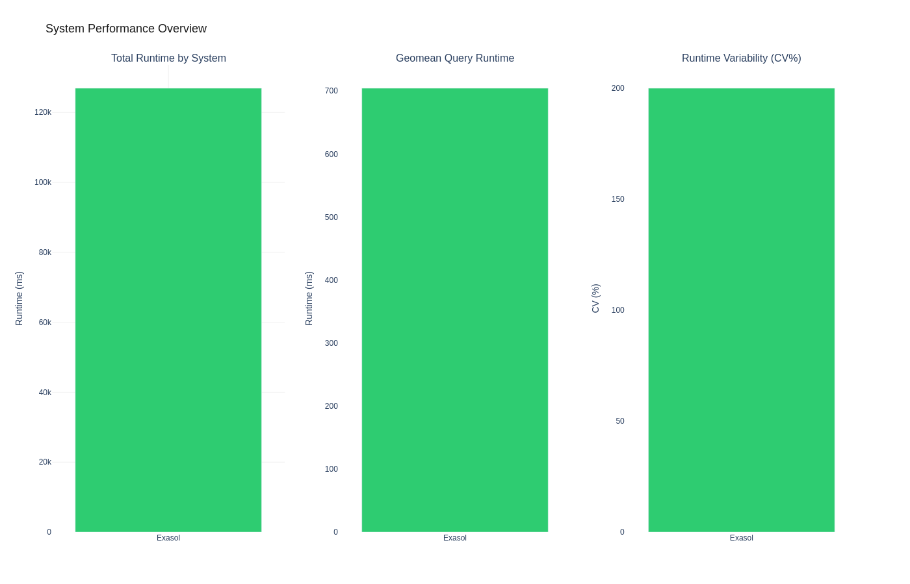
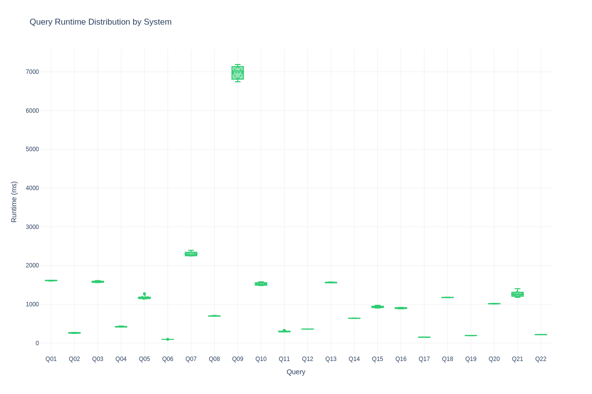
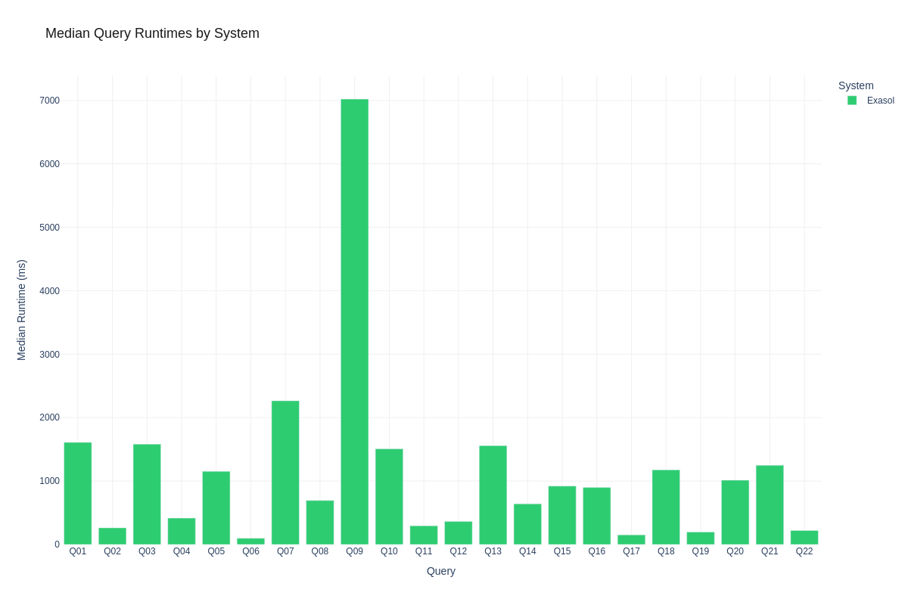

# Exasol Node Scaling: 10N SF1000

**Author:** Benchmark Team
**Environment:** aws / eu-west-1 / r6id.4xlarge
**Date:** 2026-02-12 00:56:51

> **Note:** Sensitive information (passwords, IP addresses) has been sanitized for security reasons. Placeholders like `<EXASOL_DB_PASSWORD>`, `<PRIVATE_IP>`, and `<PUBLIC_IP>` are used throughout this document. When reproducing this benchmark, substitute these with your actual credentials and addresses.

This document shows exactly how the benchmark was run so it can be reproduced.

## Executive Summary

We compared 1 database systems:
- **exasol**


## Systems Under Test

### Exasol 2025.2.0

**Software Configuration:**
- **Database:** exasol 2025.2.0
- **Setup method:** installer
- **Data device:** /dev/exasol.storage
- **Cluster configuration:** 10-node cluster


**Hardware Specifications:**
- **Cloud Provider:** AWS
- **Region:** eu-west-1
- **Instance Type:** r6id.4xlarge
- **Node Count:** 10 nodes
- **CPU:** Intel(R) Xeon(R) Platinum 8375C CPU @ 2.90GHz
- **CPU Cores per node:** 16 vCPUs (160 total vCPUs)
- **Memory per node:** 123.8GB RAM (1238.0GB total RAM)
- **Node hostnames:**
  - exasol-node5: ip-10-0-1-133
  - exasol-node3: ip-10-0-1-219
  - exasol-node8: ip-10-0-1-207
  - exasol-node4: ip-10-0-1-139
  - exasol-node0: ip-10-0-1-48
  - exasol-node9: ip-10-0-1-19
  - exasol-node1: ip-10-0-1-52
  - exasol-node7: ip-10-0-1-185
  - exasol-node2: ip-10-0-1-32
  - exasol-node6: ip-10-0-1-121


**Detailed system information:** See attachments for complete system specifications

## Test Environment

This benchmark was executed on the following infrastructure:

### Hardware Specifications

- **Cloud Provider:** AWS
- **Region:** eu-west-1
- **Exasol Instance:** r6id.4xlarge


### Database Configuration

The following commands were **actually executed** during the benchmark setup. You can copy and paste these to reproduce the installation:

#### Exasol 2025.2.0 Setup

**Storage Configuration:**
```bash
# [All 10 Nodes] Create GPT partition table
sudo parted -s /dev/nvme1n1 mklabel gpt

# [All 10 Nodes] Create 0GB partition for data generation
sudo parted -s /dev/nvme1n1 mkpart primary ext4 1MiB 0GiB

# Using additional disk: /dev/nvme1n1 (via /dev/exasol.storage)
lsblk /dev/nvme1n1

```

**User Setup:**
```bash
# [All 10 Nodes] Create Exasol system user
sudo useradd -m -s /bin/bash exasol || true

# [All 10 Nodes] Add exasol user to sudo group
sudo usermod -aG sudo exasol || true

# Set password for exasol user (interactive)
sudo passwd exasol

```

**Tool Setup:**
```bash
# Download c4 cluster management tool v4.28.5
wget -q --tries=3 --retry-connrefused --waitretry=5 https://x-up.s3.amazonaws.com/releases/c4/linux/x86_64/4.28.5/c4 -O c4 &amp;&amp; chmod +x c4

```

**SSH Setup:**
```bash
# Generate SSH key pair for cluster communication
ssh-keygen -t rsa -b 2048 -f ~/.ssh/id_rsa -N &#34;&#34;

# [All 10 Nodes] Distribute ubuntu SSH key to exasol user
sudo mkdir -p ~exasol/.ssh &amp;&amp; echo &#39;ssh-rsa AAAAB3NzaC1yc2EAAAADAQABAAABAQDWdkh1ZK3qNpN2B9OxWqtL9FbHhrnhKJk3gyH3T4JU23F7EWcctkdVp00dGrFmYArtRKrf3FTHNvd85V36Mh3eobMmnilmtdqaT0F3HdWbrXuCe68o19/SlEoElJN5cnZlinuYqkFRwux1zHoBOPFIv5ZXUfIc+DLmNkdeyk8Z1ea8qOTKeWQuoY3N7Pv32LXJ/ZbZD2oyt5ymgMZApZW+zhXgW8d1Gl0ChGoZayidp7tc8aoa6geo9lH3lltQxEDV0DUaqisiZ7XEDWgBcoZ58UUMHLa2U1m0EmwptUdvuVa06zutm55UwrzvhZLVEi8WUQSafyL7dPo0LlGzSqsj ubuntu@ip-10-0-1-48&#39; | sudo tee ~exasol/.ssh/authorized_keys &gt; /dev/null &amp;&amp; sudo chown -R exasol:exasol ~exasol/.ssh &amp;&amp; sudo chmod 700 ~exasol/.ssh &amp;&amp; sudo chmod 600 ~exasol/.ssh/authorized_keys

# [All 10 Nodes] Configure localhost SSH access to exasol user
ssh-keyscan -H localhost &gt;&gt; ~/.ssh/known_hosts 2&gt;/dev/null || true
ssh-keyscan -H 127.0.0.1 &gt;&gt; ~/.ssh/known_hosts 2&gt;/dev/null || true
mkdir -p ~/.ssh
touch ~/.ssh/config
grep -q &#34;Host localhost&#34; ~/.ssh/config 2&gt;/dev/null || cat &gt;&gt; ~/.ssh/config &lt;&lt; &#39;SSHEOF&#39;

Host localhost 127.0.0.1
    StrictHostKeyChecking no
    UserKnownHostsFile /dev/null
    LogLevel ERROR
SSHEOF
chmod 600 ~/.ssh/config

# [All 10 Nodes] Generate SSH key pair for exasol user
sudo -u exasol bash -c &#39;mkdir -p ~/.ssh &amp;&amp; chmod 700 ~/.ssh &amp;&amp; if [ ! -f ~/.ssh/id_rsa ]; then ssh-keygen -t rsa -b 2048 -f ~/.ssh/id_rsa -N &#34;&#34; -q; fi&#39;

# [All 10 Nodes] Cross-distribute exasol SSH keys for cluster communication
# Collect exasol public keys from all nodes, distribute to all authorized_keys
sudo cat ~exasol/.ssh/id_rsa.pub  # on each node
echo &#39;&lt;KEY&gt;&#39; | sudo tee -a ~exasol/.ssh/authorized_keys &gt; /dev/null
sudo chown exasol:exasol ~exasol/.ssh/authorized_keys &amp;&amp; sudo chmod 600 ~exasol/.ssh/authorized_keys

# [All 10 Nodes] Configure exasol SSH config for cluster nodes
sudo -u exasol bash -c &#39;
mkdir -p ~/.ssh &amp;&amp; chmod 700 ~/.ssh
touch ~/.ssh/config &amp;&amp; chmod 600 ~/.ssh/config
grep -q &#34;Host localhost&#34; ~/.ssh/config 2&gt;/dev/null || cat &gt;&gt; ~/.ssh/config &lt;&lt; SSHEOF

Host localhost 127.0.0.1 &lt;PRIVATE_IP&gt; &lt;PRIVATE_IP&gt; &lt;PRIVATE_IP&gt; &lt;PRIVATE_IP&gt; &lt;PRIVATE_IP&gt; &lt;PRIVATE_IP&gt; &lt;PRIVATE_IP&gt; &lt;PRIVATE_IP&gt; &lt;PRIVATE_IP&gt; &lt;PRIVATE_IP&gt; &lt;PUBLIC_IP&gt; &lt;PUBLIC_IP&gt; &lt;PUBLIC_IP&gt; &lt;PUBLIC_IP&gt; &lt;PUBLIC_IP&gt; &lt;PUBLIC_IP&gt; &lt;PUBLIC_IP&gt; &lt;PUBLIC_IP&gt; &lt;PUBLIC_IP&gt; &lt;PUBLIC_IP&gt;
    StrictHostKeyChecking no
    UserKnownHostsFile /dev/null
    LogLevel ERROR
SSHEOF
&#39;

```

**Configuration:**
```bash
# Create c4 configuration file on remote system
echo &#34;CCC_HOST_ADDRS=\&#34;&lt;PRIVATE_IP&gt; &lt;PRIVATE_IP&gt; &lt;PRIVATE_IP&gt; &lt;PRIVATE_IP&gt; &lt;PRIVATE_IP&gt; &lt;PRIVATE_IP&gt; &lt;PRIVATE_IP&gt; &lt;PRIVATE_IP&gt; &lt;PRIVATE_IP&gt; &lt;PRIVATE_IP&gt;\&#34;
CCC_HOST_EXTERNAL_ADDRS=\&#34;&lt;PUBLIC_IP&gt; &lt;PUBLIC_IP&gt; &lt;PUBLIC_IP&gt; &lt;PUBLIC_IP&gt; &lt;PUBLIC_IP&gt; &lt;PUBLIC_IP&gt; &lt;PUBLIC_IP&gt; &lt;PUBLIC_IP&gt; &lt;PUBLIC_IP&gt; &lt;PUBLIC_IP&gt;\&#34;
CCC_HOST_DATADISK=/dev/exasol.storage
CCC_HOST_IMAGE_USER=exasol
CCC_HOST_IMAGE_PASSWORD=&lt;EXASOL_IMAGE_PASSWORD&gt;
CCC_HOST_KEY_PAIR_FILE=id_rsa
CCC_PLAY_RESERVE_NODES=0
CCC_PLAY_WORKING_COPY=@exasol-2025.2.0
CCC_PLAY_DB_PASSWORD=&lt;EXASOL_DB_PASSWORD&gt;
CCC_PLAY_ADMIN_PASSWORD=&lt;EXASOL_ADMIN_PASSWORD&gt;
CCC_PLAY_DB_MEM_SIZE=960000
CCC_ADMINUI_START_SERVER=true&#34; | tee /tmp/exasol_c4.conf &gt; /dev/null

```

**Cluster Deployment:**
```bash
# Deploy Exasol cluster using c4
./c4 host play -i /tmp/exasol_c4.conf

```

**License Setup:**
```bash
# Install Exasol license file
confd_client license_upload license: &lt;LICENSE_CONTENT&gt;

```

**Database Tuning:**
```bash
# Stop Exasol database for parameter configuration
confd_client db_stop db_name: Exasol

# Configure Exasol database parameters for analytical workload optimization
confd_client db_configure db_name: Exasol params_add: &#34;[&#39;-writeTouchInit=1&#39;,&#39;-cacheMonitorLimit=0&#39;,&#39;-maxOverallSlbUsageRatio=0.95&#39;,&#39;-useQueryCache=0&#39;,&#39;-query_log_timeout=0&#39;,&#39;-joinOrderMethod=0&#39;,&#39;-etlCheckCertsDefault=0&#39;,&#39;-replicationborder=11000000&#39;]&#34;

# Starting database with new parameters
confd_client db_start db_name: Exasol

```

**Setup:**
```bash
# [All 10 Nodes] Configuring passwordless sudo on all nodes
sudo sed -i &#34;/%sudo/s/) ALL$/) NOPASSWD: ALL/&#34; /etc/sudoers

```

**Cluster Management:**
```bash
# Get cluster play ID for confd_client operations
c4 ps

```

**Redundancy:**
```bash
# Stop database for redundancy change
confd_client db_stop db_name: Exasol

# Decrease volume redundancy to 1
confd_client st_volume_decrease_redundancy vname: DataVolume1 delta: 1

# Restart database after redundancy change
confd_client db_start db_name: Exasol

```


**Tuning Parameters:**
- Optimizer mode: `analytical`
- Database parameters:
  - `-writeTouchInit=1`
  - `-cacheMonitorLimit=0`
  - `-maxOverallSlbUsageRatio=0.95`
  - `-useQueryCache=0`
  - `-query_log_timeout=0`
  - `-joinOrderMethod=0`
  - `-etlCheckCertsDefault=0`
  - `-replicationborder=11000000`

**Data Directory:** `None`


## Workload Configuration

### Benchmark Parameters

- **Workload:** TPCH
- **Scale factor:** 1000
- **Data format:** csv
- **Queries tested:** All standard TPCH queries (Q01-Q22)
- **Warmup runs per query:** 1
- **Measured runs per query:** 5
- **Execution mode:** Sequential (single connection)

### Execution Command

This benchmark is completely self-contained and includes all tuning configurations:

```bash
# Extract and run the benchmark
unzip exa_node_scaling_10n-benchmark.zip
cd exa_node_scaling_10n

# Execute the complete benchmark
./run_benchmark.sh
```

**Manual execution steps:**
```bash
# Install dependencies
pip install -r requirements.txt

# Probe system information
python -m benchkit probe --config config.yaml

# Run benchmark with all configurations applied
python -m benchkit run --config config.yaml
```

**Note:** All database tuning parameters and system configurations are embedded in the benchmark package and applied automatically during execution.

## Results

### Infrastructure Setup Timings


### Workload Preparation Timings

The following table shows the time taken for data generation, schema creation, and data loading for each system:

| System | Data Generation | Schema Creation | Data Loading | Total Preparation | Raw Size | Stored Size | Compression |
|--------|----------------|-----------------|--------------|-------------------|----------|-------------|-------------|
| Exasol | 0.00s | 2.56s | 4520.08s | 4687.26s | 957.2 GB | 239.2 GB | 4.0x |


### Performance Summary

| query   | system   |   warmup |   runs |   median_ms |   mean_ms |   std_ms |   min_ms |   max_ms |
|---------|----------|----------|--------|-------------|-----------|----------|----------|----------|
| Q01     | exasol   |   1605.1 |      5 |      1609.7 |    1611.9 |      7.5 |   1602.3 |   1622.4 |
| Q02     | exasol   |   1786.7 |      5 |       262.8 |     262.7 |     10.2 |    249.7 |    273.6 |
| Q03     | exasol   |   1678.1 |      5 |      1581.4 |    1583.1 |     20.2 |   1560.9 |   1613.3 |
| Q04     | exasol   |    521.8 |      5 |       415.9 |     421.2 |     11   |    413.2 |    440   |
| Q05     | exasol   |   1687.4 |      5 |      1153.8 |    1175.3 |     54.3 |   1145.9 |   1272.2 |
| Q06     | exasol   |    138.5 |      5 |        97.6 |      97.5 |      0.4 |     96.9 |     97.8 |
| Q07     | exasol   |   2252.6 |      5 |      2265.6 |    2299.4 |     61.4 |   2252.4 |   2394.7 |
| Q08     | exasol   |    821.6 |      5 |       693.8 |     698.3 |      8.1 |    693.2 |    712.3 |
| Q09     | exasol   |   6725.5 |      5 |      7021   |    6980.4 |    187.9 |   6744.1 |   7188.6 |
| Q10     | exasol   |   1535.5 |      5 |      1506.8 |    1524.6 |     40.1 |   1486.3 |   1579.8 |
| Q11     | exasol   |    307   |      5 |       295.2 |     300.2 |     15.7 |    288.4 |    327.6 |
| Q12     | exasol   |    502   |      5 |       362.4 |     362.6 |      1.8 |    360.2 |    365.2 |
| Q13     | exasol   |   1651.8 |      5 |      1557.7 |    1562.6 |      9.3 |   1555.6 |   1577.9 |
| Q14     | exasol   |    671   |      5 |       641.4 |     641.7 |      3.4 |    637.5 |    645.9 |
| Q15     | exasol   |    926.2 |      5 |       921   |     932.2 |     27   |    904.3 |    973.7 |
| Q16     | exasol   |    919.5 |      5 |       898.8 |     901.6 |     14.7 |    885.3 |    921.4 |
| Q17     | exasol   |    166.1 |      5 |       150.9 |     151.2 |      2.5 |    148.2 |    154.2 |
| Q18     | exasol   |   1303   |      5 |      1175.7 |    1176.8 |      3.6 |   1172.5 |   1182.1 |
| Q19     | exasol   |    259.2 |      5 |       196.2 |     195.9 |      1.6 |    193.8 |    198   |
| Q20     | exasol   |   1027.8 |      5 |      1014.1 |    1015.7 |      5.1 |   1010   |   1023.7 |
| Q21     | exasol   |   1246.7 |      5 |      1249.1 |    1266.4 |     85.2 |   1180.6 |   1403.5 |
| Q22     | exasol   |    238.2 |      5 |       220.4 |     220.3 |      1.4 |    218.3 |    221.9 |


### Visualizations

#### Performance Overview



*Comprehensive dashboard showing key performance metrics: total runtime, average query time, query count, and performance variability (coefficient of variation) across all systems.*

**Interactive version:** [View interactive chart](attachments/figures/system_performance_overview.html) for detailed insights and hover information.

#### Runtime Distributions



*Box plot showing the distribution of query runtimes. The box shows the interquartile range (25th to 75th percentile), with the median marked by the line inside the box. Whiskers extend to show the full range, excluding outliers.*

**Interactive version:** [View interactive chart](attachments/figures/query_runtime_boxplot.html) for detailed query-by-query analysis.



*Bar chart comparing median query runtimes across systems. Lower bars indicate better performance.*

**Interactive version:** [View interactive chart](attachments/figures/median_runtime_bar.html) to explore individual query performance.

#### Comparative Analysis


*Heatmap showing relative performance across queries and systems. Values are normalized so that 1.0 represents the fastest system for each query. Darker colors indicate better performance.*

**Interactive version:** [View interactive chart](attachments/figures/performance_heatmap.html) for detailed heat map analysis.


> **Note:** All visualizations are available as both static PNG images (shown above) and interactive HTML charts (linked). The interactive versions allow you to zoom, pan, and hover for detailed information.

### Key Observations

**exasol:**
- Median runtime: 915.2ms
- Average runtime: 1153.7ms
- Fastest query: 96.9ms
- Slowest query: 7188.6ms


### Raw Data

The complete dataset is available in the following files:
- **Query results:** [`attachments/runs.csv`](attachments/runs.csv)
- **Summary statistics:** [`attachments/summary.json`](attachments/summary.json)
- **System information:** [`attachments/system.json`](attachments/system.json)
- **Benchmark package:** [`exa_node_scaling_10n-benchmark.zip`](exa_node_scaling_10n-benchmark.zip)

## Reproducibility

### System Requirements

Based on our testing environment:

- **CPU:** 16 logical cores
- **Memory:** 123.8GB RAM
- **Storage:** NVMe SSD recommended for optimal performance
- **OS:** Linux

### Configuration Files

The exact configuration used for this benchmark is available at:
[`attachments/config.yaml`](attachments/config.yaml)

### System Specifications

**Exasol 2025.2.0:**
- **Setup method:** installer
- **Data directory:** 
- **Applied configurations:**
  - optimizer_mode: analytical
  - db_params: [&#39;-writeTouchInit=1&#39;, &#39;-cacheMonitorLimit=0&#39;, &#39;-maxOverallSlbUsageRatio=0.95&#39;, &#39;-useQueryCache=0&#39;, &#39;-query_log_timeout=0&#39;, &#39;-joinOrderMethod=0&#39;, &#39;-etlCheckCertsDefault=0&#39;, &#39;-replicationborder=11000000&#39;]


## Methodology Notes

**Environment Consistency:**
- All systems tested on identical hardware specifications
- Same operating system and software versions
- Consistent resource allocation and container limits

**Execution Protocol:**
- 1 warmup run(s) per query (sequential, results discarded)
- 5 measured runs per query (results recorded)
- Wall-clock time measured by benchmark client
- Database processes restarted between test runs for consistency

**Configuration Management:**
- All tuning parameters documented in this post
- Configuration commands provided for exact reproduction
- System-specific optimizations applied as documented above
- Benchmark package contains all configuration files and scripts