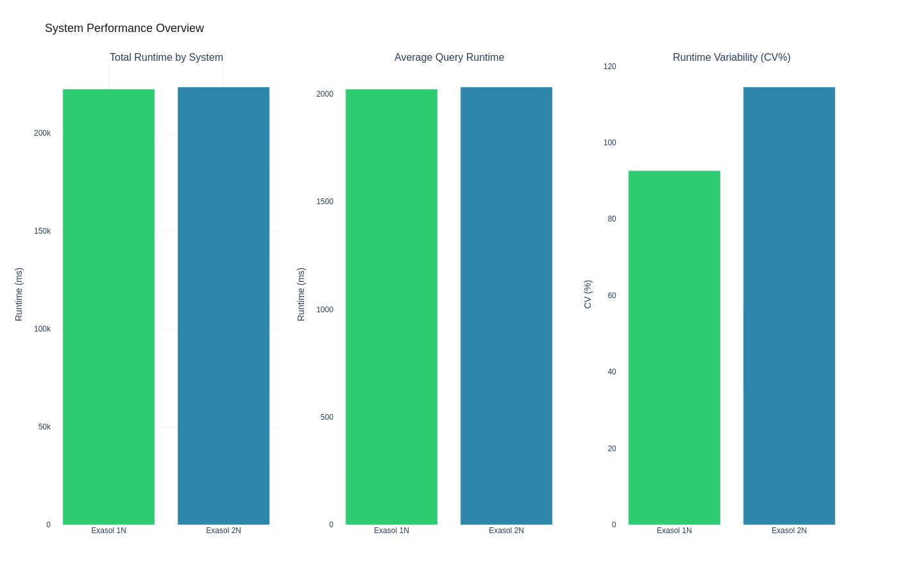
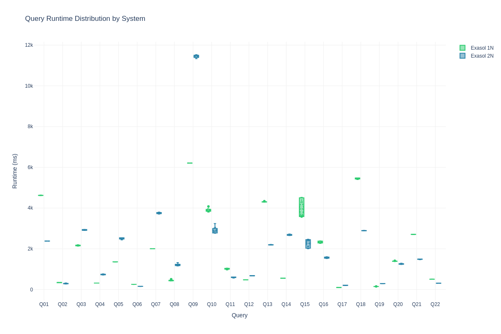
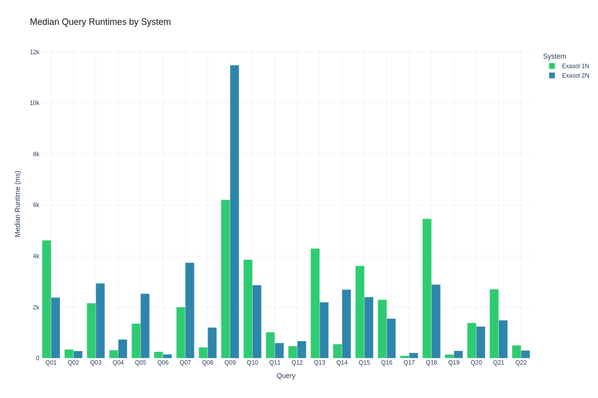
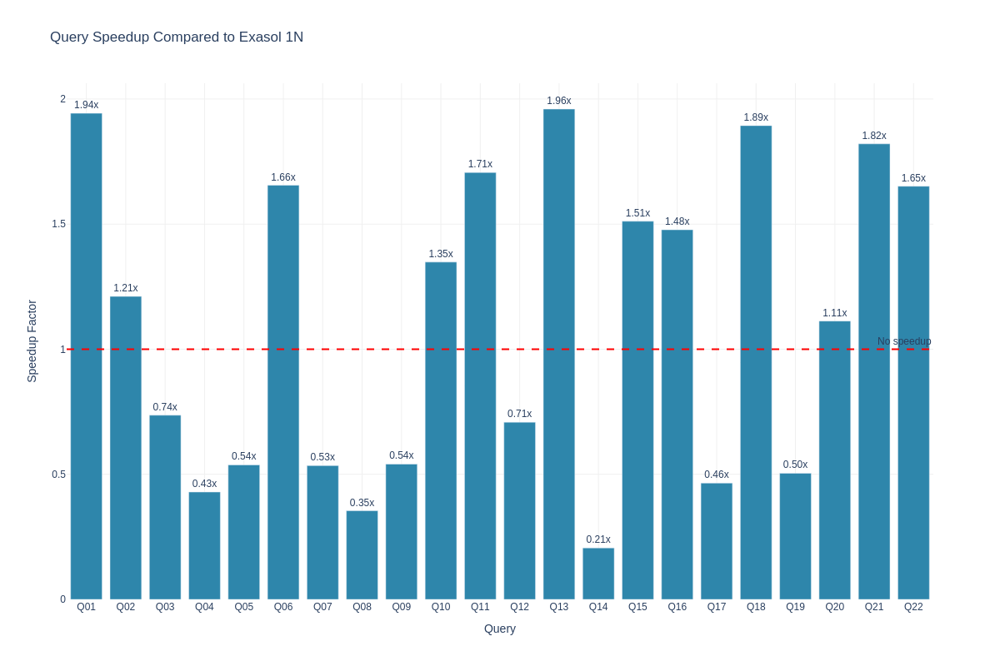
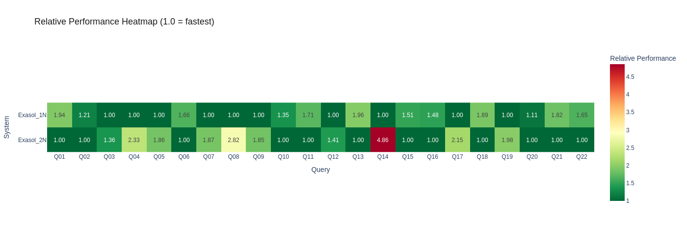

# Exasol 1N vs 2N: TPC-H SF1000 with Replication Border

**Author:** Benchmark Team
**Environment:** aws / eu-west-1 / r6i.16xlarge
**Date:** 2026-02-10 21:42:08

> **Note:** Sensitive information (passwords, IP addresses) has been sanitized for security reasons. Placeholders like `<EXASOL_DB_PASSWORD>`, `<PRIVATE_IP>`, and `<PUBLIC_IP>` are used throughout this document. When reproducing this benchmark, substitute these with your actual credentials and addresses.

This document shows exactly how the benchmark was run so it can be reproduced.

## Executive Summary

We compared 2 database systems:
- **exasol_1n**
- **exasol_2n**

**Key Findings:**
- exasol_1n was the fastest overall with 1367.9ms median runtime
- exasol_2n was 1.1x slower- Tested 220 total query executions across 22 different TPC-H queries

## Systems Under Test

### Exasol_1n 2025.2.0

**Software Configuration:**
- **Database:** exasol 2025.2.0
- **Setup method:** installer
- **Data device:** /dev/exasol.storage


**Hardware Specifications:**
- **Cloud Provider:** AWS
- **Region:** eu-west-1
- **Instance Type:** r6i.16xlarge
- **CPU:** Intel(R) Xeon(R) Platinum 8375C CPU @ 2.90GHz
- **CPU Cores:** 64 vCPUs
- **Memory:** 495.8GB RAM
- **Hostname:** ip-10-0-1-93

### Exasol_2n 2025.2.0

**Software Configuration:**
- **Database:** exasol 2025.2.0
- **Setup method:** installer
- **Data device:** /dev/exasol.storage
- **Cluster configuration:** 2-node cluster


**Hardware Specifications:**
- **Cloud Provider:** AWS
- **Region:** eu-west-1
- **Instance Type:** r6i.16xlarge
- **Node Count:** 2 nodes
- **CPU:** Intel(R) Xeon(R) Platinum 8375C CPU @ 2.90GHz
- **CPU Cores per node:** 64 vCPUs (128 total vCPUs)
- **Memory per node:** 495.8GB RAM (991.6GB total RAM)
- **Node hostnames:**
  - exasol_2n-node1: ip-10-0-1-29
  - exasol_2n-node0: ip-10-0-1-176


**Detailed system information:** See attachments for complete system specifications

## Test Environment

This benchmark was executed on the following infrastructure:

### Hardware Specifications

- **Cloud Provider:** AWS
- **Region:** eu-west-1
- **Exasol_1n Instance:** r6i.16xlarge
- **Exasol_2n Instance:** r6i.16xlarge


### Database Configuration

The following commands were **actually executed** during the benchmark setup. You can copy and paste these to reproduce the installation:

#### Exasol_2n 2025.2.0 Setup

**Storage Configuration:**
```bash
# [All 2 Nodes] Create GPT partition table
sudo parted -s /dev/nvme1n1 mklabel gpt

# [All 2 Nodes] Create 1300GB partition for data generation
sudo parted -s /dev/nvme1n1 mkpart primary ext4 1MiB 1300GiB

# [All 2 Nodes] Create raw partition for Exasol (1700GB)
sudo parted -s /dev/nvme1n1 mkpart primary 1300GiB 100%

# [All 2 Nodes] Format /dev/nvme1n1p1 with ext4 filesystem
sudo mkfs.ext4 -F /dev/nvme1n1p1

# [All 2 Nodes] Create mount point /data
sudo mkdir -p /data

# [All 2 Nodes] Mount /dev/nvme1n1p1 to /data
sudo mount /dev/nvme1n1p1 /data

# [All 2 Nodes] Set ownership of /data to $(whoami):$(whoami)
sudo chown -R $(whoami):$(whoami) /data

```

**User Setup:**
```bash
# [All 2 Nodes] Create Exasol system user
sudo useradd -m -s /bin/bash exasol || true

# [All 2 Nodes] Add exasol user to sudo group
sudo usermod -aG sudo exasol || true

# Set password for exasol user (interactive)
sudo passwd exasol

```

**Tool Setup:**
```bash
# Download c4 cluster management tool v4.28.5
wget -q --tries=3 --retry-connrefused --waitretry=5 https://x-up.s3.amazonaws.com/releases/c4/linux/x86_64/4.28.5/c4 -O c4 &amp;&amp; chmod +x c4

```

**SSH Setup:**
```bash
# Generate SSH key pair for cluster communication
ssh-keygen -t rsa -b 2048 -f ~/.ssh/id_rsa -N &#34;&#34;

```

**Configuration:**
```bash
# Create c4 configuration file on remote system
echo &#34;CCC_HOST_ADDRS=\&#34;&lt;PRIVATE_IP&gt; &lt;PRIVATE_IP&gt;\&#34;
CCC_HOST_EXTERNAL_ADDRS=\&#34;&lt;PUBLIC_IP&gt; &lt;PUBLIC_IP&gt;\&#34;
CCC_HOST_DATADISK=/dev/exasol.storage
CCC_HOST_IMAGE_USER=exasol
CCC_HOST_IMAGE_PASSWORD=&lt;EXASOL_IMAGE_PASSWORD&gt;
CCC_HOST_KEY_PAIR_FILE=id_rsa
CCC_PLAY_RESERVE_NODES=0
CCC_PLAY_WORKING_COPY=@exasol-2025.2.0
CCC_PLAY_DB_PASSWORD=&lt;EXASOL_DB_PASSWORD&gt;
CCC_PLAY_ADMIN_PASSWORD=&lt;EXASOL_ADMIN_PASSWORD&gt;
CCC_PLAY_DB_MEM_SIZE=384000
CCC_ADMINUI_START_SERVER=true&#34; | tee /tmp/exasol_c4.conf &gt; /dev/null

```

**Cluster Deployment:**
```bash
# Deploy Exasol cluster using c4
./c4 host play -i /tmp/exasol_c4.conf

```

**License Setup:**
```bash
# Install Exasol license file
confd_client license_upload license: &lt;LICENSE_CONTENT&gt;

```

**Database Tuning:**
```bash
# Stop Exasol database for parameter configuration
confd_client db_stop db_name: Exasol

# Configure Exasol database parameters for analytical workload optimization
confd_client db_configure db_name: Exasol params_add: &#34;[&#39;-writeTouchInit=1&#39;,&#39;-cacheMonitorLimit=0&#39;,&#39;-maxOverallSlbUsageRatio=0.95&#39;,&#39;-useQueryCache=0&#39;,&#39;-query_log_timeout=0&#39;,&#39;-joinOrderMethod=0&#39;,&#39;-etlCheckCertsDefault=0&#39;,&#39;-replicationborder=11000000&#39;]&#34;

# Starting database with new parameters
confd_client db_start db_name: Exasol

```

**Setup:**
```bash
# [All 2 Nodes] Configuring passwordless sudo on all nodes
sudo sed -i &#34;/%sudo/s/) ALL$/) NOPASSWD: ALL/&#34; /etc/sudoers

```

**Cluster Management:**
```bash
# Get cluster play ID for confd_client operations
c4 ps

```

**Redundancy:**
```bash
# Stop database for redundancy change
confd_client db_stop db_name: Exasol

# Decrease volume redundancy to 1
confd_client st_volume_decrease_redundancy vname: DataVolume1 delta: 1

# Restart database after redundancy change
confd_client db_start db_name: Exasol

```


**Tuning Parameters:**
- Optimizer mode: `analytical`
- Database parameters:
  - `-writeTouchInit=1`
  - `-cacheMonitorLimit=0`
  - `-maxOverallSlbUsageRatio=0.95`
  - `-useQueryCache=0`
  - `-query_log_timeout=0`
  - `-joinOrderMethod=0`
  - `-etlCheckCertsDefault=0`
  - `-replicationborder=11000000`

**Data Directory:** `None`


#### Exasol_1n 2025.2.0 Setup

**Storage Configuration:**
```bash
# Create GPT partition table
sudo parted -s /dev/nvme1n1 mklabel gpt

# Create 1300GB partition for data generation
sudo parted -s /dev/nvme1n1 mkpart primary ext4 1MiB 1300GiB

# Create raw partition for Exasol (1700GB)
sudo parted -s /dev/nvme1n1 mkpart primary 1300GiB 100%

# Format /dev/nvme1n1p1 with ext4 filesystem
sudo mkfs.ext4 -F /dev/nvme1n1p1

# Create mount point /data
sudo mkdir -p /data

# Mount /dev/nvme1n1p1 to /data
sudo mount /dev/nvme1n1p1 /data

# Set ownership of /data to $(whoami):$(whoami)
sudo chown -R $(whoami):$(whoami) /data

```

**User Setup:**
```bash
# Create Exasol system user
sudo useradd -m -s /bin/bash exasol || true

# Add exasol user to sudo group
sudo usermod -aG sudo exasol || true

# Set password for exasol user (interactive)
sudo passwd exasol

```

**SSH Setup:**
```bash
# Generate SSH key pair for cluster communication
ssh-keygen -t rsa -b 2048 -f ~/.ssh/id_rsa -N &#34;&#34;

```

**License Setup:**
```bash
# Install Exasol license file
confd_client license_upload license: &lt;LICENSE_CONTENT&gt;

```

**Database Tuning:**
```bash
# Stop Exasol database for parameter configuration
confd_client db_stop db_name: Exasol

# Configure Exasol database parameters for analytical workload optimization
confd_client db_configure db_name: Exasol params_add: &#34;[&#39;-writeTouchInit=1&#39;,&#39;-cacheMonitorLimit=0&#39;,&#39;-maxOverallSlbUsageRatio=0.95&#39;,&#39;-useQueryCache=0&#39;,&#39;-query_log_timeout=0&#39;,&#39;-joinOrderMethod=0&#39;,&#39;-etlCheckCertsDefault=0&#39;]&#34;

# Starting database with new parameters
confd_client db_start db_name: Exasol

```

**Setup:**
```bash
# Configuring passwordless sudo on all nodes
sudo sed -i &#34;/%sudo/s/) ALL$/) NOPASSWD: ALL/&#34; /etc/sudoers

```


**Tuning Parameters:**
- Optimizer mode: `analytical`
- Database parameters:
  - `-writeTouchInit=1`
  - `-cacheMonitorLimit=0`
  - `-maxOverallSlbUsageRatio=0.95`
  - `-useQueryCache=0`
  - `-query_log_timeout=0`
  - `-joinOrderMethod=0`
  - `-etlCheckCertsDefault=0`

**Data Directory:** `None`


## Workload Configuration

### Benchmark Parameters

- **Workload:** TPCH
- **Scale factor:** 1000
- **Data format:** csv
- **Queries tested:** All standard TPCH queries (Q01-Q22)
- **Warmup runs per query:** 1
- **Measured runs per query:** 5
- **Execution mode:** Sequential (single connection)

### Execution Command

This benchmark is completely self-contained and includes all tuning configurations:

```bash
# Extract and run the benchmark
unzip exa_1n2n_sf1000-benchmark.zip
cd exa_1n2n_sf1000

# Execute the complete benchmark
./run_benchmark.sh
```

**Manual execution steps:**
```bash
# Install dependencies
pip install -r requirements.txt

# Probe system information
python -m benchkit probe --config config.yaml

# Run benchmark with all configurations applied
python -m benchkit run --config config.yaml
```

**Note:** All database tuning parameters and system configurations are embedded in the benchmark package and applied automatically during execution.

## Results

### Infrastructure Setup Timings


### Workload Preparation Timings

The following table shows the time taken for data generation, schema creation, and data loading for each system:

| System | Data Generation | Schema Creation | Data Loading | Total Preparation | Raw Size | Stored Size | Compression |
|--------|----------------|-----------------|--------------|-------------------|----------|-------------|-------------|
| Exasol_1n | 1736.49s | 1.70s | 6380.81s | 11478.45s | 957.2 GB | 235.1 GB | 4.1x |
| Exasol_2n | 1736.48s | 2.55s | 5603.16s | 8959.79s | 957.2 GB | 235.8 GB | 4.1x |

**Key Observations:**
- Exasol_2n had the fastest preparation time at 8959.79s
- Exasol_1n took 11478.45s (1.3x slower)

### Performance Summary

| query   | system    |   warmup |   runs |   median_ms |   mean_ms |   std_ms |   min_ms |   max_ms |
|---------|-----------|----------|--------|-------------|-----------|----------|----------|----------|
| Q01     | exasol_1n |   4540.3 |      5 |      4619   |    4620.1 |      9.3 |   4611.1 |   4635.7 |
| Q01     | exasol_2n |   2320.7 |      5 |      2377.5 |    2377.5 |      3.3 |   2374.2 |   2382.5 |
| Q02     | exasol_1n |    381.1 |      5 |       342.8 |     339.5 |      8.1 |    329.3 |    348.1 |
| Q02     | exasol_2n |    747.3 |      5 |       283.1 |     289.4 |     18.2 |    270.7 |    319   |
| Q03     | exasol_1n |   2133.2 |      5 |      2159.3 |    2161.4 |     24.2 |   2131.3 |   2195.2 |
| Q03     | exasol_2n |   2781.5 |      5 |      2933.4 |    2925.3 |     22.5 |   2899.9 |   2948   |
| Q04     | exasol_1n |    319.7 |      5 |       315.7 |     315.6 |      0.9 |    314.5 |    316.6 |
| Q04     | exasol_2n |    721   |      5 |       735.7 |     736.8 |     21.7 |    710.3 |    765.8 |
| Q05     | exasol_1n |   1603.1 |      5 |      1359.2 |    1358   |      4.1 |   1351.1 |   1361.3 |
| Q05     | exasol_2n |   2986.3 |      5 |      2528.2 |    2506.5 |     44.4 |   2434.7 |   2541   |
| Q06     | exasol_1n |    251.2 |      5 |       252.1 |     252   |      1.4 |    249.8 |    253.5 |
| Q06     | exasol_2n |    149.4 |      5 |       152.3 |     152.5 |      3.9 |    146.5 |    156.7 |
| Q07     | exasol_1n |   1997.9 |      5 |      2000.6 |    2000.6 |      0.9 |   1999.5 |   2001.9 |
| Q07     | exasol_2n |   3709.5 |      5 |      3743.2 |    3751.2 |     38.5 |   3702.5 |   3802.3 |
| Q08     | exasol_1n |    430.2 |      5 |       426   |     442.9 |     35.2 |    424.5 |    505.7 |
| Q08     | exasol_2n |   1200.9 |      5 |      1202.7 |    1212.7 |     63.4 |   1153.7 |   1319.4 |
| Q09     | exasol_1n |   6241.4 |      5 |      6208.7 |    6207.8 |      3.3 |   6202.1 |   6210.6 |
| Q09     | exasol_2n |  11468.2 |      5 |     11482.1 |   11449.6 |     78.5 |  11332.3 |  11529.6 |
| Q10     | exasol_1n |   3868.2 |      5 |      3860.8 |    3896.4 |    106.4 |   3800.1 |   4078   |
| Q10     | exasol_2n |   2925.9 |      5 |      2863.6 |    2911.7 |    192.6 |   2765.9 |   3237.6 |
| Q11     | exasol_1n |   1021.8 |      5 |      1020   |    1013.4 |     32.8 |    961   |   1047   |
| Q11     | exasol_2n |    644.7 |      5 |       597.8 |     595.7 |     20.1 |    563   |    614.4 |
| Q12     | exasol_1n |    572.9 |      5 |       475.8 |     475.3 |      1.2 |    473.7 |    476.6 |
| Q12     | exasol_2n |    659.5 |      5 |       671.8 |     675.3 |      7.4 |    667.4 |    683.8 |
| Q13     | exasol_1n |   4282.2 |      5 |      4296.9 |    4303   |     20.2 |   4288.8 |   4338.3 |
| Q13     | exasol_2n |   2196.7 |      5 |      2192.5 |    2194   |     11.3 |   2179.7 |   2210   |
| Q14     | exasol_1n |    554.2 |      5 |       553.3 |     553.8 |      1.3 |    552.5 |    555.8 |
| Q14     | exasol_2n |   2663.8 |      5 |      2687.8 |    2683.9 |     29.1 |   2649   |   2723   |
| Q15     | exasol_1n |   4375.6 |      5 |      3621.1 |    3956.5 |    506.2 |   3554.2 |   4520.6 |
| Q15     | exasol_2n |   2037.7 |      5 |      2396   |    2267.8 |    229.1 |   1999.9 |   2466.3 |
| Q16     | exasol_1n |   2448.3 |      5 |      2293.5 |    2320   |     54.7 |   2260.5 |   2386.1 |
| Q16     | exasol_2n |   1636.6 |      5 |      1552.5 |    1560.7 |     33.6 |   1521.7 |   1605.1 |
| Q17     | exasol_1n |    102.3 |      5 |        97.3 |      96.5 |      4.3 |     89.6 |    100.1 |
| Q17     | exasol_2n |    226.4 |      5 |       209.4 |     204.9 |      8.7 |    194.6 |    214.3 |
| Q18     | exasol_1n |   5477.6 |      5 |      5465.1 |    5451.2 |     33.2 |   5401.4 |   5478.4 |
| Q18     | exasol_2n |   2868.7 |      5 |      2886   |    2888.7 |      8.5 |   2880.3 |   2902.5 |
| Q19     | exasol_1n |    155.6 |      5 |       146.3 |     146.6 |      1.7 |    144.7 |    149.3 |
| Q19     | exasol_2n |    305.5 |      5 |       290.2 |     291.4 |      4.7 |    285.9 |    296.3 |
| Q20     | exasol_1n |   1377.7 |      5 |      1382.7 |    1387.4 |     15   |   1374.5 |   1413.4 |
| Q20     | exasol_2n |   1251.2 |      5 |      1242.8 |    1252.2 |     24   |   1225.9 |   1287   |
| Q21     | exasol_1n |   2680.4 |      5 |      2706.9 |    2706.4 |      5.1 |   2699.5 |   2713.8 |
| Q21     | exasol_2n |   1499.3 |      5 |      1486.7 |    1484.6 |     12.4 |   1463.8 |   1495.1 |
| Q22     | exasol_1n |    507.1 |      5 |       503.8 |     504.2 |      1.9 |    502.7 |    507.5 |
| Q22     | exasol_2n |    320.4 |      5 |       305.1 |     307.5 |      5.3 |    302.8 |    315.7 |

### System Comparison

| query   | baseline_system   | comparison_system   |   baseline_ms |   comparison_ms |   ratio |   speedup | faster   |
|---------|-------------------|---------------------|---------------|-----------------|---------|-----------|----------|
| Q01     | exasol_1n         | exasol_2n           |        4619   |          2377.5 |    0.51 |      1.94 | True     |
| Q02     | exasol_1n         | exasol_2n           |         342.8 |           283.1 |    0.83 |      1.21 | True     |
| Q03     | exasol_1n         | exasol_2n           |        2159.3 |          2933.4 |    1.36 |      0.74 | False    |
| Q04     | exasol_1n         | exasol_2n           |         315.7 |           735.7 |    2.33 |      0.43 | False    |
| Q05     | exasol_1n         | exasol_2n           |        1359.2 |          2528.2 |    1.86 |      0.54 | False    |
| Q06     | exasol_1n         | exasol_2n           |         252.1 |           152.3 |    0.6  |      1.66 | True     |
| Q07     | exasol_1n         | exasol_2n           |        2000.6 |          3743.2 |    1.87 |      0.53 | False    |
| Q08     | exasol_1n         | exasol_2n           |         426   |          1202.7 |    2.82 |      0.35 | False    |
| Q09     | exasol_1n         | exasol_2n           |        6208.7 |         11482.1 |    1.85 |      0.54 | False    |
| Q10     | exasol_1n         | exasol_2n           |        3860.8 |          2863.6 |    0.74 |      1.35 | True     |
| Q11     | exasol_1n         | exasol_2n           |        1020   |           597.8 |    0.59 |      1.71 | True     |
| Q12     | exasol_1n         | exasol_2n           |         475.8 |           671.8 |    1.41 |      0.71 | False    |
| Q13     | exasol_1n         | exasol_2n           |        4296.9 |          2192.5 |    0.51 |      1.96 | True     |
| Q14     | exasol_1n         | exasol_2n           |         553.3 |          2687.8 |    4.86 |      0.21 | False    |
| Q15     | exasol_1n         | exasol_2n           |        3621.1 |          2396   |    0.66 |      1.51 | True     |
| Q16     | exasol_1n         | exasol_2n           |        2293.5 |          1552.5 |    0.68 |      1.48 | True     |
| Q17     | exasol_1n         | exasol_2n           |          97.3 |           209.4 |    2.15 |      0.46 | False    |
| Q18     | exasol_1n         | exasol_2n           |        5465.1 |          2886   |    0.53 |      1.89 | True     |
| Q19     | exasol_1n         | exasol_2n           |         146.3 |           290.2 |    1.98 |      0.5  | False    |
| Q20     | exasol_1n         | exasol_2n           |        1382.7 |          1242.8 |    0.9  |      1.11 | True     |
| Q21     | exasol_1n         | exasol_2n           |        2706.9 |          1486.7 |    0.55 |      1.82 | True     |
| Q22     | exasol_1n         | exasol_2n           |         503.8 |           305.1 |    0.61 |      1.65 | True     |


### Visualizations

#### Performance Overview



*Comprehensive dashboard showing key performance metrics: total runtime, average query time, query count, and performance variability (coefficient of variation) across all systems.*

**Interactive version:** [View interactive chart](attachments/figures/system_performance_overview.html) for detailed insights and hover information.

#### Runtime Distributions



*Box plot showing the distribution of query runtimes. The box shows the interquartile range (25th to 75th percentile), with the median marked by the line inside the box. Whiskers extend to show the full range, excluding outliers.*

**Interactive version:** [View interactive chart](attachments/figures/query_runtime_boxplot.html) for detailed query-by-query analysis.



*Bar chart comparing median query runtimes across systems. Lower bars indicate better performance.*

**Interactive version:** [View interactive chart](attachments/figures/median_runtime_bar.html) to explore individual query performance.

#### Comparative Analysis



*Speedup factor comparing each system against the baseline. Values above 1.0 indicate faster performance than the baseline, while values below 1.0 indicate slower performance.*

**Interactive version:** [View interactive chart](attachments/figures/speedup_comparison.html) to compare performance across queries.



*Heatmap showing relative performance across queries and systems. Values are normalized so that 1.0 represents the fastest system for each query. Darker colors indicate better performance.*

**Interactive version:** [View interactive chart](attachments/figures/performance_heatmap.html) for detailed heat map analysis.


> **Note:** All visualizations are available as both static PNG images (shown above) and interactive HTML charts (linked). The interactive versions allow you to zoom, pan, and hover for detailed information.

### Key Observations

**exasol_1n:**
- Median runtime: 1367.9ms
- Average runtime: 2023.1ms
- Fastest query: 89.6ms
- Slowest query: 6210.6ms

**exasol_2n:**
- Median runtime: 1508.4ms
- Average runtime: 2032.7ms
- Fastest query: 146.5ms
- Slowest query: 11529.6ms


### Raw Data

The complete dataset is available in the following files:
- **Query results:** [`attachments/runs.csv`](attachments/runs.csv)
- **Summary statistics:** [`attachments/summary.json`](attachments/summary.json)
- **System information:** [`attachments/system.json`](attachments/system.json)
- **Benchmark package:** [`exa_1n2n_sf1000-benchmark.zip`](exa_1n2n_sf1000-benchmark.zip)

## Reproducibility

### System Requirements

Based on our testing environment:

- **CPU:** 64 logical cores
- **Memory:** 495.8GB RAM
- **Storage:** NVMe SSD recommended for optimal performance
- **OS:** Linux

### Configuration Files

The exact configuration used for this benchmark is available at:
[`attachments/config.yaml`](attachments/config.yaml)

### System Specifications

**Exasol_1n 2025.2.0:**
- **Setup method:** installer
- **Data directory:** 
- **Applied configurations:**
  - optimizer_mode: analytical
  - db_params: [&#39;-writeTouchInit=1&#39;, &#39;-cacheMonitorLimit=0&#39;, &#39;-maxOverallSlbUsageRatio=0.95&#39;, &#39;-useQueryCache=0&#39;, &#39;-query_log_timeout=0&#39;, &#39;-joinOrderMethod=0&#39;, &#39;-etlCheckCertsDefault=0&#39;]

**Exasol_2n 2025.2.0:**
- **Setup method:** installer
- **Data directory:** 
- **Applied configurations:**
  - optimizer_mode: analytical
  - db_params: [&#39;-writeTouchInit=1&#39;, &#39;-cacheMonitorLimit=0&#39;, &#39;-maxOverallSlbUsageRatio=0.95&#39;, &#39;-useQueryCache=0&#39;, &#39;-query_log_timeout=0&#39;, &#39;-joinOrderMethod=0&#39;, &#39;-etlCheckCertsDefault=0&#39;, &#39;-replicationborder=11000000&#39;]


## Methodology Notes

**Environment Consistency:**
- All systems tested on identical hardware specifications
- Same operating system and software versions
- Consistent resource allocation and container limits

**Execution Protocol:**
- 1 warmup run(s) per query (sequential, results discarded)
- 5 measured runs per query (results recorded)
- Wall-clock time measured by benchmark client
- Database processes restarted between test runs for consistency

**Configuration Management:**
- All tuning parameters documented in this post
- Configuration commands provided for exact reproduction
- System-specific optimizations applied as documented above
- Benchmark package contains all configuration files and scripts